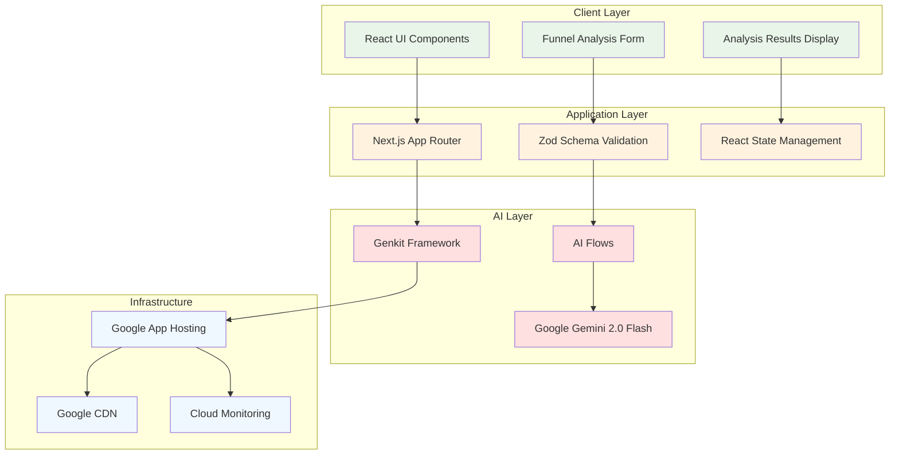

# Funnel Flow: AI-Powered Marketing Funnel Optimization

<div align="center">


**Transform your marketing campaigns with AI-powered funnel analysis and optimization**

[](https://www.typescriptlang.org/)
[](https://nextjs.org/)
[](https://firebase.google.com/docs/genkit)
[](https://tailwindcss.com/)
[](https://deepmind.google/technologies/gemini/)
[](LICENSE)

[🚀 **Live Demo**](https://your-domain.com) • [📚 **Documentation**](#-documentation) • [🛠️ **Getting Started**](#-getting-started) • [🤝 **Contributing**](#-contributing)

</div>

---

## 📋 Table of Contents

- [🎯 Overview](#-overview)
- [✨ Key Features](#-key-features)
- [🏗️ Architecture](#️-architecture)
- [🛠️ Technology Stack](#️-technology-stack)
- [🚀 Getting Started](#-getting-started)
- [📁 Project Structure](#-project-structure)
- [🔧 Development](#-development)
- [🚀 Deployment](#-deployment)
- [📚 Documentation](#-documentation)
- [🔒 Security](#-security)
- [📊 Performance](#-performance)
- [🗺️ Roadmap](#️-roadmap)
- [🤝 Contributing](#-contributing)
- [📄 License](#-license)

---

## 🎯 Overview

**Funnel Flow** is a sophisticated, AI-powered marketing funnel analysis and optimization platform that helps businesses identify conversion bottlenecks and optimize their marketing campaigns for maximum ROI.

### 🎪 What It Does

- **🔍 Analyzes Marketing Offers**: Input URLs or descriptions of your marketing campaigns
- **🕳️ Identifies Funnel Leaks**: AI-powered detection of conversion barriers
- **💡 Provides Actionable Insights**: Specific recommendations for A/B testing
- **📝 Generates Marketing Copy**: Context-aware social media and email content
- **📊 Tracks Performance**: Analysis history and trend monitoring (planned)

### 🎯 Target Audience

- **SaaS Founders** seeking to optimize conversion funnels
- **Marketing Professionals** looking for data-driven insights
- **E-commerce Businesses** wanting to improve sales funnels
- **Agencies** providing optimization services to clients
- **Consultants** helping businesses improve marketing ROI

---

## ✨ Key Features

### 🔥 Current Features

| Feature | Description | Status |
|---------|-------------|--------|
| **AI Funnel Analysis** | Deep analysis of marketing offers using Google Gemini 2.0 Flash | ✅ Live |
| **Multiple Input Types** | Support for URLs and text descriptions | ✅ Live |
| **Persona-Based Analysis** | Tailored insights for different audience segments | ✅ Live |
| **A/B Testing Suggestions** | Dual recommendations for every identified issue | ✅ Live |
| **Sample Copy Generation** | AI-generated marketing copy based on analysis | ✅ Live |
| **Real-time Processing** | Sub-30 second analysis with progress indicators | ✅ Live |

### 🚧 Planned Features

| Feature | Description | Timeline |
|---------|-------------|----------|
| **User Authentication** | Firebase Auth with OAuth providers | Q1 2024 |
| **Analysis History** | Save and track analysis over time | Q1 2024 |
| **Custom Personas** | User-defined audience segments | Q2 2024 |
| **Advanced Analytics** | Trend analysis and performance metrics | Q2 2024 |
| **Team Collaboration** | Shared workspaces and role-based access | Q3 2024 |
| **API Access** | RESTful API for integrations | Q3 2024 |

---

## 🏗️ Architecture

### System Overview



### Key Architectural Principles

- **🔄 Stateless Design**: Current MVP prioritizes privacy and simplicity
- **🧩 Modular Components**: Composable UI and AI flow architecture
- **🛡️ Type Safety**: End-to-end TypeScript with Zod validation
- **⚡ Performance First**: Optimized for sub-30 second AI responses
- **🔒 Security by Design**: Input sanitization and output validation
- **📈 Scalable Foundation**: Built for 10x growth with auto-scaling

---

## 🛠️ Technology Stack

### Frontend Stack

| Technology | Version | Purpose | Documentation |
|------------|---------|---------|---------------|
| **Next.js** | 15.x | Full-stack React framework | [Next.js Docs](https://nextjs.org/docs) |
| **React** | 18.x | UI library | [React Docs](https://react.dev/) |
| **TypeScript** | 5.x | Type safety | [TypeScript Docs](https://www.typescriptlang.org/docs/) |
| **Tailwind CSS** | 3.x | Utility-first styling | [Tailwind Docs](https://tailwindcss.com/docs) |
| **Shadcn UI** | Latest | Component library | [Shadcn UI](https://ui.shadcn.com/) |
| **React Hook Form** | 7.x | Form management | [RHF Docs](https://react-hook-form.com/) |

### Backend & AI Stack

| Technology | Version | Purpose | Documentation |
|------------|---------|---------|---------------|
| **Genkit** | Latest | AI flow orchestration | [Genkit Docs](https://firebase.google.com/docs/genkit) |
| **Google Gemini** | 2.0 Flash | Large language model | [Gemini API](https://ai.google.dev/) |
| **Zod** | 3.x | Schema validation | [Zod Docs](https://zod.dev/) |
| **Node.js** | 20.x | Runtime environment | [Node.js Docs](https://nodejs.org/docs/) |

### Infrastructure & DevOps

| Technology | Purpose | Documentation |
|------------|---------|---------------|
| **Google App Hosting** | Serverless deployment | [App Hosting](https://cloud.google.com/appengine) |
| **Google Cloud CDN** | Global content delivery | [Cloud CDN](https://cloud.google.com/cdn) |
| **Cloud Monitoring** | Observability platform | [Monitoring](https://cloud.google.com/monitoring) |
| **Secret Manager** | Credential management | [Secret Manager](https://cloud.google.com/secret-manager) |

---

## 🚀 Getting Started

### Prerequisites

Ensure you have the following installed on your development machine:

- **Node.js** (v20 or higher) - [Download](https://nodejs.org/)
- **npm** or **yarn** package manager
- **Google AI API Key** - [Get API Key](https://ai.google.dev/)
- **Git** - [Download](https://git-scm.com/)

### Installation

1. **Clone the Repository**
   ```bash
   git clone https://github.com/JacobKayembekazadi/funnel-flow.git
   cd funnel-flow
   ```

2. **Install Dependencies**
   ```bash
   npm install
   # or
   yarn install
   ```

3. **Environment Configuration**
   
   Create a `.env.local` file in the project root:
   ```bash
   cp .env.example .env.local
   ```
   
   Add your configuration:
   ```env
   # Required: Google AI API Key
   GOOGLE_API_KEY="your_google_ai_api_key_here"
   
   # Optional: Development settings
   NODE_ENV="development"
   NEXT_PUBLIC_APP_URL="http://localhost:3000"
   ```

4. **Verify Installation**
   ```bash
   npm run typecheck
   npm run lint
   ```

### Development Servers

Run both servers concurrently for full functionality:

**Terminal 1: Next.js Frontend**
```bash
npm run dev
# Starts on http://localhost:3000
```

**Terminal 2: Genkit AI Backend**
```bash
npm run genkit:dev
# Genkit UI on http://localhost:4000
```

For auto-reloading Genkit flows during development:
```bash
npm run genkit:watch
```

### Quick Start Checklist

- [ ] Repository cloned and dependencies installed
- [ ] Google AI API key configured in `.env.local`
- [ ] Both development servers running
- [ ] Application accessible at `http://localhost:3000`
- [ ] Genkit UI accessible at `http://localhost:4000`
- [ ] Test analysis with sample URL or text

---

## 📁 Project Structure

```
funnel-flow/
├── 📄 README.md                     # This file
├── 📄 package.json                  # Dependencies and scripts
├── 📄 next.config.ts                # Next.js configuration
├── 📄 tailwind.config.ts            # Tailwind CSS configuration
├── 📄 apphosting.yaml               # Google App Hosting config
├── 📁 docs/                         # 📚 Complete documentation suite
│   ├── 📄 architectural_document.md
│   ├── 📄 product_requirements_document.md
│   ├── 📄 technical_specification.md
│   ├── 📄 development_workflow.md
│   ├── 📄 testing_strategy.md
│   ├── 📄 security_documentation.md
│   ├── 📄 operations_manual.md
│   ├── 📄 database_design.md
│   ├── 📄 user_manual.md
│   ├── 📄 deployment_guide.md
│   └── 📄 api_documentation.md
├── 📁 src/
│   ├── 📁 app/                      # Next.js App Router
│   │   ├── 📄 globals.css          # Global styles
│   │   ├── 📄 layout.tsx           # Root layout
│   │   └── 📄 page.tsx             # Homepage component
│   ├── 📁 components/               # React components
│   │   ├── 📁 ui/                  # Reusable UI components (Shadcn)
│   │   └── 📁 funnel-flow/         # App-specific components
│   ├── 📁 ai/                      # AI & Genkit flows
│   │   ├── 📄 genkit.ts            # Genkit configuration
│   │   ├── 📄 dev.ts               # Development server
│   │   └── 📁 flows/               # AI flow definitions
│   ├── 📁 hooks/                   # Custom React hooks
│   └── 📁 lib/                     # Utilities and helpers
└── 📁 .specstory/                  # AI chat history (auto-generated)
```

### Key Directories Explained

| Directory | Purpose | Key Files |
|-----------|---------|-----------|
| `src/app/` | Next.js App Router pages and layouts | `page.tsx`, `layout.tsx` |
| `src/components/ui/` | Reusable UI components from Shadcn | `button.tsx`, `input.tsx`, etc. |
| `src/components/funnel-flow/` | Business logic components | `FunnelAnalysisForm.tsx`, `AnalysisResults.tsx` |
| `src/ai/flows/` | AI flow definitions | `analyze-marketing-offer.ts` |
| `docs/` | Comprehensive documentation | All `.md` files |

---

## 🔧 Development

### Available Scripts

| Script | Command | Description |
|--------|---------|-------------|
| **Development** | `npm run dev` | Start Next.js dev server with Turbopack |
| **AI Development** | `npm run genkit:dev` | Start Genkit development server |
| **AI Watch Mode** | `npm run genkit:watch` | Auto-reload Genkit flows on changes |
| **Build** | `npm run build` | Create production build |
| **Start** | `npm run start` | Start production server |
| **Type Check** | `npm run typecheck` | Run TypeScript type checking |
| **Lint** | `npm run lint` | Run ESLint code analysis |

### Development Workflow

1. **Start Development Environment**
   ```bash
   # Terminal 1: Frontend
   npm run dev
   
   # Terminal 2: AI Backend
   npm run genkit:watch
   ```

2. **Code Quality Checks**
   ```bash
   npm run typecheck  # Type safety
   npm run lint       # Code quality
   ```

3. **Testing AI Flows**
   - Use Genkit UI at `http://localhost:4000`
   - Test flows with sample inputs
   - Debug prompt engineering

4. **Component Development**
   - Create components in appropriate directories
   - Follow existing patterns and conventions
   - Use TypeScript for type safety

### AI Flow Development

#### Creating New Flows

1. **Define Flow Structure**
   ```typescript
   // src/ai/flows/new-flow.ts
   import { ai } from '@/ai/genkit';
   import { z } from 'genkit';
   
   const NewFlowInputSchema = z.object({
     // Define input schema
   });
   
   const NewFlowOutputSchema = z.object({
     // Define output schema
   });
   
   export const newFlow = ai.defineFlow(
     {
       name: 'newFlow',
       inputSchema: NewFlowInputSchema,
       outputSchema: NewFlowOutputSchema,
     },
     async (input) => {
       // Flow implementation
     }
   );
   ```

2. **Test in Genkit UI**
   - Navigate to `http://localhost:4000`
   - Find your flow in the flows list
   - Test with sample inputs

3. **Integrate with Frontend**
   - Import flow in React components
   - Handle loading and error states
   - Validate responses with schemas

---

## 🚀 Deployment

### Production Deployment

The application is optimized for deployment on **Google App Hosting**, providing:

- **Serverless Architecture**: Automatic scaling and zero-ops maintenance
- **Global CDN**: Fast content delivery worldwide
- **Built-in Security**: HTTPS, security headers, and DDoS protection
- **Integrated Monitoring**: Real-time performance and error tracking

### Deployment Steps

1. **Build Application**
   ```bash
   npm run build
   ```

2. **Deploy to Google App Hosting**
   ```bash
   # Using Firebase CLI
   firebase deploy --project your-project-id
   
   # Or using GitHub Actions (configured)
   git push origin main
   ```

3. **Environment Variables**
   - Configure secrets in Google Secret Manager
   - Set production environment variables
   - Verify HTTPS certificates

### Configuration Files

- **`apphosting.yaml`**: Google App Hosting configuration
- **`next.config.ts`**: Next.js production settings
- **GitHub Actions**: Automated deployment pipeline

For detailed deployment instructions, see our [📋 Deployment Guide](docs/deployment_guide.md).

---

## 📚 Documentation

We maintain comprehensive documentation for all aspects of the project:

### 📋 Documentation Index

| Document | Purpose | Audience |
|----------|---------|----------|
| [🏗️ **Architectural Document**](docs/architectural_document.md) | System architecture and technical overview | Developers, Architects |
| [📋 **Product Requirements**](docs/product_requirements_document.md) | Product specifications and requirements | Product Managers, Stakeholders |
| [🔧 **Technical Specification**](docs/technical_specification.md) | Detailed technical implementation specs | Developers, Engineers |
| [⚙️ **Development Workflow**](docs/development_workflow.md) | Development processes and best practices | Developers, Contributors |
| [🧪 **Testing Strategy**](docs/testing_strategy.md) | Comprehensive testing approach | QA Engineers, Developers |
| [🔒 **Security Documentation**](docs/security_documentation.md) | Complete security framework | Security Teams, DevOps |
| [📊 **Operations Manual**](docs/operations_manual.md) | Production operations and monitoring | SRE, DevOps, Operations |
| [🗄️ **Database Design**](docs/database_design.md) | Data architecture and migration strategy | Database Engineers, Architects |
| [👤 **User Manual**](docs/user_manual.md) | End-user guide and instructions | End Users, Support Teams |
| [🚀 **Deployment Guide**](docs/deployment_guide.md) | Production deployment procedures | DevOps, Infrastructure Teams |
| [🔌 **API Documentation**](docs/api_documentation.md) | Complete API reference with examples | API Consumers, Integrators |

### 📊 Documentation Stats

- **Total Documentation**: 11 comprehensive documents
- **Total Lines**: 10,000+ lines of detailed documentation
- **Mermaid Diagrams**: 15+ architectural and process flow diagrams
- **Code Examples**: TypeScript, JavaScript, Python, bash configurations
- **Coverage**: Complete project lifecycle from conception to operations

---

## 🔒 Security

Security is a top priority for Funnel Flow. We implement multiple layers of protection:

### 🛡️ Security Measures

- **Input Validation**: Comprehensive sanitization and validation
- **Output Encoding**: XSS prevention and safe rendering
- **HTTPS Enforcement**: TLS 1.3 encryption for all communications
- **Rate Limiting**: Protection against abuse and DDoS
- **Content Security Policy**: Strict CSP headers
- **Security Headers**: Comprehensive security header implementation

### 🔐 Current Security Model

- **Stateless Architecture**: No persistent user data storage
- **Public Access**: No authentication required (MVP)
- **Input Sanitization**: All user inputs validated and sanitized
- **AI Security**: Prompt injection protection and output validation

### 🛡️ Planned Security Enhancements

- **OAuth 2.0 Authentication**: Google, GitHub, Microsoft providers
- **JWT Token Management**: Secure session handling
- **Role-Based Access Control**: User permissions and admin access
- **API Key Management**: Programmatic access with scoped permissions

For detailed security information, see our [🔒 Security Documentation](docs/security_documentation.md).

---

## 📊 Performance

### ⚡ Performance Targets

| Metric | Target | Current | Status |
|--------|--------|---------|--------|
| **Page Load Time** | <2 seconds | ~1.5 seconds | ✅ |
| **AI Response Time** | <30 seconds | ~18 seconds | ✅ |
| **First Contentful Paint** | <1.5 seconds | ~1.2 seconds | ✅ |
| **Cumulative Layout Shift** | <0.1 | ~0.05 | ✅ |
| **Time to Interactive** | <3 seconds | ~2.1 seconds | ✅ |

### 🚀 Performance Optimizations

- **Turbopack**: Next.js 15 with Turbopack for faster development
- **Server Components**: Reduced client-side JavaScript
- **Image Optimization**: Next.js automatic image optimization
- **Code Splitting**: Automatic route-based code splitting
- **CDN Distribution**: Global content delivery network
- **Caching Strategy**: Aggressive caching for static assets

### 📈 Monitoring

- **Real User Monitoring**: Google Analytics and Core Web Vitals
- **Performance Budgets**: Automated performance regression detection
- **Error Tracking**: Comprehensive error monitoring and alerting
- **Uptime Monitoring**: 99.9% availability target with alerting

---

## 🗺️ Roadmap

### 🎯 2024 Development Roadmap

#### Q1 2024: Foundation & Authentication
- [x] ✅ MVP Launch with AI funnel analysis
- [x] ✅ Comprehensive documentation suite
- [ ] 🚧 User authentication (Firebase Auth)
- [ ] 🚧 Analysis history and persistence
- [ ] 🚧 User dashboard and profile management

#### Q2 2024: Advanced Features
- [ ] 📋 Custom persona creation and management
- [ ] 📋 Advanced analytics and trend analysis
- [ ] 📋 Analysis sharing and collaboration
- [ ] 📋 Email and Slack integration
- [ ] 📋 Performance optimization and caching

#### Q3 2024: Enterprise Features
- [ ] 📋 Team workspaces and role-based access
- [ ] 📋 API access and developer portal
- [ ] 📋 Webhook system for integrations
- [ ] 📋 White-label solutions
- [ ] 📋 SOC 2 compliance certification

#### Q4 2024: Scale & Innovation
- [ ] 📋 Multi-language support (i18n)
- [ ] 📋 Mobile application (React Native)
- [ ] 📋 Advanced AI models and capabilities
- [ ] 📋 Marketplace for custom personas
- [ ] 📋 AI-powered campaign automation

### 🎯 Long-term Vision (2025+)

- **AI Innovation**: Integration with latest AI models and capabilities
- **Global Expansion**: Multi-region deployment and localization
- **Enterprise Platform**: Complete marketing optimization suite
- **Ecosystem**: Third-party integrations and partner network
- **Research**: Open-source AI marketing research initiative

---

## 🤝 Contributing

We welcome contributions from the community! Here's how you can help:

### 🌟 Ways to Contribute

- **🐛 Bug Reports**: Report issues and bugs
- **💡 Feature Requests**: Suggest new features and improvements
- **📝 Documentation**: Improve documentation and examples
- **🔧 Code Contributions**: Submit pull requests
- **🧪 Testing**: Help with testing and quality assurance
- **🎨 Design**: UI/UX improvements and design contributions

### 📋 Development Setup

1. **Fork the Repository**
   ```bash
   git clone https://github.com/your-username/funnel-flow.git
   cd funnel-flow
   ```

2. **Create Feature Branch**
   ```bash
   git checkout -b feature/your-feature-name
   ```

3. **Make Changes**
   - Follow existing code patterns
   - Add tests for new features
   - Update documentation as needed

4. **Test Changes**
   ```bash
   npm run typecheck
   npm run lint
   npm run build
   ```

5. **Submit Pull Request**
   - Describe your changes clearly
   - Reference related issues
   - Include screenshots for UI changes

### 📝 Contribution Guidelines

- **Code Style**: Follow existing TypeScript and React patterns
- **Commit Messages**: Use conventional commit format
- **Documentation**: Update relevant documentation
- **Testing**: Include tests for new functionality
- **Security**: Follow security best practices

For detailed contribution guidelines, see our [⚙️ Development Workflow](docs/development_workflow.md).

---

## 📞 Support & Community

### 🆘 Getting Help

- **📖 Documentation**: Check our comprehensive docs
- **🐛 Issues**: Report bugs on GitHub Issues
- **💬 Discussions**: Join GitHub Discussions
- **📧 Email**: Contact us at support@funnelflow.com

### 🌐 Links

- **🔗 Website**: [https://funnelflow.com](https://funnelflow.com)
- **📱 Demo**: [https://demo.funnelflow.com](https://demo.funnelflow.com)
- **📚 Docs**: [https://docs.funnelflow.com](https://docs.funnelflow.com)
- **🐦 Twitter**: [@FunnelFlowAI](https://twitter.com/FunnelFlowAI)

---

## 📄 License

This project is licensed under the **MIT License** - see the [LICENSE](LICENSE) file for details.

### 📜 License Summary

- ✅ **Commercial Use**: Use in commercial projects
- ✅ **Modification**: Modify and adapt the code
- ✅ **Distribution**: Distribute original or modified code
- ✅ **Private Use**: Use for private projects
- ❌ **Liability**: No warranty or liability
- ❌ **Patent Use**: No patent rights granted

---

<div align="center">

**🚀 Built with ❤️ by the Funnel Flow Team**

*Transforming marketing optimization through AI*

[](https://www.typescriptlang.org/)
[](https://nextjs.org/)
[](https://ai.google.dev/)

[⭐ **Star us on GitHub**](https://github.com/JacobKayembekazadi/funnel-flow) | [🐦 **Follow on Twitter**](https://twitter.com/FunnelFlowAI) | [📧 **Get Updates**](https://funnelflow.com/newsletter)

</div>
