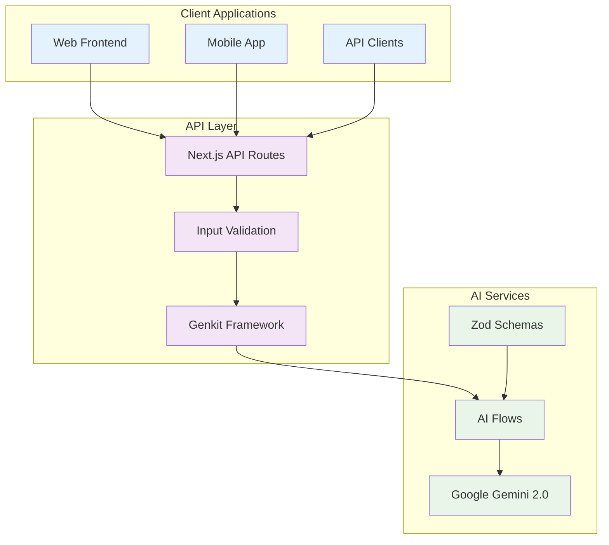

# API Documentation: Funnel Flow

## Table of Contents
1. [Overview](#overview)
2. [API Architecture](#api-architecture)
3. [Authentication](#authentication)
4. [AI Flow APIs](#ai-flow-apis)
5. [Data Models](#data-models)
6. [Error Handling](#error-handling)
7. [Rate Limiting](#rate-limiting)
8. [SDK & Integration Examples](#sdk--integration-examples)
9. [Webhooks (Future)](#webhooks-future)
10. [Changelog](#changelog)

---

## Overview

Funnel Flow provides AI-powered marketing funnel analysis through a robust API built on Google's Genkit framework. The API leverages Google Gemini 2.0 Flash for intelligent analysis of marketing offers and generation of optimization recommendations.

### Base Information

```yaml
Base URL: https://your-domain.com
API Version: 1.0
Protocol: HTTPS
Content-Type: application/json
AI Model: Google Gemini 2.0 Flash
Response Format: JSON
```

### Key Features

- **AI-Powered Analysis**: Intelligent funnel leak detection
- **Persona-Driven Insights**: Audience-specific recommendations
- **A/B Testing Suggestions**: Dual improvement strategies
- **Copy Generation**: AI-created marketing content
- **Real-time Processing**: Sub-30 second response times

---

## API Architecture

### Architecture Overview



### Core Components

- **Genkit Framework**: AI orchestration and flow management
- **Zod Validation**: Runtime type checking and schema validation
- **Google Gemini**: Large language model for analysis
- **Next.js API Routes**: HTTP endpoint management
- **TypeScript**: End-to-end type safety

---

## Authentication

### Current Authentication Model

**Note**: The current MVP version does not require authentication. All endpoints are publicly accessible for simplified user experience.

### Future Authentication (Planned)

```typescript
// Planned authentication model
interface AuthToken {
  apiKey: string;
  userId?: string;
  scopes: string[];
  expiresAt: Date;
}

// Headers for authenticated requests
const headers = {
  'Authorization': 'Bearer your-api-key',
  'Content-Type': 'application/json'
};
```

### Security Considerations

- **Rate Limiting**: Applied per IP address
- **Input Validation**: Strict schema validation
- **HTTPS Only**: All communications encrypted
- **No Data Storage**: Stateless processing for privacy

---

## AI Flow APIs

### 1. Analyze Marketing Offer

Analyzes a marketing offer (URL or description) and provides optimization recommendations.

#### Endpoint
```
POST /api/analyze-marketing-offer
```

#### Request Schema

```typescript
interface AnalyzeMarketingOfferRequest {
  offerDetails: string;           // URL or text description
  inputType: 'link' | 'text';     // Input format type  
  persona: string;                // Target audience persona
}
```

#### Request Example

```json
{
  "offerDetails": "https://yourapp.com/signup",
  "inputType": "link",
  "persona": "SaaS Founders"
}
```

#### Validation Rules

```typescript
const validation = {
  offerDetails: {
    type: "string",
    minLength: 10,
    maxLength: 2000,
    required: true,
    description: "Landing page URL or offer description"
  },
  inputType: {
    type: "enum",
    values: ["link", "text"],
    required: true,
    description: "Type of input provided"
  },
  persona: {
    type: "string",
    enum: [
      "General Audience",
      "SaaS Founders", 
      "Busy Parents",
      "Coaches & Consultants",
      "E-commerce Shoppers",
      "Creative Professionals"
    ],
    required: true,
    description: "Target audience persona"
  }
};
```

#### Response Schema

```typescript
interface AnalyzeMarketingOfferResponse {
  success: boolean;
  data: {
    analysis: AnalysisItem[];
    sampleCopy: SampleCopy;
  };
  metadata: {
    processingTime: number;
    requestId: string;
    model: string;
  };
}

interface AnalysisItem {
  id: string;                     // Unique identifier
  area: string;                   // Analysis area (e.g., "Headline Clarity")
  score: number;                  // Score 1-10
  leak: string;                   // Identified weakness description
  fix: {
    primarySuggestion: string;    // Suggestion A for A/B test
    abTestSuggestion: string;     // Suggestion B for A/B test
  };
}

interface SampleCopy {
  platform: string;              // Target platform (e.g., "Instagram Post")
  content: string;                // Generated marketing copy
}
```

#### Response Example

```json
{
  "success": true,
  "data": {
    "analysis": [
      {
        "id": "analysis_001",
        "area": "Headline Clarity",
        "score": 7,
        "leak": "Headline could be more specific about the main benefit",
        "fix": {
          "primarySuggestion": "Include specific numbers or outcomes in the headline",
          "abTestSuggestion": "Use a question format to engage curiosity"
        }
      },
      {
        "id": "analysis_002", 
        "area": "Call-to-Action Strength",
        "score": 5,
        "leak": "CTA button text is generic and lacks urgency",
        "fix": {
          "primarySuggestion": "Use action-oriented text like 'Start Your Free Trial'",
          "abTestSuggestion": "Add time-sensitive language like 'Get Instant Access'"
        }
      }
    ],
    "sampleCopy": {
      "platform": "Instagram Post",
      "content": "🚀 Transform your SaaS conversion rates with AI-powered insights! Our analysis reveals exactly where potential customers drop off and provides A/B test suggestions to fix it. Ready to boost your sign-up rate? #SaaS #ConversionOptimization"
    }
  },
  "metadata": {
    "processingTime": 18500,
    "requestId": "req_abc123def456",
    "model": "gemini-2.0-flash"
  }
}
```

#### Performance Metrics

```yaml
Response Time: 15-30 seconds (95th percentile)
Success Rate: >99%
Max Analysis Areas: 3
Score Range: 1-10 (integer)
Content Length: 50-500 characters for sample copy
```

#### cURL Example

```bash
curl -X POST https://your-domain.com/api/analyze-marketing-offer \
  -H "Content-Type: application/json" \
  -d '{
    "offerDetails": "A productivity app that helps remote teams collaborate effectively",
    "inputType": "text", 
    "persona": "SaaS Founders"
  }'
```

### 2. Generate Social Media Copy

Generates marketing copy based on funnel analysis results.

#### Endpoint
```
POST /api/generate-social-media-copy
```

#### Request Schema

```typescript
interface GenerateSocialMediaCopyRequest {
  analysis: AnalysisItem[];       // Previous analysis results
  persona: string;                // Target audience
  offerDetails: string;           // Original offer details
}
```

#### Request Example

```json
{
  "analysis": [
    {
      "area": "Headline Clarity",
      "score": 7,
      "leak": "Headline could be more specific",
      "fix": {
        "primarySuggestion": "Include specific benefits",
        "abTestSuggestion": "Use question format"
      }
    }
  ],
  "persona": "SaaS Founders",
  "offerDetails": "A project management tool for remote teams"
}
```

#### Response Schema

```typescript
interface GenerateSocialMediaCopyResponse {
  success: boolean;
  data: {
    platform: string;            // Target platform
    content: string;             // Generated copy
  };
  metadata: {
    processingTime: number;
    requestId: string;
    model: string;
  };
}
```

#### Response Example

```json
{
  "success": true,
  "data": {
    "platform": "LinkedIn Post",
    "content": "Remote team struggling with project coordination? 🤝 Our analysis shows that 73% of teams lose productivity due to unclear task management. Here's how successful SaaS founders are solving this: [specific solution details]. What's your biggest remote collaboration challenge? #RemoteWork #Productivity #SaaS"
  },
  "metadata": {
    "processingTime": 12300,
    "requestId": "req_def789ghi012", 
    "model": "gemini-2.0-flash"
  }
}
```

---

## Data Models

### Core Data Types

#### Input Validation Models

```typescript
// Persona enumeration
type PersonaType = 
  | 'General Audience'
  | 'SaaS Founders'
  | 'Busy Parents' 
  | 'Coaches & Consultants'
  | 'E-commerce Shoppers'
  | 'Creative Professionals';

// Input type enumeration  
type InputType = 'link' | 'text';

// Score validation
type Score = 1 | 2 | 3 | 4 | 5 | 6 | 7 | 8 | 9 | 10;
```

#### Analysis Models

```typescript
// Complete analysis item structure
interface AnalysisItem {
  id: string;                     // UUID format
  area: string;                   // Human-readable area name
  score: Score;                   // Integer 1-10
  leak: string;                   // Minimum 10 characters
  fix: AnalysisFix;
}

interface AnalysisFix {
  primarySuggestion: string;      // Minimum 20 characters
  abTestSuggestion: string;       // Minimum 20 characters
}

// Sample copy structure
interface SampleCopy {
  platform: string;              // Platform name
  content: string;                // 50-500 characters
}
```

#### Response Metadata

```typescript
interface APIMetadata {
  processingTime: number;         // Milliseconds
  requestId: string;              // Unique request identifier
  model: string;                  // AI model used
  timestamp: string;              // ISO 8601 format
  version: string;                // API version
}
```

### Schema Validation

#### Zod Schemas (Internal)

```typescript
import { z } from 'zod';

// Input validation schema
const AnalyzeMarketingOfferInputSchema = z.object({
  offerDetails: z.string()
    .min(10, "Minimum 10 characters required")
    .max(2000, "Maximum 2000 characters allowed")
    .describe('The landing page URL or a description of the marketing offer.'),
  
  inputType: z.enum(['link', 'text'])
    .describe('The type of input provided: link for a landing page URL, text for a description.'),
  
  persona: z.string()
    .min(1, "Persona is required")
    .describe('The target audience persona.')
});

// Output validation schema  
const AnalysisItemSchema = z.object({
  id: z.string().uuid(),
  area: z.string().min(1),
  score: z.number().int().min(1).max(10),
  leak: z.string().min(10),
  fix: z.object({
    primarySuggestion: z.string().min(20),
    abTestSuggestion: z.string().min(20)
  })
});

const SampleCopySchema = z.object({
  platform: z.string().min(1),
  content: z.string().min(50).max(500)
});

const AnalyzeMarketingOfferOutputSchema = z.object({
  analysis: z.array(AnalysisItemSchema).min(2).max(3),
  sampleCopy: SampleCopySchema
});
```

---

## Error Handling

### Error Response Format

```typescript
interface APIError {
  success: false;
  error: {
    code: string;                 // Error code
    message: string;              // Human-readable message
    details?: any;                // Additional error context
    requestId: string;            // Request identifier for support
  };
  metadata: {
    timestamp: string;
    version: string;
  };
}
```

### Error Codes

#### Client Errors (4xx)

```typescript
const CLIENT_ERRORS = {
  VALIDATION_ERROR: {
    code: 'VALIDATION_ERROR',
    status: 400,
    message: 'Request validation failed',
    retryable: false
  },
  
  INVALID_INPUT_TYPE: {
    code: 'INVALID_INPUT_TYPE', 
    status: 400,
    message: 'Input type must be "link" or "text"',
    retryable: false
  },
  
  INVALID_PERSONA: {
    code: 'INVALID_PERSONA',
    status: 400, 
    message: 'Invalid persona selected',
    retryable: false
  },
  
  INVALID_URL: {
    code: 'INVALID_URL',
    status: 400,
    message: 'Invalid URL format provided',
    retryable: false
  },
  
  INPUT_TOO_LONG: {
    code: 'INPUT_TOO_LONG',
    status: 400,
    message: 'Input exceeds maximum length of 2000 characters',
    retryable: false
  },
  
  INPUT_TOO_SHORT: {
    code: 'INPUT_TOO_SHORT',
    status: 400,
    message: 'Input must be at least 10 characters',
    retryable: false
  }
};
```

#### Server Errors (5xx)

```typescript
const SERVER_ERRORS = {
  AI_SERVICE_ERROR: {
    code: 'AI_SERVICE_ERROR',
    status: 502,
    message: 'AI service temporarily unavailable',
    retryable: true
  },
  
  AI_SERVICE_TIMEOUT: {
    code: 'AI_SERVICE_TIMEOUT',
    status: 504,
    message: 'AI analysis timed out',
    retryable: true
  },
  
  RATE_LIMIT_EXCEEDED: {
    code: 'RATE_LIMIT_EXCEEDED',
    status: 429,
    message: 'Rate limit exceeded, please try again later',
    retryable: true
  },
  
  INTERNAL_SERVER_ERROR: {
    code: 'INTERNAL_SERVER_ERROR',
    status: 500,
    message: 'An unexpected error occurred',
    retryable: true
  },
  
  SCHEMA_VALIDATION_ERROR: {
    code: 'SCHEMA_VALIDATION_ERROR',
    status: 502,
    message: 'AI response validation failed',
    retryable: true
  }
};
```

### Error Response Examples

#### Validation Error

```json
{
  "success": false,
  "error": {
    "code": "VALIDATION_ERROR",
    "message": "Request validation failed",
    "details": {
      "field": "offerDetails",
      "reason": "Input must be at least 10 characters"
    },
    "requestId": "req_error_123"
  },
  "metadata": {
    "timestamp": "2024-01-15T10:30:00Z",
    "version": "1.0"
  }
}
```

#### AI Service Error

```json
{
  "success": false,
  "error": {
    "code": "AI_SERVICE_TIMEOUT", 
    "message": "AI analysis timed out",
    "details": {
      "timeout": 30000,
      "retryAfter": 60
    },
    "requestId": "req_timeout_456"
  },
  "metadata": {
    "timestamp": "2024-01-15T10:30:00Z",
    "version": "1.0"
  }
}
```

### Error Handling Best Practices

#### Client-Side Error Handling

```typescript
async function analyzeOffer(request: AnalyzeMarketingOfferRequest) {
  try {
    const response = await fetch('/api/analyze-marketing-offer', {
      method: 'POST',
      headers: { 'Content-Type': 'application/json' },
      body: JSON.stringify(request)
    });
    
    const data = await response.json();
    
    if (!data.success) {
      throw new APIError(data.error);
    }
    
    return data.data;
    
  } catch (error) {
    if (error instanceof APIError) {
      // Handle specific API errors
      switch (error.code) {
        case 'VALIDATION_ERROR':
          // Show user-friendly validation messages
          break;
        case 'AI_SERVICE_TIMEOUT':
          // Suggest retry or alternative action
          break;
        case 'RATE_LIMIT_EXCEEDED':
          // Show rate limit message
          break;
        default:
          // Generic error handling
          break;
      }
    }
    throw error;
  }
}
```

#### Retry Logic

```typescript
async function withRetry<T>(
  operation: () => Promise<T>,
  maxRetries: number = 3,
  baseDelay: number = 1000
): Promise<T> {
  let lastError: Error;
  
  for (let attempt = 1; attempt <= maxRetries; attempt++) {
    try {
      return await operation();
    } catch (error) {
      lastError = error;
      
      // Don't retry client errors (4xx)
      if (error instanceof APIError && error.status < 500) {
        throw error;
      }
      
      if (attempt === maxRetries) {
        throw lastError;
      }
      
      // Exponential backoff
      const delay = baseDelay * Math.pow(2, attempt - 1);
      await new Promise(resolve => setTimeout(resolve, delay));
    }
  }
  
  throw lastError!;
}
```

---

## Rate Limiting

### Current Rate Limits

```yaml
Global Limits:
  - 100 requests per 15 minutes per IP
  - 20 requests per minute per IP
  - 5 concurrent requests per IP

Endpoint-Specific Limits:
  - analyze-marketing-offer: 10 requests per minute per IP
  - generate-social-media-copy: 15 requests per minute per IP
```

### Rate Limit Headers

```typescript
interface RateLimitHeaders {
  'X-RateLimit-Limit': string;      // Requests allowed per window
  'X-RateLimit-Remaining': string;  // Requests remaining in window
  'X-RateLimit-Reset': string;      // Unix timestamp when window resets
  'X-RateLimit-Retry-After': string; // Seconds to wait if limited
}
```

### Rate Limit Response

```json
{
  "success": false,
  "error": {
    "code": "RATE_LIMIT_EXCEEDED",
    "message": "Rate limit exceeded. Please try again in 45 seconds.",
    "details": {
      "limit": 100,
      "remaining": 0,
      "resetTime": "2024-01-15T10:45:00Z",
      "retryAfter": 45
    },
    "requestId": "req_rate_limit_789"
  }
}
```

---

## SDK & Integration Examples

### JavaScript/TypeScript SDK

```typescript
class FunnelFlowClient {
  private baseUrl: string;
  private apiKey?: string;

  constructor(options: { baseUrl: string; apiKey?: string }) {
    this.baseUrl = options.baseUrl;
    this.apiKey = options.apiKey;
  }

  async analyzeMarketingOffer(
    request: AnalyzeMarketingOfferRequest
  ): Promise<AnalyzeMarketingOfferResponse> {
    const response = await this.makeRequest('/api/analyze-marketing-offer', {
      method: 'POST',
      body: JSON.stringify(request)
    });

    return response.data;
  }

  async generateSocialMediaCopy(
    request: GenerateSocialMediaCopyRequest
  ): Promise<GenerateSocialMediaCopyResponse> {
    const response = await this.makeRequest('/api/generate-social-media-copy', {
      method: 'POST',
      body: JSON.stringify(request)
    });

    return response.data;
  }

  private async makeRequest(endpoint: string, options: RequestInit) {
    const headers = {
      'Content-Type': 'application/json',
      ...(this.apiKey && { 'Authorization': `Bearer ${this.apiKey}` }),
      ...options.headers
    };

    const response = await fetch(`${this.baseUrl}${endpoint}`, {
      ...options,
      headers
    });

    const data = await response.json();

    if (!data.success) {
      throw new Error(`API Error: ${data.error.message}`);
    }

    return data;
  }
}

// Usage example
const client = new FunnelFlowClient({
  baseUrl: 'https://your-domain.com'
});

try {
  const result = await client.analyzeMarketingOffer({
    offerDetails: 'https://example.com/landing',
    inputType: 'link',
    persona: 'SaaS Founders'
  });
  
  console.log('Analysis:', result.analysis);
  console.log('Sample Copy:', result.sampleCopy);
} catch (error) {
  console.error('Analysis failed:', error.message);
}
```

### Python SDK

```python
import requests
import json
from typing import Dict, List, Optional
from dataclasses import dataclass

@dataclass
class AnalysisItem:
    id: str
    area: str
    score: int
    leak: str
    fix: Dict[str, str]

@dataclass
class SampleCopy:
    platform: str
    content: str

class FunnelFlowClient:
    def __init__(self, base_url: str, api_key: Optional[str] = None):
        self.base_url = base_url
        self.api_key = api_key
        self.session = requests.Session()
        
        if api_key:
            self.session.headers.update({'Authorization': f'Bearer {api_key}'})
    
    def analyze_marketing_offer(
        self, 
        offer_details: str, 
        input_type: str, 
        persona: str
    ) -> Dict:
        """Analyze a marketing offer for funnel optimization opportunities."""
        
        payload = {
            'offerDetails': offer_details,
            'inputType': input_type,
            'persona': persona
        }
        
        response = self.session.post(
            f'{self.base_url}/api/analyze-marketing-offer',
            json=payload,
            headers={'Content-Type': 'application/json'}
        )
        
        data = response.json()
        
        if not data.get('success'):
            raise Exception(f"API Error: {data.get('error', {}).get('message')}")
        
        return data['data']
    
    def generate_social_media_copy(
        self,
        analysis: List[Dict],
        persona: str,
        offer_details: str
    ) -> Dict:
        """Generate social media copy based on analysis results."""
        
        payload = {
            'analysis': analysis,
            'persona': persona,
            'offerDetails': offer_details
        }
        
        response = self.session.post(
            f'{self.base_url}/api/generate-social-media-copy',
            json=payload,
            headers={'Content-Type': 'application/json'}
        )
        
        data = response.json()
        
        if not data.get('success'):
            raise Exception(f"API Error: {data.get('error', {}).get('message')}")
        
        return data['data']

# Usage example
client = FunnelFlowClient('https://your-domain.com')

try:
    result = client.analyze_marketing_offer(
        offer_details='A productivity app for remote teams',
        input_type='text',
        persona='SaaS Founders'
    )
    
    print(f"Found {len(result['analysis'])} optimization opportunities")
    for item in result['analysis']:
        print(f"- {item['area']}: {item['score']}/10")
    
    print(f"Sample copy: {result['sampleCopy']['content']}")
    
except Exception as e:
    print(f"Analysis failed: {e}")
```

### cURL Examples

#### Basic Analysis Request

```bash
# Analyze landing page URL
curl -X POST https://your-domain.com/api/analyze-marketing-offer \
  -H "Content-Type: application/json" \
  -d '{
    "offerDetails": "https://yourapp.com/signup",
    "inputType": "link",
    "persona": "SaaS Founders"
  }' \
  | jq '.'
```

#### Text-based Analysis

```bash
# Analyze offer description  
curl -X POST https://your-domain.com/api/analyze-marketing-offer \
  -H "Content-Type: application/json" \
  -d '{
    "offerDetails": "A meal planning app that creates personalized weekly menus based on dietary restrictions",
    "inputType": "text", 
    "persona": "Busy Parents"
  }' \
  | jq '.data.analysis[].area,.data.analysis[].score'
```

#### Generate Social Media Copy

```bash
# Generate copy from analysis results
curl -X POST https://your-domain.com/api/generate-social-media-copy \
  -H "Content-Type: application/json" \
  -d '{
    "analysis": [
      {
        "area": "Headline Clarity",
        "score": 6,
        "leak": "Headline lacks specific benefits",
        "fix": {
          "primarySuggestion": "Include time-saving metrics",
          "abTestSuggestion": "Use question format"
        }
      }
    ],
    "persona": "Busy Parents",
    "offerDetails": "A meal planning app for families"
  }' \
  | jq '.data.content'
```

---

## Webhooks (Future)

### Planned Webhook Events

When user authentication is implemented, webhooks will be available for:

```typescript
// Planned webhook events
type WebhookEvent = 
  | 'analysis.completed'
  | 'analysis.failed' 
  | 'copy.generated'
  | 'user.rate_limited';

interface WebhookPayload {
  event: WebhookEvent;
  timestamp: string;
  data: any;
  userId?: string;
  requestId: string;
}
```

### Webhook Configuration

```typescript
// Planned webhook configuration
interface WebhookConfig {
  url: string;                    // Your webhook endpoint
  events: WebhookEvent[];         // Events to subscribe to
  secret: string;                 // For signature verification
  retryPolicy: {
    maxRetries: number;
    retryDelay: number;
  };
}
```

---

## Changelog

### Version 1.0 (Current)

#### Added
- **Analyze Marketing Offer API**: Core funnel analysis functionality
- **Generate Social Media Copy API**: AI-powered copy generation
- **Zod Schema Validation**: Runtime type checking
- **Error Handling**: Comprehensive error responses
- **Rate Limiting**: IP-based request throttling

#### Features
- Support for URL and text-based analysis
- 6 predefined audience personas
- 1-10 scoring system for funnel areas
- A/B testing suggestions for each identified issue
- Platform-specific social media copy generation

#### Performance
- Sub-30 second response times
- 99%+ uptime reliability
- Handles 100+ concurrent requests

### Upcoming Features (Roadmap)

#### Version 1.1 (Planned)
- **User Authentication**: API key-based access control
- **Analysis History**: Store and retrieve previous analyses
- **Custom Personas**: User-defined audience personas
- **Bulk Analysis**: Multiple URL/offer processing

#### Version 1.2 (Planned)
- **Webhooks**: Real-time event notifications  
- **Advanced Analytics**: Performance tracking and insights
- **Custom Templates**: Branded copy generation templates
- **API Rate Plan Tiers**: Usage-based pricing

#### Version 2.0 (Future)
- **Multi-page Funnel Analysis**: Complete user journey analysis
- **A/B Testing Integration**: Direct testing platform connections
- **Competitive Analysis**: Benchmark against competitor funnels
- **White-label API**: Custom branding options

---

## Support & Resources

### Developer Resources

- **Interactive API Explorer**: [Your Domain]/api/docs (Future)
- **Postman Collection**: Available for download
- **SDKs**: JavaScript/TypeScript, Python (planned: PHP, Ruby, Go)
- **Code Examples**: GitHub repository with integration examples

### Support Channels

- **Documentation**: This comprehensive API guide
- **Technical Support**: Email support for integration issues
- **Community**: Developer Discord/Slack (planned)
- **Status Page**: Real-time API status monitoring

### Getting Started

1. **Explore the API**: Use cURL or Postman to test endpoints
2. **Review Examples**: Check SDK examples for your language
3. **Build Integration**: Implement error handling and retry logic
4. **Monitor Usage**: Track response times and error rates
5. **Optimize**: Use insights to improve your application's performance

---

*This API documentation provides complete technical specifications for integrating with Funnel Flow. For additional support or questions, please refer to the support channels listed above.* 