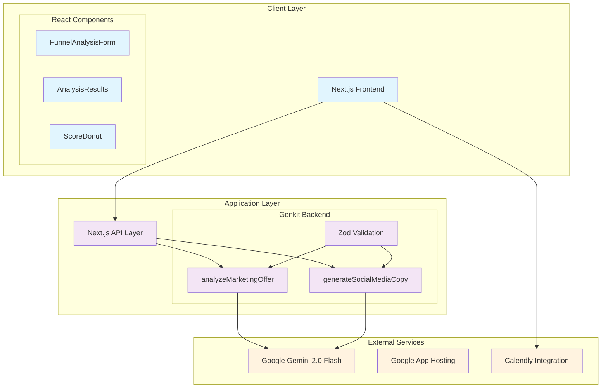
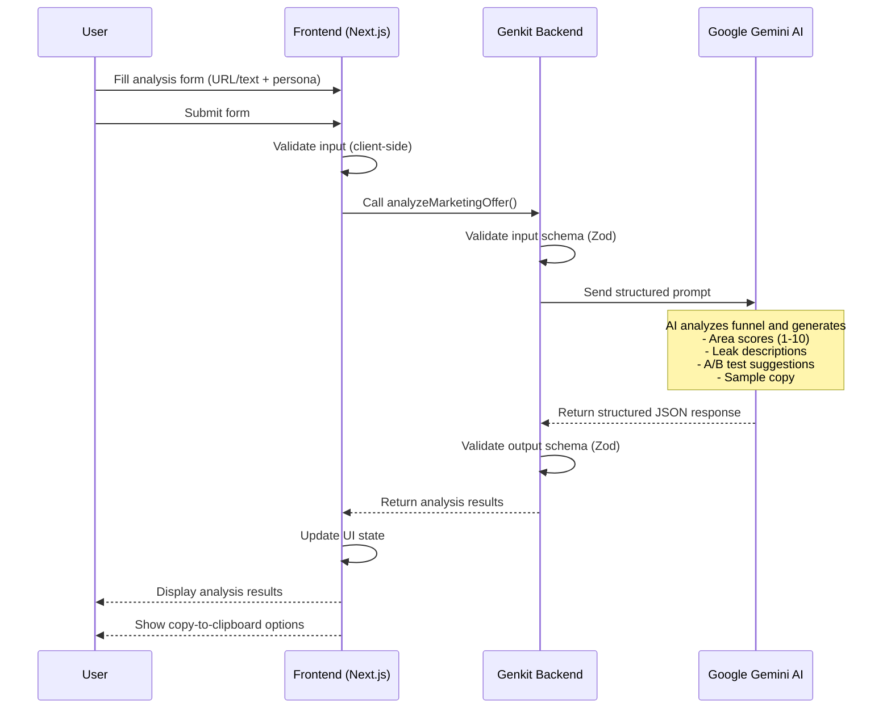
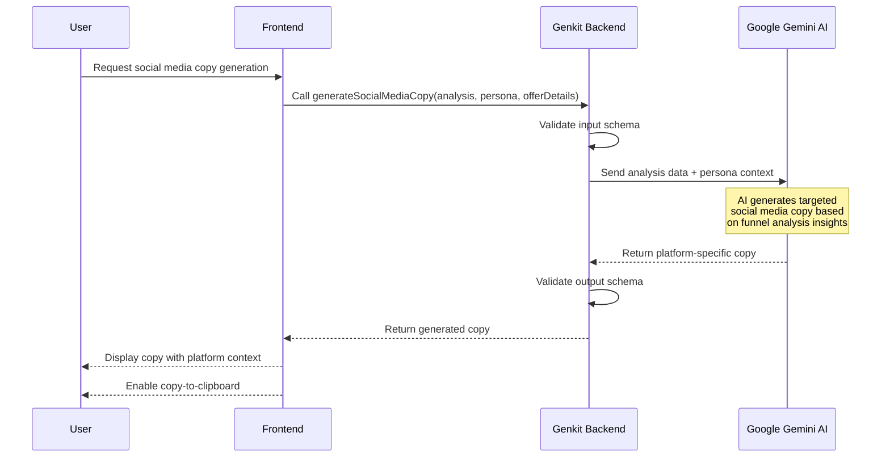
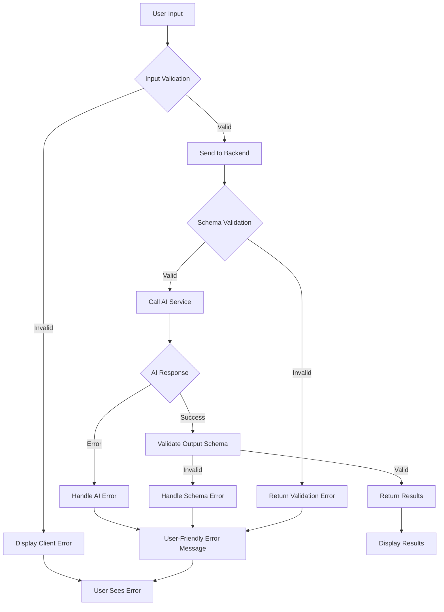
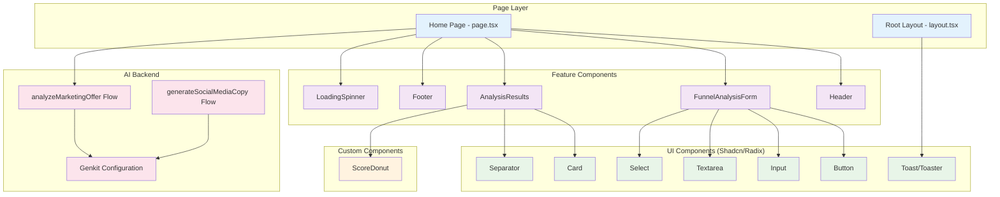
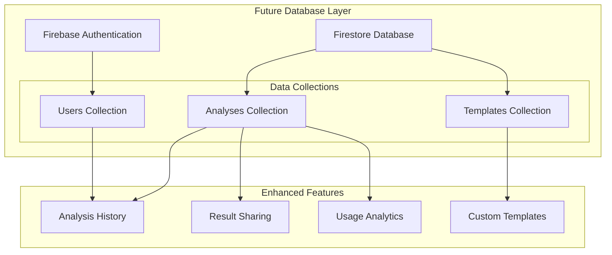
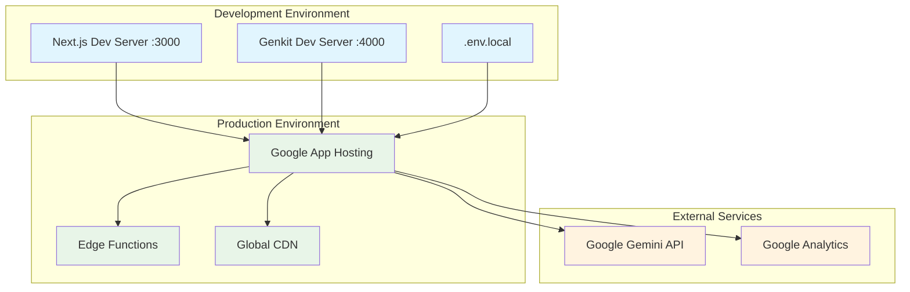

# Funnel Flow: Architectural Document

## 1. High-Level Application Overview and Purpose

**Funnel Flow** is an AI-powered marketing funnel analysis and optimization platform designed to help marketers and business owners identify conversion bottlenecks and improve their marketing funnels. The application leverages Google's Gemini 2.0 Flash AI model to provide intelligent analysis and actionable recommendations.

### Core Value Proposition
- **AI Funnel Analysis**: Identifies key areas of funnel leakage with scored assessments (1-10)
- **A/B Testing Recommendations**: Provides two distinct fix suggestions for each identified leak
- **Social Media Copy Generation**: Creates engaging marketing copy based on analysis insights
- **Persona-Driven Analysis**: Tailors recommendations to specific target audience personas

### Target Users
- Marketing professionals
- SaaS founders
- E-commerce business owners
- Digital agencies
- Conversion optimization specialists

---

## 2. Main Components

### 2.1 Frontend (Next.js Client)

The frontend is a React-based single-page application built with Next.js 15, featuring a modern, responsive design with dark theme aesthetics.

**Key Components:**
- **`FunnelAnalysisForm`**: Primary input interface for collecting user data
- **`AnalysisResults`**: Displays AI-generated analysis with visual score indicators
- **`ScoreDonut`**: Custom SVG-based circular progress indicator for scores
- **`Header`** / **`Footer`**: Branding and navigation elements
- **`LoadingSpinner`**: User feedback during AI processing

### 2.2 Backend (Genkit AI Service)

The backend is powered by Google's Genkit framework, providing a TypeScript-based AI orchestration layer with structured input/output schemas.

**Core AI Flows:**
- **`analyzeMarketingOffer`**: Main analysis engine for funnel evaluation
- **`generateSocialMediaCopy`**: Secondary flow for content generation (partially implemented)

### 2.3 Database

**Current State:** Stateless architecture with no persistent storage
**Future Roadmap:** 
- Firebase Authentication for user management
- Firestore for analysis history and user preferences
- Potential integration with analytics databases

### 2.4 External Integrations

- **Google AI (Gemini 2.0 Flash)**: Primary AI model for analysis and generation
- **Web Clipboard API**: Client-side copy functionality
- **Google App Hosting**: Deployment platform
- **Calendly**: External booking integration for consultation services

---

## 3. System Architecture Diagram



---

## 4. Key Data Models

### 4.1 Marketing Offer Analysis Models

```typescript
// Input Schema for Marketing Offer Analysis
interface AnalyzeMarketingOfferInput {
  offerDetails: string;     // URL or text description
  inputType: 'link' | 'text';
  persona: string;          // Target audience persona
}

// Individual Analysis Item
interface AnalysisItem {
  id: string;              // Unique identifier
  area: string;            // Analysis area (e.g., "Headline Clarity")
  score: number;           // Score from 1-10
  leak: string;            // Identified funnel weakness
  fix: {
    primarySuggestion: string;    // Suggestion A for A/B test
    abTestSuggestion: string;     // Suggestion B for A/B test
  };
}

// Generated Marketing Copy
interface SampleCopy {
  platform: string;        // e.g., "Instagram Post"
  content: string;         // Generated marketing copy
}

// Complete Analysis Output
interface AnalyzeMarketingOfferOutput {
  analysis: AnalysisItem[];
  sampleCopy: SampleCopy;
}
```

### 4.2 Social Media Copy Generation Models

```typescript
// Input for Social Media Copy Generation
interface GenerateSocialMediaCopyInput {
  analysis: Array<{
    area: string;
    score: number;
    leak: string;
    fix: {
      primarySuggestion: string;
      abTestSuggestion: string;
    };
  }>;
  persona: string;
  offerDetails: string;
}

// Social Media Copy Output
interface GenerateSocialMediaCopyOutput {
  platform: string;
  content: string;
}
```

### 4.3 UI State Models

```typescript
// Frontend Component State
interface FunnelFlowState {
  inputType: 'link' | 'text';
  inputValue: string;
  persona: string;
  results: AnalyzeMarketingOfferOutput | null;
  error: string;
  isPending: boolean;
}
```

---

## 5. Data Model Relationships

```mermaid
erDiagram
    AnalyzeMarketingOfferInput {
        string offerDetails
        enum inputType
        string persona
    }
    
    AnalyzeMarketingOfferOutput {
        AnalysisItem array analysis
        SampleCopy sampleCopy
    }
    
    AnalysisItem {
        string id
        string area
        number score
        string leak
        Fix fix
    }
    
    Fix {
        string primarySuggestion
        string abTestSuggestion
    }
    
    SampleCopy {
        string platform
        string content
    }
    
    GenerateSocialMediaCopyInput {
        AnalysisItem array analysis
        string persona
        string offerDetails
    }
    
    GenerateSocialMediaCopyOutput {
        string platform
        string content
    }
    
    AnalyzeMarketingOfferOutput ||--o{ AnalysisItem : contains
    AnalysisItem ||--|| Fix : has
    AnalyzeMarketingOfferOutput ||--|| SampleCopy : includes
    GenerateSocialMediaCopyInput ||--o{ AnalysisItem : uses
```

---

## 6. Core Workflows

### 6.1 Primary User Analysis Workflow



### 6.2 Social Media Copy Generation Workflow (Future)



### 6.3 Error Handling Workflow



---

## 7. Technology Stack

### 7.1 Frontend Technologies

| Technology | Version | Purpose |
|------------|---------|---------|
| **Next.js** | 15.3.3 | React framework with SSR/SSG capabilities |
| **React** | 18.3.1 | UI library for component-based architecture |
| **TypeScript** | 5.x | Type safety and developer experience |
| **Tailwind CSS** | 3.4.1 | Utility-first CSS framework |
| **Shadcn UI** | Latest | Pre-built accessible components |
| **Radix UI** | 1.x | Headless UI primitives |
| **React Hook Form** | 7.54.2 | Form state management |
| **Zod** | 3.24.2 | Schema validation and type inference |
| **Lucide React** | 0.475.0 | Icon library |
| **Recharts** | 2.15.1 | Data visualization (for future features) |

### 7.2 Backend Technologies

| Technology | Version | Purpose |
|------------|---------|---------|
| **Genkit** | 1.13.0 | Google's AI orchestration framework |
| **@genkit-ai/googleai** | 1.13.0 | Google AI integration plugin |
| **@genkit-ai/next** | 1.13.0 | Next.js integration for Genkit |
| **Firebase** | 11.9.1 | Future authentication and database |
| **Zod** | 3.24.2 | Schema validation for AI flows |
| **TypeScript** | 5.x | Type safety across the stack |

### 7.3 AI and External Services

| Service | Purpose | Integration Method |
|---------|---------|-------------------|
| **Google Gemini 2.0 Flash** | Primary AI model for analysis | Genkit GoogleAI plugin |
| **Google App Hosting** | Deployment platform | Configuration via apphosting.yaml |
| **Calendly** | External consultation booking | Direct link integration |

### 7.4 Development and Build Tools

| Tool | Purpose |
|------|---------|
| **Turbopack** | Next.js build tool for fast development |
| **PostCSS** | CSS processing and optimization |
| **ESLint** | Code linting and quality assurance |
| **Genkit CLI** | AI flow development and testing |

---

## 8. Component Architecture



---

## 9. Security and Configuration

### 9.1 Environment Configuration

```typescript
// Required Environment Variables
{
  GOOGLE_API_KEY: string;  // Google AI API authentication
}
```

### 9.2 Security Considerations

- **API Key Management**: Secure storage of Google AI API keys in environment variables
- **Input Validation**: Comprehensive Zod schema validation on both client and server
- **Type Safety**: End-to-end TypeScript for reduced runtime errors
- **CSP Headers**: Content Security Policy for XSS protection (via Next.js)
- **HTTPS**: Enforced in production via Google App Hosting

---

## 10. Performance and Scalability

### 10.1 Current Performance Features

- **Turbopack**: Fast development builds and HMR
- **React 18**: Concurrent features for better UX
- **Streaming**: Planned implementation for AI responses
- **Client-Side Caching**: React state management for results
- **Lazy Loading**: Dynamic imports for non-critical components

### 10.2 Scalability Considerations

- **Stateless Architecture**: No server-side session state
- **Edge-Ready**: Next.js deployment compatible with edge functions
- **AI Rate Limiting**: Handled by Google AI service quotas
- **Horizontal Scaling**: Google App Hosting auto-scaling capabilities

---

## 11. Future Architecture Evolution

### 11.1 Planned Database Integration



### 11.2 Roadmap Features

1. **User Authentication**: Firebase Auth integration
2. **Analysis History**: Persistent storage of user analyses
3. **Custom Personas**: User-defined target audience profiles
4. **Advanced Visualizations**: Enhanced data presentation
5. **Streaming Responses**: Real-time AI response delivery
6. **API Endpoints**: RESTful API for third-party integrations
7. **White-label Solutions**: Customizable branding options

---

## 12. Deployment Architecture



---

## 13. Conclusion

Funnel Flow represents a modern, AI-first architecture that prioritizes:

- **Type Safety**: End-to-end TypeScript with Zod validation
- **Developer Experience**: Hot reloading, comprehensive tooling
- **User Experience**: Fast, responsive interface with immediate feedback
- **Scalability**: Stateless design ready for horizontal scaling
- **Maintainability**: Clear separation of concerns and modular architecture
- **Extensibility**: Plugin-based AI framework for future enhancements

The architecture is designed to evolve seamlessly from the current MVP to a full-featured SaaS platform while maintaining code quality and performance standards.
