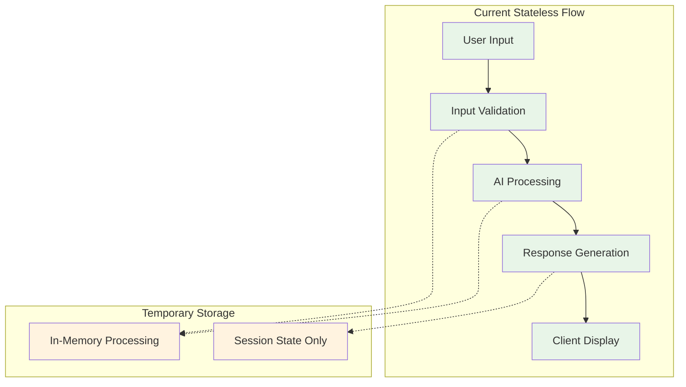
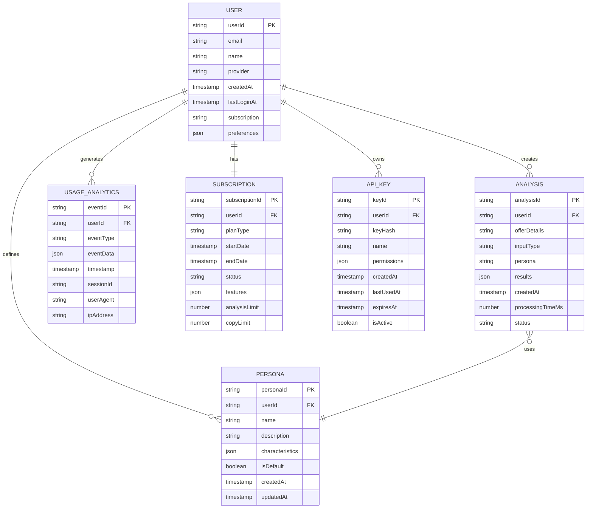

# Database Design: Funnel Flow

## Table of Contents
1. [Database Overview](#database-overview)
2. [Current Architecture](#current-architecture)
3. [Future Database Design](#future-database-design)
4. [Entity Relationship Model](#entity-relationship-model)
5. [Schema Design](#schema-design)
6. [Data Access Patterns](#data-access-patterns)
7. [Performance Optimization](#performance-optimization)
8. [Security & Privacy](#security--privacy)
9. [Migration Strategy](#migration-strategy)
10. [Backup & Recovery](#backup--recovery)
11. [Monitoring & Maintenance](#monitoring--maintenance)

---

## Database Overview

### Current State: Stateless Architecture

Funnel Flow currently operates as a **stateless application** with no persistent data storage. This design choice prioritizes:

- **Privacy**: No user data retention
- **Simplicity**: Reduced operational complexity
- **Scalability**: Easy horizontal scaling
- **Compliance**: Minimal data protection requirements

### Future State: Hybrid Architecture

The planned evolution introduces selective data persistence to enable:

- **User Accounts**: Authentication and personalization
- **Analysis History**: Previous analysis storage and trends
- **Usage Analytics**: Business intelligence and optimization
- **Custom Personas**: User-defined audience segments

---

## Current Architecture

### Stateless Data Flow



### Current Data Handling

```typescript
interface CurrentDataFlow {
  input: {
    storage: 'memory_only';
    lifetime: 'request_duration';
    encryption: 'https_in_transit';
    location: 'processing_instance';
  };
  
  processing: {
    storage: 'genkit_runtime';
    lifetime: 'ai_request_duration';
    encryption: 'google_ai_encryption';
    location: 'google_cloud_ai';
  };
  
  output: {
    storage: 'response_object';
    lifetime: 'client_session';
    encryption: 'https_in_transit';
    location: 'client_browser';
  };
  
  logs: {
    storage: 'google_cloud_logging';
    lifetime: '30_days';
    encryption: 'google_cloud_encryption';
    location: 'us_central1';
  };
}
```

---

## Future Database Design

### Database Selection Criteria

```typescript
interface DatabaseRequirements {
  scalability: {
    requirement: 'Handle 10x growth (50k+ users)';
    solution: 'Horizontal scaling capability';
    technology: 'Cloud-native database';
  };
  
  consistency: {
    requirement: 'Eventual consistency acceptable';
    solution: 'NoSQL or NewSQL database';
    technology: 'Multi-region replication';
  };
  
  availability: {
    requirement: '99.9% uptime';
    solution: 'Multi-AZ deployment';
    technology: 'Automatic failover';
  };
  
  performance: {
    requirement: '<100ms query response';
    solution: 'Optimized for read-heavy workloads';
    technology: 'Read replicas and caching';
  };
  
  integration: {
    requirement: 'Google Cloud ecosystem';
    solution: 'Native Google Cloud service';
    technology: 'Firestore or Cloud SQL';
  };
}
```

### Recommended Technology Stack

#### Primary Database: Cloud Firestore

```yaml
Why Firestore:
  - Serverless and fully managed
  - Real-time synchronization capabilities
  - Automatic scaling
  - Strong Google Cloud integration
  - Document-based for flexible schemas
  - Built-in security rules
  - Offline capability for future mobile apps

Technical Specifications:
  - Document/Collection model
  - Strong consistency within regions
  - Eventual consistency across regions
  - Automatic multi-region replication
  - Real-time listeners for live updates
  - Integrated with Firebase Auth
```

#### Alternative: Cloud SQL (PostgreSQL)

```yaml
Why Cloud SQL (PostgreSQL):
  - ACID compliance for critical data
  - Complex query capabilities
  - Strong consistency guarantees
  - Mature ecosystem and tooling
  - JSON support for flexible schemas
  - Advanced indexing options

Use Cases:
  - Financial/billing data
  - Audit trails
  - Complex analytical queries
  - Regulatory compliance requirements
```

---

## Entity Relationship Model

### Conceptual Data Model



### Logical Data Model

#### Document Structure (Firestore)

```typescript
interface UserDocument {
  userId: string;                 // Document ID
  email: string;
  name: string;
  authProvider: 'google' | 'github' | 'microsoft';
  profileImage?: string;
  createdAt: FirebaseFirestore.Timestamp;
  lastLoginAt: FirebaseFirestore.Timestamp;
  subscription: {
    planType: 'free' | 'pro' | 'enterprise';
    startDate: FirebaseFirestore.Timestamp;
    endDate?: FirebaseFirestore.Timestamp;
    status: 'active' | 'cancelled' | 'expired';
    features: string[];
  };
  preferences: {
    defaultPersona: string;
    emailNotifications: boolean;
    analyticsOptOut: boolean;
    theme: 'dark' | 'light' | 'system';
  };
  metadata: {
    totalAnalyses: number;
    totalCopyGenerations: number;
    lastAnalysisAt?: FirebaseFirestore.Timestamp;
  };
}
```

```typescript
interface AnalysisDocument {
  analysisId: string;             // Document ID
  userId: string;
  input: {
    offerDetails: string;
    inputType: 'link' | 'text';
    persona: string;
    customPersonaId?: string;
  };
  results: {
    analysis: AnalysisItem[];
    sampleCopy: SampleCopy;
    confidence: number;
    processingTimeMs: number;
  };
  metadata: {
    createdAt: FirebaseFirestore.Timestamp;
    status: 'processing' | 'completed' | 'failed';
    aiModel: string;
    version: string;
    requestId: string;
  };
  sharing?: {
    isPublic: boolean;
    shareToken?: string;
    sharedAt?: FirebaseFirestore.Timestamp;
  };
}
```

```typescript
interface PersonaDocument {
  personaId: string;              // Document ID
  userId: string;
  name: string;
  description: string;
  characteristics: {
    demographics: {
      ageRange: string;
      occupation: string;
      income: string;
    };
    psychographics: {
      values: string[];
      interests: string[];
      challenges: string[];
    };
    behavior: {
      decisionMaking: string;
      mediaConsumption: string[];
      purchasingTriggers: string[];
    };
  };
  metadata: {
    isDefault: boolean;
    createdAt: FirebaseFirestore.Timestamp;
    updatedAt: FirebaseFirestore.Timestamp;
    usageCount: number;
    lastUsedAt?: FirebaseFirestore.Timestamp;
  };
}
```

---

## Schema Design

### Database Schema (Firestore Collections)

#### Collection Structure

```yaml
Root Collections:
  /users/{userId}
    - User profile and account information
    - Subscription details
    - Preferences and settings
  
  /users/{userId}/analyses/{analysisId}
    - User's analysis history (subcollection)
    - Input data and results
    - Metadata and sharing info
  
  /users/{userId}/personas/{personaId}
    - Custom personas (subcollection)
    - Persona characteristics
    - Usage statistics
  
  /users/{userId}/apiKeys/{keyId}
    - API keys for programmatic access
    - Permissions and usage tracking
  
  /analytics/{eventId}
    - Global usage analytics
    - Aggregated metrics
    - Performance data
  
  /system/{documentType}
    - System configuration
    - Feature flags
    - Global settings
```

#### Firestore Security Rules

```javascript
rules_version = '2';
service cloud.firestore {
  match /databases/{database}/documents {
    // Users can only access their own data
    match /users/{userId} {
      allow read, write: if request.auth != null && request.auth.uid == userId;
      
      // User's analyses
      match /analyses/{analysisId} {
        allow read, write: if request.auth != null && request.auth.uid == userId;
        allow read: if resource.data.sharing.isPublic == true;
      }
      
      // User's custom personas
      match /personas/{personaId} {
        allow read, write: if request.auth != null && request.auth.uid == userId;
      }
      
      // User's API keys
      match /apiKeys/{keyId} {
        allow read, write: if request.auth != null && request.auth.uid == userId;
      }
    }
    
    // Global analytics (admin only)
    match /analytics/{eventId} {
      allow read, write: if request.auth != null && 
        get(/databases/$(database)/documents/users/$(request.auth.uid)).data.role == 'admin';
    }
    
    // System configuration (admin only)
    match /system/{document} {
      allow read: if request.auth != null;
      allow write: if request.auth != null && 
        get(/databases/$(database)/documents/users/$(request.auth.uid)).data.role == 'admin';
    }
  }
}
```

### Data Validation Schema

```typescript
import { z } from 'zod';

// User validation schema
const UserSchema = z.object({
  userId: z.string().uuid(),
  email: z.string().email(),
  name: z.string().min(1).max(100),
  authProvider: z.enum(['google', 'github', 'microsoft']),
  profileImage: z.string().url().optional(),
  subscription: z.object({
    planType: z.enum(['free', 'pro', 'enterprise']),
    status: z.enum(['active', 'cancelled', 'expired']),
    features: z.array(z.string())
  }),
  preferences: z.object({
    defaultPersona: z.string(),
    emailNotifications: z.boolean(),
    analyticsOptOut: z.boolean(),
    theme: z.enum(['dark', 'light', 'system'])
  })
});

// Analysis validation schema
const AnalysisSchema = z.object({
  analysisId: z.string().uuid(),
  userId: z.string().uuid(),
  input: z.object({
    offerDetails: z.string().min(10).max(2000),
    inputType: z.enum(['link', 'text']),
    persona: z.string().min(1),
    customPersonaId: z.string().uuid().optional()
  }),
  results: z.object({
    analysis: z.array(AnalysisItemSchema),
    sampleCopy: SampleCopySchema,
    confidence: z.number().min(0).max(1),
    processingTimeMs: z.number().positive()
  }),
  metadata: z.object({
    status: z.enum(['processing', 'completed', 'failed']),
    aiModel: z.string(),
    version: z.string(),
    requestId: z.string().uuid()
  })
});

// Custom persona validation schema
const PersonaSchema = z.object({
  personaId: z.string().uuid(),
  userId: z.string().uuid(),
  name: z.string().min(1).max(100),
  description: z.string().min(10).max(500),
  characteristics: z.object({
    demographics: z.object({
      ageRange: z.string(),
      occupation: z.string(),
      income: z.string()
    }),
    psychographics: z.object({
      values: z.array(z.string()),
      interests: z.array(z.string()),
      challenges: z.array(z.string())
    }),
    behavior: z.object({
      decisionMaking: z.string(),
      mediaConsumption: z.array(z.string()),
      purchasingTriggers: z.array(z.string())
    })
  })
});
```

---

## Data Access Patterns

### Query Patterns

#### User Data Queries

```typescript
class UserRepository {
  // Get user profile
  async getUser(userId: string): Promise<UserDocument | null> {
    const userDoc = await this.firestore
      .collection('users')
      .doc(userId)
      .get();
    
    return userDoc.exists ? userDoc.data() as UserDocument : null;
  }
  
  // Update user preferences
  async updateUserPreferences(userId: string, preferences: Partial<UserPreferences>): Promise<void> {
    await this.firestore
      .collection('users')
      .doc(userId)
      .update({ 
        preferences: preferences,
        'metadata.updatedAt': FieldValue.serverTimestamp()
      });
  }
  
  // Get user subscription info
  async getUserSubscription(userId: string): Promise<Subscription | null> {
    const userDoc = await this.getUser(userId);
    return userDoc?.subscription || null;
  }
}
```

#### Analysis History Queries

```typescript
class AnalysisRepository {
  // Get user's analysis history with pagination
  async getUserAnalyses(
    userId: string, 
    limit: number = 20, 
    startAfter?: string
  ): Promise<AnalysisDocument[]> {
    let query = this.firestore
      .collection('users')
      .doc(userId)
      .collection('analyses')
      .orderBy('metadata.createdAt', 'desc')
      .limit(limit);
    
    if (startAfter) {
      const startAfterDoc = await this.firestore
        .collection('users')
        .doc(userId)
        .collection('analyses')
        .doc(startAfter)
        .get();
      
      query = query.startAfter(startAfterDoc);
    }
    
    const snapshot = await query.get();
    return snapshot.docs.map(doc => doc.data() as AnalysisDocument);
  }
  
  // Search analyses by persona
  async getAnalysesByPersona(userId: string, persona: string): Promise<AnalysisDocument[]> {
    const snapshot = await this.firestore
      .collection('users')
      .doc(userId)
      .collection('analyses')
      .where('input.persona', '==', persona)
      .orderBy('metadata.createdAt', 'desc')
      .limit(50)
      .get();
    
    return snapshot.docs.map(doc => doc.data() as AnalysisDocument);
  }
  
  // Get analysis trends (aggregated data)
  async getAnalysisTrends(userId: string, days: number = 30): Promise<AnalysisTrends> {
    const since = new Date();
    since.setDate(since.getDate() - days);
    
    const snapshot = await this.firestore
      .collection('users')
      .doc(userId)
      .collection('analyses')
      .where('metadata.createdAt', '>=', Timestamp.fromDate(since))
      .get();
    
    const analyses = snapshot.docs.map(doc => doc.data() as AnalysisDocument);
    
    return this.calculateTrends(analyses);
  }
}
```

#### Custom Personas Queries

```typescript
class PersonaRepository {
  // Get user's custom personas
  async getUserPersonas(userId: string): Promise<PersonaDocument[]> {
    const snapshot = await this.firestore
      .collection('users')
      .doc(userId)
      .collection('personas')
      .orderBy('metadata.createdAt', 'desc')
      .get();
    
    return snapshot.docs.map(doc => doc.data() as PersonaDocument);
  }
  
  // Get most used personas
  async getMostUsedPersonas(userId: string, limit: number = 5): Promise<PersonaDocument[]> {
    const snapshot = await this.firestore
      .collection('users')
      .doc(userId)
      .collection('personas')
      .orderBy('metadata.usageCount', 'desc')
      .limit(limit)
      .get();
    
    return snapshot.docs.map(doc => doc.data() as PersonaDocument);
  }
  
  // Update persona usage
  async incrementPersonaUsage(userId: string, personaId: string): Promise<void> {
    await this.firestore
      .collection('users')
      .doc(userId)
      .collection('personas')
      .doc(personaId)
      .update({
        'metadata.usageCount': FieldValue.increment(1),
        'metadata.lastUsedAt': FieldValue.serverTimestamp()
      });
  }
}
```

### Caching Strategy

```typescript
interface CachingStrategy {
  userProfiles: {
    cache: 'Redis';
    ttl: '1 hour';
    invalidation: 'on_update';
    pattern: 'user:{userId}:profile';
  };
  
  analysisHistory: {
    cache: 'Application memory';
    ttl: '15 minutes';
    invalidation: 'on_new_analysis';
    pattern: 'user:{userId}:analyses:page:{page}';
  };
  
  customPersonas: {
    cache: 'Redis';
    ttl: '30 minutes';
    invalidation: 'on_persona_change';
    pattern: 'user:{userId}:personas';
  };
  
  aggregatedMetrics: {
    cache: 'Redis';
    ttl: '6 hours';
    invalidation: 'scheduled_refresh';
    pattern: 'analytics:{metric}:{timeframe}';
  };
}
```

---

## Performance Optimization

### Indexing Strategy

#### Firestore Composite Indexes

```yaml
Required Composite Indexes:
  - Collection: users/{userId}/analyses
    Fields:
      - metadata.createdAt (Descending)
      - metadata.status (Ascending)
    
  - Collection: users/{userId}/analyses
    Fields:
      - input.persona (Ascending)
      - metadata.createdAt (Descending)
    
  - Collection: users/{userId}/personas
    Fields:
      - metadata.usageCount (Descending)
      - metadata.createdAt (Descending)
    
  - Collection: analytics
    Fields:
      - timestamp (Descending)
      - eventType (Ascending)
      - userId (Ascending)
```

#### Query Optimization

```typescript
class OptimizedQueries {
  // Efficient pagination with cursor-based approach
  async getPaginatedAnalyses(
    userId: string,
    pageSize: number = 20,
    cursor?: FirebaseFirestore.DocumentSnapshot
  ): Promise<{ analyses: AnalysisDocument[], nextCursor?: FirebaseFirestore.DocumentSnapshot }> {
    let query = this.firestore
      .collection('users')
      .doc(userId)
      .collection('analyses')
      .orderBy('metadata.createdAt', 'desc')
      .limit(pageSize);
    
    if (cursor) {
      query = query.startAfter(cursor);
    }
    
    const snapshot = await query.get();
    const analyses = snapshot.docs.map(doc => doc.data() as AnalysisDocument);
    const nextCursor = snapshot.docs.length === pageSize ? snapshot.docs[snapshot.docs.length - 1] : undefined;
    
    return { analyses, nextCursor };
  }
  
  // Batch read for multiple documents
  async getBatchAnalyses(userId: string, analysisIds: string[]): Promise<AnalysisDocument[]> {
    const batch = this.firestore.batch();
    const refs = analysisIds.map(id => 
      this.firestore.collection('users').doc(userId).collection('analyses').doc(id)
    );
    
    const snapshots = await Promise.all(refs.map(ref => ref.get()));
    return snapshots
      .filter(snap => snap.exists)
      .map(snap => snap.data() as AnalysisDocument);
  }
}
```

### Performance Monitoring

```typescript
interface DatabasePerformanceMetrics {
  queryLatency: {
    target: '<100ms p95';
    monitoring: 'Cloud Monitoring + custom metrics';
    alerting: '>200ms p95 for 5 minutes';
  };
  
  throughput: {
    target: '1000 ops/second sustained';
    monitoring: 'Firestore metrics';
    alerting: 'approaching quota limits';
  };
  
  cacheHitRate: {
    target: '>80% for user data';
    monitoring: 'Redis metrics';
    alerting: '<70% hit rate';
  };
  
  indexUsage: {
    target: 'all queries use indexes';
    monitoring: 'Firestore query profiling';
    alerting: 'composite index missing';
  };
}
```

---

## Security & Privacy

### Data Security Framework

#### Encryption Strategy

```typescript
interface DataEncryption {
  atRest: {
    database: 'Google Cloud encryption (AES-256)';
    backups: 'Google Cloud encryption (AES-256)';
    logs: 'Google Cloud encryption (AES-256)';
  };
  
  inTransit: {
    clientToServer: 'TLS 1.3';
    serverToDatabase: 'Google Cloud internal encryption';
    backupReplication: 'Google Cloud encryption';
  };
  
  applicationLevel: {
    sensitiveFields: 'Field-level encryption for PII';
    apiKeys: 'One-way hashing with salt';
    userPasswords: 'Not stored (OAuth only)';
  };
}
```

#### Data Access Controls

```typescript
class DataAccessControl {
  // User data access validation
  async validateUserAccess(requestingUserId: string, targetUserId: string): Promise<boolean> {
    // Users can only access their own data
    if (requestingUserId === targetUserId) {
      return true;
    }
    
    // Check for admin access
    const requestingUser = await this.getUserRole(requestingUserId);
    return requestingUser?.role === 'admin';
  }
  
  // Analysis sharing validation
  async validateAnalysisAccess(
    requestingUserId: string, 
    analysisUserId: string, 
    analysisId: string
  ): Promise<boolean> {
    // Owner can always access
    if (requestingUserId === analysisUserId) {
      return true;
    }
    
    // Check if analysis is publicly shared
    const analysis = await this.getAnalysis(analysisUserId, analysisId);
    return analysis?.sharing?.isPublic === true;
  }
  
  // API key validation
  async validateApiKeyAccess(apiKey: string, requiredPermissions: string[]): Promise<boolean> {
    const keyDoc = await this.getApiKeyByHash(this.hashApiKey(apiKey));
    
    if (!keyDoc || !keyDoc.isActive || keyDoc.expiresAt < new Date()) {
      return false;
    }
    
    return requiredPermissions.every(permission => 
      keyDoc.permissions.includes(permission)
    );
  }
}
```

### Privacy Implementation

#### GDPR Compliance Framework

```typescript
class GDPRCompliance {
  // Right to access (Article 15)
  async exportUserData(userId: string): Promise<UserDataExport> {
    const [user, analyses, personas, analytics] = await Promise.all([
      this.userRepo.getUser(userId),
      this.analysisRepo.getAllUserAnalyses(userId),
      this.personaRepo.getUserPersonas(userId),
      this.analyticsRepo.getUserAnalytics(userId)
    ]);
    
    return {
      exportedAt: new Date().toISOString(),
      userData: user,
      analysisHistory: analyses,
      customPersonas: personas,
      usageAnalytics: analytics
    };
  }
  
  // Right to rectification (Article 16)
  async updateUserData(userId: string, updates: UserDataUpdate): Promise<void> {
    // Validate updates
    const validatedUpdates = UserUpdateSchema.parse(updates);
    
    // Apply updates
    await this.userRepo.updateUser(userId, validatedUpdates);
    
    // Log data modification
    await this.auditRepo.logDataModification(userId, 'update', updates);
  }
  
  // Right to erasure (Article 17)
  async deleteUserData(userId: string): Promise<void> {
    const batch = this.firestore.batch();
    
    // Delete user document and all subcollections
    await this.deleteUserAndSubcollections(userId, batch);
    
    // Anonymize analytics data
    await this.anonymizeUserAnalytics(userId);
    
    // Execute batch deletion
    await batch.commit();
    
    // Log deletion
    await this.auditRepo.logDataDeletion(userId);
  }
  
  // Right to data portability (Article 20)
  async exportPortableData(userId: string, format: 'json' | 'csv'): Promise<PortableDataExport> {
    const userData = await this.exportUserData(userId);
    
    if (format === 'csv') {
      return this.convertToCSV(userData);
    }
    
    return {
      format: 'json',
      data: userData,
      machineReadable: true
    };
  }
}
```

---

## Migration Strategy

### Phase 1: Database Setup (Month 1)

```yaml
Week 1: Infrastructure Setup
  - Set up Firestore database
  - Configure security rules
  - Set up development/staging environments
  - Implement basic user authentication

Week 2: Core Schema Implementation
  - Create user collection structure
  - Implement user registration/profile
  - Set up basic CRUD operations
  - Add input validation

Week 3: Authentication Integration
  - Integrate Firebase Auth
  - Implement OAuth providers (Google, GitHub)
  - Add JWT token management
  - Create user session handling

Week 4: Testing & Validation
  - End-to-end testing of auth flow
  - Performance testing of database operations
  - Security testing of access controls
  - Load testing with concurrent users
```

### Phase 2: Analysis History (Month 2)

```yaml
Week 1: Analysis Storage
  - Implement analysis document schema
  - Create analysis save/retrieve operations
  - Add analysis history pagination
  - Implement search functionality

Week 2: Data Migration
  - Create migration scripts for existing users
  - Implement backward compatibility
  - Add feature flags for gradual rollout
  - Monitor migration performance

Week 3: UI Integration
  - Add analysis history interface
  - Implement history search and filtering
  - Add analysis sharing functionality
  - Create export capabilities

Week 4: Performance Optimization
  - Optimize database queries
  - Implement caching layer
  - Add performance monitoring
  - Conduct load testing
```

### Phase 3: Advanced Features (Month 3)

```yaml
Week 1: Custom Personas
  - Implement persona schema
  - Create persona management UI
  - Add persona templates
  - Implement persona analytics

Week 2: Analytics & Insights
  - Implement usage analytics collection
  - Create analytics dashboard
  - Add trend analysis
  - Implement reporting features

Week 3: API Keys & Integration
  - Implement API key management
  - Create API documentation
  - Add rate limiting per user
  - Implement webhook system

Week 4: Enterprise Features
  - Add team/organization support
  - Implement role-based access
  - Create admin dashboard
  - Add billing integration
```

### Migration Scripts

```typescript
class DatabaseMigration {
  // Migration from stateless to stateful
  async migrateToDatabase(): Promise<void> {
    console.log('Starting database migration...');
    
    // Phase 1: Create initial schema
    await this.createInitialSchema();
    
    // Phase 2: Migrate existing user sessions (if any)
    await this.migrateUserSessions();
    
    // Phase 3: Set up default personas
    await this.createDefaultPersonas();
    
    // Phase 4: Initialize system configuration
    await this.initializeSystemConfig();
    
    console.log('Database migration completed');
  }
  
  // Schema versioning for future migrations
  async runMigration(fromVersion: string, toVersion: string): Promise<void> {
    const migrations = this.getMigrationPath(fromVersion, toVersion);
    
    for (const migration of migrations) {
      try {
        await migration.execute();
        await this.updateSchemaVersion(migration.version);
      } catch (error) {
        await migration.rollback();
        throw new Error(`Migration failed: ${migration.version}`);
      }
    }
  }
}
```

---

## Backup & Recovery

### Backup Strategy

#### Automated Backup Configuration

```yaml
Firestore Backup:
  frequency: "Daily at 2:00 AM UTC"
  retention: "30 days for daily, 12 months for monthly"
  location: "Multi-region (us-central1, us-east1)"
  encryption: "Google Cloud encryption"
  
Point-in-Time Recovery:
  enabled: true
  retention: "7 days"
  granularity: "Per collection"
  
Export Strategy:
  format: "Firestore export format"
  destination: "Cloud Storage bucket"
  compression: "gzip"
  validation: "Checksum verification"
```

#### Backup Monitoring

```typescript
class BackupMonitoring {
  // Monitor backup health
  async checkBackupHealth(): Promise<BackupHealthReport> {
    const latestBackup = await this.getLatestBackup();
    const backupAge = Date.now() - latestBackup.createdAt.getTime();
    
    return {
      status: backupAge < 25 * 60 * 60 * 1000 ? 'healthy' : 'unhealthy', // 25 hours
      lastBackupTime: latestBackup.createdAt,
      backupSize: latestBackup.sizeBytes,
      success: latestBackup.status === 'completed',
      nextScheduledBackup: this.getNextBackupTime()
    };
  }
  
  // Validate backup integrity
  async validateBackupIntegrity(backupId: string): Promise<boolean> {
    try {
      const backup = await this.getBackup(backupId);
      const checksumValid = await this.validateChecksum(backup);
      const dataIntegrity = await this.validateDataIntegrity(backup);
      
      return checksumValid && dataIntegrity;
    } catch (error) {
      console.error('Backup validation failed:', error);
      return false;
    }
  }
}
```

### Disaster Recovery Procedures

#### Recovery Time Objectives

```typescript
interface RecoveryObjectives {
  userAccounts: {
    rto: '1 hour';          // Recovery Time Objective
    rpo: '1 hour';          // Recovery Point Objective
    priority: 'critical';
  };
  
  analysisHistory: {
    rto: '4 hours';
    rpo: '24 hours';
    priority: 'high';
  };
  
  customPersonas: {
    rto: '4 hours';
    rpo: '24 hours';
    priority: 'medium';
  };
  
  analyticsData: {
    rto: '24 hours';
    rpo: '24 hours';
    priority: 'low';
  };
}
```

#### Recovery Procedures

```typescript
class DisasterRecovery {
  // Complete database restoration
  async restoreDatabase(backupId: string, targetInstance: string): Promise<void> {
    console.log(`Starting database restore from backup: ${backupId}`);
    
    try {
      // 1. Validate backup integrity
      const isValid = await this.validateBackupIntegrity(backupId);
      if (!isValid) {
        throw new Error('Backup integrity validation failed');
      }
      
      // 2. Prepare target environment
      await this.prepareTargetEnvironment(targetInstance);
      
      // 3. Restore data
      await this.restoreFromBackup(backupId, targetInstance);
      
      // 4. Verify restoration
      await this.verifyRestoredData(targetInstance);
      
      // 5. Update DNS and routing (if needed)
      await this.updateRouting(targetInstance);
      
      console.log('Database restore completed successfully');
    } catch (error) {
      console.error('Database restore failed:', error);
      await this.rollbackRestore(targetInstance);
      throw error;
    }
  }
  
  // Partial collection restore
  async restoreCollection(
    collectionPath: string, 
    backupId: string, 
    targetTimestamp?: Date
  ): Promise<void> {
    // Point-in-time recovery for specific collection
    await this.restoreCollectionFromBackup(collectionPath, backupId, targetTimestamp);
    
    // Rebuild indexes
    await this.rebuildCollectionIndexes(collectionPath);
    
    // Verify data consistency
    await this.verifyCollectionData(collectionPath);
  }
}
```

---

## Monitoring & Maintenance

### Database Monitoring

#### Key Performance Indicators

```typescript
interface DatabaseKPIs {
  performance: {
    queryLatency: {
      target: '<100ms p95';
      current: '45ms p95';
      trend: 'stable';
    };
    
    throughput: {
      target: '1000 ops/second';
      current: '150 ops/second';
      trend: 'growing';
    };
    
    cacheHitRate: {
      target: '>85%';
      current: '92%';
      trend: 'stable';
    };
  };
  
  reliability: {
    availability: {
      target: '99.9%';
      current: '99.97%';
      trend: 'stable';
    };
    
    errorRate: {
      target: '<0.1%';
      current: '0.02%';
      trend: 'stable';
    };
  };
  
  capacity: {
    storageUsage: {
      current: '2.5 GB';
      growth: '100 MB/month';
      nextAlert: '5 GB (20 months)';
    };
    
    readQuota: {
      current: '15k reads/day';
      limit: '50k reads/day';
      utilization: '30%';
    };
    
    writeQuota: {
      current: '5k writes/day';
      limit: '20k writes/day';
      utilization: '25%';
    };
  };
}
```

#### Monitoring Dashboard

```yaml
Database Health Dashboard:
  - Query performance metrics
  - Error rate trends
  - Storage utilization
  - Index usage statistics
  - Backup status
  - Security audit events

Real-time Alerts:
  - Query latency > 200ms p95
  - Error rate > 1%
  - Storage usage > 80%
  - Failed backup operations
  - Security rule violations
  - Quota limit approaching (80%)

Weekly Reports:
  - Performance trends
  - Capacity planning
  - Index optimization suggestions
  - Security audit summary
  - Cost analysis
```

### Maintenance Procedures

#### Regular Maintenance Tasks

```typescript
class DatabaseMaintenance {
  // Daily maintenance tasks
  async performDailyMaintenance(): Promise<void> {
    await Promise.all([
      this.checkBackupStatus(),
      this.monitorQueryPerformance(),
      this.reviewErrorLogs(),
      this.checkSecurityAlerts(),
      this.validateDataIntegrity()
    ]);
  }
  
  // Weekly maintenance tasks
  async performWeeklyMaintenance(): Promise<void> {
    await Promise.all([
      this.analyzeIndexUsage(),
      this.optimizeQueries(),
      this.reviewStorageUsage(),
      this.updateSecurityRules(),
      this.performDataCleanup()
    ]);
  }
  
  // Monthly maintenance tasks
  async performMonthlyMaintenance(): Promise<void> {
    await Promise.all([
      this.capacityPlanningReview(),
      this.securityAudit(),
      this.performanceOptimization(),
      this.backupRetentionCleanup(),
      this.costOptimizationReview()
    ]);
  }
  
  // Index optimization
  async optimizeIndexes(): Promise<void> {
    const indexStats = await this.getIndexUsageStats();
    
    // Identify unused indexes
    const unusedIndexes = indexStats.filter(index => 
      index.usageCount < 10 && index.ageInDays > 30
    );
    
    // Suggest index removals
    for (const index of unusedIndexes) {
      console.log(`Consider removing unused index: ${index.name}`);
    }
    
    // Identify missing indexes
    const slowQueries = await this.getSlowQueries();
    for (const query of slowQueries) {
      if (!query.usesIndex) {
        console.log(`Consider adding index for query: ${query.pattern}`);
      }
    }
  }
}
```

---

*This database design document provides a comprehensive foundation for Funnel Flow's data architecture evolution from stateless to stateful, ensuring scalability, security, and maintainability as the platform grows.* 