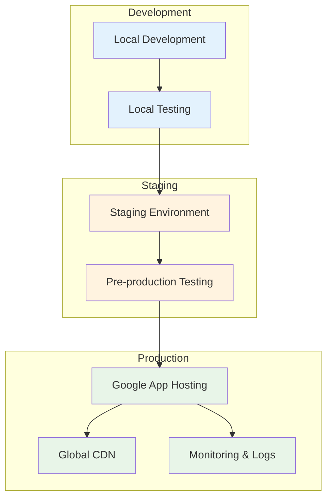

# Deployment Guide: Funnel Flow

## Table of Contents
1. [Overview](#overview)
2. [Prerequisites](#prerequisites)
3. [Environment Setup](#environment-setup)
4. [Local Deployment Testing](#local-deployment-testing)
5. [Production Deployment](#production-deployment)
6. [Post-Deployment Verification](#post-deployment-verification)
7. [Monitoring & Maintenance](#monitoring--maintenance)
8. [Rollback Procedures](#rollback-procedures)
9. [Troubleshooting](#troubleshooting)

---

## Overview

This guide covers the complete deployment process for Funnel Flow, from local testing to production deployment on Google App Hosting. The application uses a modern Next.js frontend with a Genkit AI backend, deployed as a unified application.

### Deployment Architecture



### Technology Stack Summary
- **Frontend**: Next.js 15 with React 18
- **Backend**: Genkit with Google AI integration
- **Runtime**: Node.js 20+
- **Deployment Platform**: Google App Hosting
- **Build Tool**: Turbopack (Next.js integrated)

---

## Prerequisites

### Required Accounts & Services

#### Google Cloud Platform
```bash
# Create or verify Google Cloud account
# Enable required APIs:
# - App Hosting API
# - Cloud Build API
# - Artifact Registry API
# - Cloud Run API
```

#### Required Tools Installation

```bash
# 1. Node.js (version 20 or higher)
node --version  # Should be >= 20.0.0
npm --version   # Should be >= 9.0.0

# 2. Google Cloud CLI
gcloud --version

# 3. Git
git --version

# 4. Firebase CLI (for App Hosting)
npm install -g firebase-tools
firebase --version
```

### API Keys & Credentials

#### Google AI API Key
1. Visit [Google AI Studio](https://aistudio.google.com/)
2. Create or select a project
3. Generate an API key
4. **Store securely** - you'll need this for deployment

#### Service Account Setup (Optional for advanced deployments)
```bash
# Create service account for deployment
gcloud iam service-accounts create funnel-flow-deploy \
    --description="Service account for Funnel Flow deployment" \
    --display-name="Funnel Flow Deploy"

# Grant necessary permissions
gcloud projects add-iam-policy-binding PROJECT_ID \
    --member="serviceAccount:funnel-flow-deploy@PROJECT_ID.iam.gserviceaccount.com" \
    --role="roles/apphosting.admin"
```

---

## Environment Setup

### 1. Project Configuration

#### Clone and Setup Repository
```bash
# Clone the repository
git clone https://github.com/your-org/funnel-flow.git
cd funnel-flow

# Install dependencies
npm install

# Verify project structure
npm run typecheck
npm run lint
```

#### Environment Variables Configuration

Create environment files for different deployment stages:

**`.env.local` (Local Development)**
```bash
# Development environment
GOOGLE_API_KEY=your_development_api_key_here
NODE_ENV=development
NEXT_TELEMETRY_DISABLED=1

# Optional development settings
DEBUG=true
LOG_LEVEL=debug
```

**`.env.staging` (Staging Environment)**
```bash
# Staging environment
GOOGLE_API_KEY=your_staging_api_key_here
NODE_ENV=staging

# Staging-specific settings
LOG_LEVEL=info
```

**`.env.production` (Production Environment)**
```bash
# Production environment - DO NOT COMMIT THIS FILE
GOOGLE_API_KEY=your_production_api_key_here
NODE_ENV=production

# Production optimizations
NEXT_TELEMETRY_DISABLED=1
LOG_LEVEL=error
```

### 2. Google App Hosting Configuration

#### Configure `apphosting.yaml`
```yaml
# App Hosting configuration for Funnel Flow
runConfig:
  # Runtime configuration
  runtime: nodejs20
  cpu: 1
  memory: 2Gi
  
  # Scaling configuration
  maxInstances: 100
  minInstances: 0
  concurrency: 1000
  
  # Health check configuration
  timeoutSeconds: 300
  checkIntervalSeconds: 240

buildConfig:
  # Build environment
  runtime: nodejs20
  
  # Build commands
  commands:
    - npm ci --omit=dev
    - npm run build
  
  # Output directory
  outputDirectory: .next

# Environment variables (managed via Google Cloud Console)
env:
  - variable: GOOGLE_API_KEY
    secret: google-ai-api-key
  - variable: NODE_ENV
    value: production
  - variable: NEXT_TELEMETRY_DISABLED
    value: "1"
```

### 3. Build Configuration

#### Optimize `next.config.ts` for Production
```typescript
import type {NextConfig} from 'next';

const nextConfig: NextConfig = {
  // Build output configuration
  output: 'standalone',
  
  // Performance optimizations
  compress: true,
  poweredByHeader: false,
  generateEtags: true,
  
  // TypeScript and ESLint (strict for production)
  typescript: {
    ignoreBuildErrors: false
  },
  eslint: {
    ignoreDuringBuilds: false
  },
  
  // Image optimization
  images: {
    formats: ['image/webp', 'image/avif'],
    minimumCacheTTL: 60 * 60 * 24 * 7, // 1 week
    remotePatterns: [
      {
        protocol: 'https',
        hostname: 'placehold.co',
        port: '',
        pathname: '/**',
      },
    ],
  },
  
  // Security headers
  async headers() {
    return [
      {
        source: '/(.*)',
        headers: [
          {
            key: 'X-DNS-Prefetch-Control',
            value: 'on'
          },
          {
            key: 'Strict-Transport-Security',
            value: 'max-age=63072000; includeSubDomains; preload'
          },
          {
            key: 'X-XSS-Protection',
            value: '1; mode=block'
          },
          {
            key: 'X-Frame-Options',
            value: 'DENY'
          },
          {
            key: 'X-Content-Type-Options',
            value: 'nosniff'
          },
          {
            key: 'Referrer-Policy',
            value: 'origin-when-cross-origin'
          }
        ]
      }
    ];
  }
};

export default nextConfig;
```

---

## Local Deployment Testing

### 1. Development Environment Testing

#### Start Development Servers
```bash
# Terminal 1: Start Next.js development server
npm run dev

# Terminal 2: Start Genkit development server
npm run genkit:dev

# Or run both simultaneously
npm install -g concurrently
concurrently "npm run dev" "npm run genkit:watch"
```

#### Verify Development Setup
```bash
# Check Next.js server
curl http://localhost:3000

# Check Genkit UI
curl http://localhost:4000

# Test AI flow manually
# Visit http://localhost:4000 and test flows in Genkit UI
```

### 2. Production Build Testing

#### Build and Test Production Bundle
```bash
# Create production build
npm run build

# Start production server
npm run start

# Test production server
curl http://localhost:3000

# Verify build output
ls -la .next/
```

#### Performance Testing
```bash
# Install lighthouse CLI
npm install -g @lhci/cli

# Run lighthouse audit
lhci autorun --upload.target=temporary-public-storage

# Check Core Web Vitals
# Use Chrome DevTools -> Lighthouse
```

### 3. Pre-deployment Checklist

```bash
# Code quality checks
npm run typecheck      # ✓ TypeScript compilation
npm run lint          # ✓ ESLint checks
npm run build         # ✓ Production build
npm run start         # ✓ Production server test

# Security checks
npm audit --audit-level=high  # ✓ Security vulnerabilities

# Performance checks
# ✓ Lighthouse score > 90
# ✓ Build size analysis
# ✓ Core Web Vitals check

# Functionality checks
# ✓ Form submission works
# ✓ AI analysis completes
# ✓ Results display correctly
# ✓ Copy-to-clipboard functions
# ✓ Error handling works
```

---

## Production Deployment

### 1. Initial Setup

#### Initialize Firebase Project
```bash
# Login to Firebase
firebase login

# Initialize Firebase in project directory
firebase init hosting

# Configure for App Hosting
firebase init apphosting
```

#### Configure Secrets Management
```bash
# Set up Google AI API key as secret
gcloud secrets create google-ai-api-key \
    --data-file=<(echo -n "YOUR_GOOGLE_AI_API_KEY")

# Grant access to the secret
gcloud secrets add-iam-policy-binding google-ai-api-key \
    --member="serviceAccount:PROJECT_ID@appspot.gserviceaccount.com" \
    --role="roles/secretmanager.secretAccessor"
```

### 2. Deployment Process

#### Method 1: Firebase CLI Deployment
```bash
# Ensure you're on the correct branch
git checkout main
git pull origin main

# Deploy to App Hosting
firebase deploy --only apphosting

# Monitor deployment
firebase apphosting:backends:list
```

#### Method 2: GitHub Actions Deployment
```yaml
# .github/workflows/deploy.yml
name: Deploy to Production

on:
  push:
    branches: [ main ]

jobs:
  deploy:
    runs-on: ubuntu-latest
    steps:
      - uses: actions/checkout@v4
      
      - uses: actions/setup-node@v4
        with:
          node-version: '20'
          cache: 'npm'
      
      - name: Install dependencies
        run: npm ci
      
      - name: Run tests
        run: |
          npm run typecheck
          npm run lint
          npm run build
      
      - name: Deploy to Firebase App Hosting
        uses: FirebaseExtended/action-hosting-deploy@v0
        with:
          repoToken: '${{ secrets.GITHUB_TOKEN }}'
          firebaseServiceAccount: '${{ secrets.FIREBASE_SERVICE_ACCOUNT }}'
          projectId: your-project-id
          channelId: live
```

### 3. Domain Configuration

#### Custom Domain Setup
```bash
# Add custom domain via Firebase Console
# 1. Go to Firebase Console -> App Hosting
# 2. Click "Add custom domain"
# 3. Enter your domain (e.g., funnelflow.com)
# 4. Follow DNS verification steps

# Alternative: Using Firebase CLI
firebase hosting:sites:create your-site-name
firebase target:apply hosting production your-site-name
```

#### SSL Certificate
```bash
# Firebase automatically provisions SSL certificates
# Verify SSL is working:
curl -I https://your-domain.com
```

### 4. Environment-Specific Deployments

#### Staging Deployment
```bash
# Create staging channel
firebase hosting:channel:create staging

# Deploy to staging
firebase deploy --only apphosting:staging

# Test staging environment
curl https://your-project--staging-channel.web.app
```

#### Production Deployment
```bash
# Deploy to production
firebase deploy --only apphosting:production

# Verify production deployment
curl https://your-domain.com
```

---

## Post-Deployment Verification

### 1. Functional Testing

#### Critical Path Testing
```bash
# Test homepage loads
curl -I https://your-domain.com

# Test form submission (manually via browser)
# 1. Visit the website
# 2. Fill out analysis form
# 3. Verify AI analysis completes
# 4. Check results display correctly
# 5. Test copy-to-clipboard function
```

#### API Endpoint Testing
```bash
# Test AI service availability
# (This is internal, test via UI)

# Check health endpoints (if implemented)
curl https://your-domain.com/api/health
```

### 2. Performance Verification

#### Core Web Vitals Check
```bash
# Use PageSpeed Insights
# https://pagespeed.web.dev/?url=https://your-domain.com

# Target metrics:
# - First Contentful Paint (FCP): < 1.5s
# - Largest Contentful Paint (LCP): < 2.5s
# - Cumulative Layout Shift (CLS): < 0.1
# - First Input Delay (FID): < 100ms
```

#### Load Testing
```bash
# Install artillery for load testing
npm install -g artillery

# Create load test script
cat > load-test.yml << EOF
config:
  target: 'https://your-domain.com'
  phases:
    - duration: 60
      arrivalRate: 10
scenarios:
  - name: "Homepage load test"
    flow:
      - get:
          url: "/"
          expect:
            - statusCode: 200
EOF

# Run load test
artillery run load-test.yml
```

### 3. Security Verification

#### Security Headers Check
```bash
# Check security headers
curl -I https://your-domain.com

# Should include:
# - Strict-Transport-Security
# - X-Content-Type-Options: nosniff
# - X-Frame-Options: DENY
# - X-XSS-Protection: 1; mode=block
```

#### SSL/TLS Configuration
```bash
# Test SSL configuration
nmap --script ssl-enum-ciphers -p 443 your-domain.com

# Use SSL Labs test
# https://www.ssllabs.com/ssltest/analyze.html?d=your-domain.com
```

---

## Monitoring & Maintenance

### 1. Application Monitoring

#### Google Cloud Monitoring Setup
```bash
# Enable monitoring APIs
gcloud services enable monitoring.googleapis.com
gcloud services enable logging.googleapis.com

# Create custom metrics (optional)
# Monitor AI response times, error rates, user engagement
```

#### Health Check Configuration
```yaml
# Add to apphosting.yaml
runConfig:
  healthCheck:
    checkIntervalSeconds: 240
    timeoutSeconds: 4
    unhealthyThreshold: 2
    healthyThreshold: 2
    path: "/api/health"  # If implemented
```

### 2. Log Management

#### Structured Logging Setup
```typescript
// Add to your application
interface LogEntry {
  timestamp: string;
  level: 'info' | 'warn' | 'error';
  message: string;
  metadata?: any;
}

function log(entry: LogEntry) {
  if (process.env.NODE_ENV === 'production') {
    console.log(JSON.stringify(entry));
  } else {
    console.log(`[${entry.level.toUpperCase()}] ${entry.message}`, entry.metadata);
  }
}
```

#### View Production Logs
```bash
# View recent logs
gcloud logging read "resource.type=cloud_run_revision" --limit=50

# Stream logs in real-time
gcloud logging tail "resource.type=cloud_run_revision"

# Filter logs by severity
gcloud logging read "resource.type=cloud_run_revision AND severity>=ERROR"
```

### 3. Performance Monitoring

#### Custom Metrics
```typescript
// Track key performance indicators
function trackPerformance() {
  // Monitor AI response times
  performance.mark('ai-analysis-start');
  // ... AI call
  performance.mark('ai-analysis-end');
  performance.measure('ai-analysis-duration', 'ai-analysis-start', 'ai-analysis-end');
  
  // Send to monitoring service
  const duration = performance.getEntriesByName('ai-analysis-duration')[0].duration;
  if (duration > 30000) {
    console.warn('AI analysis taking too long:', duration);
  }
}
```

#### Alerting Setup
```bash
# Create alerting policy for high error rates
gcloud alpha monitoring policies create \
    --policy-from-file=alerting-policy.json

# Example policy for error rate > 5%
cat > alerting-policy.json << EOF
{
  "displayName": "High Error Rate",
  "conditions": [{
    "displayName": "Error rate too high",
    "conditionThreshold": {
      "filter": "resource.type=\"cloud_run_revision\"",
      "comparison": "COMPARISON_GREATER_THAN",
      "thresholdValue": 0.05
    }
  }],
  "notificationChannels": ["projects/PROJECT_ID/notificationChannels/CHANNEL_ID"]
}
EOF
```

### 4. Regular Maintenance Tasks

#### Weekly Tasks
```bash
# Check application health
gcloud app describe

# Review error logs
gcloud logging read "severity>=ERROR" --freshness=7d

# Monitor performance metrics
# Check Google Cloud Console -> Monitoring

# Review security alerts
# Check Google Cloud Security Command Center
```

#### Monthly Tasks
```bash
# Update dependencies
npm audit
npm update

# Security scan
npm audit --audit-level=high

# Performance benchmark
lighthouse https://your-domain.com

# Certificate expiry check
# (Automatic with Firebase, but verify)
```

---

## Rollback Procedures

### 1. Emergency Rollback

#### Quick Rollback via Firebase Console
1. Go to Firebase Console -> App Hosting
2. Navigate to "Releases" tab
3. Find the last known good release
4. Click "Promote to Live"
5. Confirm rollback

#### CLI Rollback
```bash
# List recent releases
firebase apphosting:backends:list

# Rollback to previous version
firebase apphosting:backends:rollback BACKEND_ID --version=PREVIOUS_VERSION_ID

# Verify rollback
curl -I https://your-domain.com
```

### 2. Gradual Rollback

#### Traffic Splitting
```bash
# Route 90% to previous version, 10% to current
firebase hosting:channel:deploy staging --version=PREVIOUS_VERSION
firebase hosting:traffic:set live:90,staging:10

# Monitor metrics and gradually adjust
firebase hosting:traffic:set live:100  # Full rollback if needed
```

### 3. Database Rollback (Future)

When database features are implemented:
```bash
# Backup before deployment
# Restore from backup if needed
# Update application to match database state
```

---

## Troubleshooting

### 1. Common Deployment Issues

#### Build Failures
```bash
# Check build logs
firebase apphosting:backends:logs BACKEND_ID

# Common issues and solutions:
# - TypeScript errors: Fix type issues and redeploy
# - Missing dependencies: Check package.json
# - Environment variables: Verify secrets are set correctly
# - Build timeout: Optimize build process or increase timeout
```

#### Runtime Errors
```bash
# Check runtime logs
gcloud logging read "resource.type=cloud_run_revision" --limit=100

# Common issues:
# - Missing environment variables
# - API key issues
# - Memory limits exceeded
# - Cold start timeouts
```

#### Performance Issues
```bash
# Monitor resource usage
gcloud monitoring metrics list

# Common solutions:
# - Increase memory allocation
# - Optimize bundle size
# - Implement caching
# - Use CDN for static assets
```

### 2. Specific Error Scenarios

#### "AI Service Unavailable"
```bash
# Check Google AI API status
# Verify API key is valid
# Check quota limits
gcloud services list --enabled | grep ai

# Solution steps:
# 1. Verify API key in secrets manager
# 2. Check API quotas
# 3. Review error logs for specific error codes
```

#### "Build Failed: Command failed"
```bash
# Check specific build error
firebase apphosting:backends:logs BACKEND_ID --limit=200

# Common causes:
# - Node.js version mismatch
# - Missing build dependencies
# - TypeScript compilation errors
# - Environment variable issues
```

#### "Application Not Responding"
```bash
# Check application health
gcloud run services describe SERVICE_NAME --region=REGION

# Check resource limits
# - CPU utilization
# - Memory usage
# - Request timeout

# Solutions:
# - Scale up resources
# - Optimize application performance
# - Check for memory leaks
```

### 3. Emergency Response Procedures

#### Complete Service Outage
1. **Immediate Actions**:
   - Check service status in Google Cloud Console
   - Verify DNS resolution
   - Check for ongoing incidents

2. **Diagnosis**:
   ```bash
   # Check service health
   gcloud run services list
   
   # Review recent deployments
   firebase apphosting:backends:list
   
   # Check error logs
   gcloud logging read "severity>=ERROR" --freshness=1h
   ```

3. **Recovery**:
   ```bash
   # Rollback to last known good version
   firebase apphosting:backends:rollback BACKEND_ID --version=LAST_GOOD_VERSION
   
   # Or redeploy current version
   firebase deploy --only apphosting
   ```

#### Performance Degradation
1. **Monitor**: Check response times and error rates
2. **Scale**: Increase instance count if needed
3. **Optimize**: Identify bottlenecks in application code
4. **Communicate**: Update users if issues persist

---

## Security Considerations

### 1. Secret Management

#### Best Practices
- Never commit API keys to version control
- Use Google Secret Manager for production secrets
- Rotate API keys regularly
- Implement least-privilege access

#### Secret Rotation
```bash
# Update Google AI API key
gcloud secrets versions add google-ai-api-key --data-file=<(echo -n "NEW_API_KEY")

# Redeploy to use new secret
firebase deploy --only apphosting
```

### 2. Access Control

#### IAM Roles
```bash
# Grant minimal necessary permissions
gcloud projects add-iam-policy-binding PROJECT_ID \
    --member="user:developer@example.com" \
    --role="roles/apphosting.developer"
```

### 3. Monitoring Security

#### Security Alerts
- Monitor for unusual traffic patterns
- Set up alerts for error rate spikes
- Review access logs regularly
- Monitor API key usage

---

*This deployment guide provides comprehensive instructions for successfully deploying and maintaining Funnel Flow in production. Follow these procedures carefully to ensure a secure, performant, and reliable deployment.* 