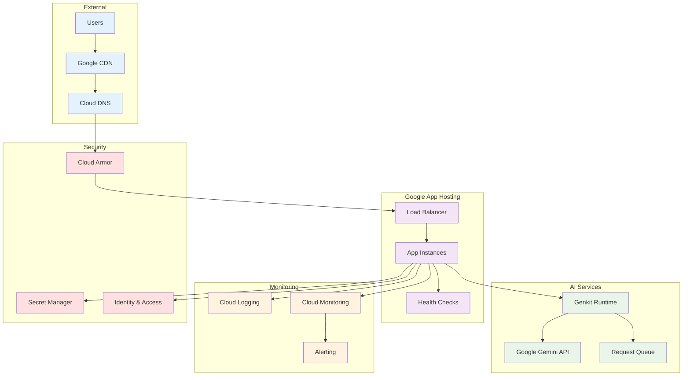
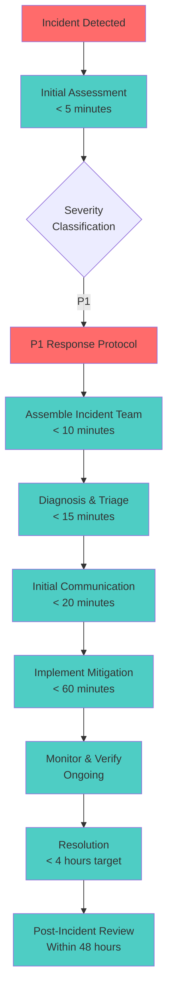
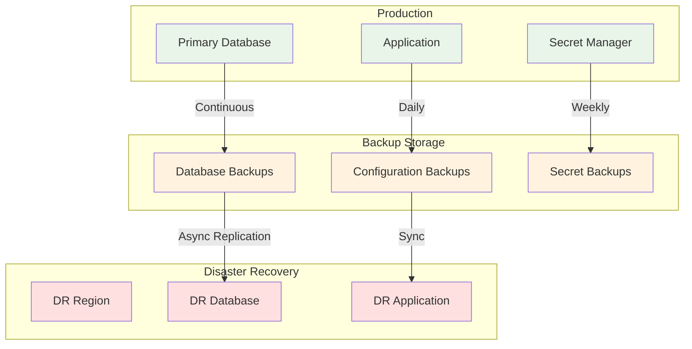

# Operations Manual: Funnel Flow

## Table of Contents
1. [Operations Overview](#operations-overview)
2. [System Architecture](#system-architecture)
3. [Monitoring & Alerting](#monitoring--alerting)
4. [Performance Management](#performance-management)
5. [Incident Response](#incident-response)
6. [Maintenance Procedures](#maintenance-procedures)
7. [Backup & Disaster Recovery](#backup--disaster-recovery)
8. [Scaling Operations](#scaling-operations)
9. [Security Operations](#security-operations)
10. [Troubleshooting Guide](#troubleshooting-guide)
11. [Runbooks](#runbooks)
12. [Operational Metrics](#operational-metrics)

---

## Operations Overview

### Mission Statement

The Operations team ensures Funnel Flow delivers reliable, high-performance AI-powered marketing analysis with 99.9% uptime while maintaining security, scalability, and cost efficiency.

### Operational Objectives

```yaml
Primary Objectives:
  - Availability: 99.9% uptime (8.77 hours downtime/year max)
  - Performance: <30 second AI response times (95th percentile)
  - Security: Zero security incidents with data exposure
  - Reliability: <2% error rate for all operations
  - Scalability: Handle 10x traffic growth without degradation

Secondary Objectives:
  - Cost Optimization: Maintain cost efficiency as scale grows
  - Automation: Reduce manual operational tasks by 80%
  - Observability: Complete visibility into system health
  - Documentation: Keep all operational docs current
```

### Service Level Objectives (SLOs)

```typescript
interface ServiceLevelObjectives {
  availability: {
    target: 99.9;              // 99.9% uptime
    measurement: 'monthly';
    consequences: 'customer_credits';
  };
  
  latency: {
    target: 30000;             // 30 seconds max
    percentile: 95;
    measurement: 'daily';
    consequences: 'performance_review';
  };
  
  errorRate: {
    target: 2;                 // <2% error rate
    measurement: 'hourly';
    consequences: 'immediate_alert';
  };
  
  aiResponseTime: {
    target: 25000;             // 25 seconds average
    percentile: 90;
    measurement: 'hourly';
    consequences: 'capacity_review';
  };
}
```

---

## System Architecture

### Production Architecture Overview



### Component Inventory

```typescript
interface SystemComponents {
  frontend: {
    technology: 'Next.js 15';
    runtime: 'Node.js 20';
    instances: 'Auto-scaling (0-100)';
    location: 'us-central1';
    cdn: 'Google CDN';
  };
  
  backend: {
    technology: 'Genkit Framework';
    aiModel: 'Google Gemini 2.0 Flash';
    validation: 'Zod schemas';
    rateLimiting: 'Memory-based';
  };
  
  infrastructure: {
    platform: 'Google App Hosting';
    networking: 'VPC with Cloud NAT';
    security: 'Cloud Armor + IAM';
    secrets: 'Secret Manager';
    logging: 'Cloud Logging';
    monitoring: 'Cloud Monitoring';
  };
  
  external: {
    ai: 'Google AI Platform';
    dns: 'Cloud DNS';
    cdn: 'Google CDN';
    calendar: 'Calendly Integration';
  };
}
```

---

## Monitoring & Alerting

### Monitoring Strategy

#### Four Golden Signals

```typescript
interface GoldenSignals {
  latency: {
    metric: 'response_time_95th_percentile';
    target: '<30 seconds';
    alertThreshold: '>45 seconds';
    criticalThreshold: '>60 seconds';
  };
  
  traffic: {
    metric: 'requests_per_minute';
    baseline: '10-50 rpm normal';
    alertThreshold: '>500 rpm sudden spike';
    criticalThreshold: '>1000 rpm';
  };
  
  errors: {
    metric: 'error_rate_percentage';
    target: '<2%';
    alertThreshold: '>5%';
    criticalThreshold: '>10%';
  };
  
  saturation: {
    metric: 'resource_utilization';
    target: '<70% CPU/Memory';
    alertThreshold: '>85%';
    criticalThreshold: '>95%';
  };
}
```

#### Monitoring Dashboard

```yaml
Primary Dashboard Widgets:
  - Service Health Overview (SLO status)
  - Request Volume (last 24h)
  - Response Time Distribution
  - Error Rate Trends
  - AI Service Performance
  - Resource Utilization
  - Geographic Traffic Distribution
  - Real User Monitoring (RUM)

Secondary Dashboards:
  - Infrastructure Health
  - Security Events
  - Cost Analysis
  - Performance Deep Dive
  - AI Model Performance
```

### Alerting Configuration

#### Alert Hierarchy

```typescript
enum AlertSeverity {
  P1_CRITICAL = 'critical',    // Immediate response required
  P2_HIGH = 'high',            // Response within 1 hour
  P3_MEDIUM = 'medium',        // Response within 4 hours
  P4_LOW = 'low'               // Response within 24 hours
}

interface AlertRule {
  name: string;
  severity: AlertSeverity;
  condition: string;
  duration: string;
  escalation: EscalationPolicy;
  runbook: string;
}
```

#### Critical Alerts (P1)

```yaml
Service Down:
  condition: "availability < 99% for 5 minutes"
  escalation: "immediate_page + incident_commander"
  runbook: "service_outage_response"

High Error Rate:
  condition: "error_rate > 10% for 3 minutes"
  escalation: "immediate_page + engineering_lead"
  runbook: "error_rate_investigation"

AI Service Failure:
  condition: "ai_success_rate < 90% for 5 minutes"
  escalation: "immediate_page + ai_team"
  runbook: "ai_service_troubleshooting"

Security Incident:
  condition: "security_alert_triggered"
  escalation: "immediate_page + security_team + legal"
  runbook: "security_incident_response"
```

#### High Priority Alerts (P2)

```yaml
Response Time Degradation:
  condition: "p95_response_time > 45 seconds for 10 minutes"
  escalation: "page_on_call + engineering_team"
  runbook: "performance_degradation"

Resource Saturation:
  condition: "cpu_utilization > 85% for 15 minutes"
  escalation: "page_on_call + infrastructure_team"
  runbook: "resource_scaling"

Rate Limit Abuse:
  condition: "rate_limit_violations > 100 in 10 minutes"
  escalation: "page_on_call + security_team"
  runbook: "rate_limit_investigation"
```

### Observability Implementation

#### Structured Logging

```typescript
interface LogEntry {
  timestamp: string;
  level: 'debug' | 'info' | 'warn' | 'error';
  service: string;
  version: string;
  requestId: string;
  userId?: string;
  operation: string;
  duration?: number;
  status: 'success' | 'error';
  error?: ErrorDetails;
  metadata: Record<string, any>;
}

class Logger {
  static info(operation: string, metadata: Record<string, any> = {}): void {
    this.log({
      level: 'info',
      operation,
      status: 'success',
      metadata,
      timestamp: new Date().toISOString(),
      service: 'funnel-flow',
      version: process.env.APP_VERSION || 'unknown',
      requestId: this.getRequestId()
    });
  }
  
  static error(operation: string, error: Error, metadata: Record<string, any> = {}): void {
    this.log({
      level: 'error',
      operation,
      status: 'error',
      error: {
        message: error.message,
        stack: error.stack,
        name: error.name
      },
      metadata,
      timestamp: new Date().toISOString(),
      service: 'funnel-flow',
      version: process.env.APP_VERSION || 'unknown',
      requestId: this.getRequestId()
    });
  }
}
```

#### Custom Metrics

```typescript
class MetricsCollector {
  // Business metrics
  static recordAnalysisCompletion(duration: number, success: boolean, persona: string): void {
    this.histogram('analysis_duration_seconds', duration, {
      success: success.toString(),
      persona
    });
    
    this.counter('analysis_total', {
      success: success.toString(),
      persona
    });
  }
  
  // Performance metrics
  static recordResponseTime(endpoint: string, duration: number, statusCode: number): void {
    this.histogram('http_request_duration_seconds', duration, {
      endpoint,
      status_code: statusCode.toString()
    });
  }
  
  // AI metrics
  static recordAIPerformance(model: string, promptTokens: number, completionTokens: number, duration: number): void {
    this.histogram('ai_request_duration_seconds', duration, { model });
    this.histogram('ai_prompt_tokens', promptTokens, { model });
    this.histogram('ai_completion_tokens', completionTokens, { model });
  }
}
```

---

## Performance Management

### Performance Monitoring

#### Key Performance Indicators

```typescript
interface PerformanceKPIs {
  userExperience: {
    pageLoadTime: '<2 seconds';
    firstContentfulPaint: '<1.5 seconds';
    largestContentfulPaint: '<2.5 seconds';
    cumulativeLayoutShift: '<0.1';
    firstInputDelay: '<100ms';
  };
  
  applicationPerformance: {
    averageResponseTime: '<20 seconds';
    p95ResponseTime: '<30 seconds';
    p99ResponseTime: '<45 seconds';
    throughput: '>100 requests/minute';
    errorRate: '<2%';
  };
  
  aiPerformance: {
    averageAnalysisTime: '<25 seconds';
    aiSuccessRate: '>99%';
    promptProcessingTime: '<5 seconds';
    responseGenerationTime: '<20 seconds';
  };
  
  infrastructurePerformance: {
    cpuUtilization: '<70% average';
    memoryUtilization: '<80% average';
    networkLatency: '<50ms';
    diskIOPS: 'within limits';
  };
}
```

#### Performance Testing

```typescript
interface PerformanceTestSuite {
  loadTesting: {
    tool: 'Artillery.io';
    scenarios: [
      {
        name: 'normal_load';
        duration: '10 minutes';
        arrivalRate: '10 users/second';
        expectedP95: '<30 seconds';
      },
      {
        name: 'peak_load';
        duration: '5 minutes';
        arrivalRate: '50 users/second';
        expectedP95: '<45 seconds';
      },
      {
        name: 'stress_test';
        duration: '2 minutes';
        arrivalRate: '100 users/second';
        expectedBehavior: 'graceful_degradation';
      }
    ];
  };
  
  enduranceTest: {
    duration: '2 hours';
    arrivalRate: '20 users/second';
    expectedBehavior: 'stable_performance';
    memoryLeakDetection: true;
  };
}
```

### Performance Optimization

#### Optimization Strategies

```yaml
Frontend Optimization:
  - Bundle size reduction (target: <500KB gzipped)
  - Image optimization (WebP/AVIF formats)
  - Code splitting and lazy loading
  - CDN utilization for static assets
  - Browser caching optimization
  - Critical CSS inlining

Backend Optimization:
  - Response compression (gzip/brotli)
  - Connection pooling for external services
  - Caching strategies for repeated requests
  - Request batching for AI services
  - Async processing where possible

AI Optimization:
  - Prompt optimization for faster processing
  - Response caching for similar requests
  - Model parameter tuning
  - Request queuing and batching
  - Fallback strategies for service issues
```

---

## Incident Response

### Incident Management Framework

#### Incident Classification

```typescript
interface IncidentClassification {
  severity: {
    P1: 'Service completely down or major security breach';
    P2: 'Service significantly degraded for many users';
    P3: 'Service degraded for some users or minor issues';
    P4: 'Minor issues with workarounds available';
  };
  
  impact: {
    critical: 'All users affected, no workaround';
    high: 'Many users affected, difficult workaround';
    medium: 'Some users affected, workaround available';
    low: 'Few users affected, easy workaround';
  };
  
  urgency: {
    critical: 'Resolution needed within 1 hour';
    high: 'Resolution needed within 4 hours';
    medium: 'Resolution needed within 24 hours';
    low: 'Resolution needed within 72 hours';
  };
}
```

#### Incident Response Team

```yaml
Incident Commander:
  - Overall incident coordination
  - Communication with stakeholders
  - Decision making authority
  - Post-incident review leadership

Technical Lead:
  - Technical investigation coordination
  - Solution implementation oversight
  - Technical communication to IC

Communications Lead:
  - Customer communication
  - Status page updates
  - Internal stakeholder updates
  - Media relations if needed

Subject Matter Experts:
  - AI/ML Engineer (for AI-related issues)
  - Infrastructure Engineer (for platform issues)
  - Security Engineer (for security incidents)
  - Frontend Engineer (for UI/UX issues)
```

### Incident Response Procedures

#### P1 Critical Incident Response



#### Communication Templates

```typescript
interface CommunicationTemplates {
  initialAlert: `
    🚨 INCIDENT ALERT 🚨
    Severity: {severity}
    Service: Funnel Flow
    Impact: {impact_description}
    Detection Time: {timestamp}
    Incident Commander: {ic_name}
    
    Initial Response:
    - Incident team assembling
    - Investigation in progress
    - Next update in 30 minutes
    
    Status Page: {status_url}
  `;
  
  updateMessage: `
    📊 INCIDENT UPDATE 📊
    Incident: {incident_id}
    Current Status: {status}
    
    Progress Update:
    {update_details}
    
    Next Steps:
    {next_steps}
    
    ETA for Resolution: {eta}
    Next Update: {next_update_time}
  `;
  
  resolutionMessage: `
    ✅ INCIDENT RESOLVED ✅
    Incident: {incident_id}
    Resolution Time: {resolution_time}
    Total Duration: {total_duration}
    
    Summary:
    {resolution_summary}
    
    Root Cause:
    {root_cause}
    
    Preventive Actions:
    {preventive_actions}
    
    Post-Mortem: {postmortem_url}
  `;
}
```

---

## Maintenance Procedures

### Scheduled Maintenance

#### Maintenance Windows

```yaml
Regular Maintenance:
  - Weekly: Sundays 2:00-4:00 AM UTC (low traffic period)
  - Monthly: First Sunday 1:00-5:00 AM UTC (extended window)
  - Quarterly: Planned 4-hour window for major updates

Emergency Maintenance:
  - Security patches: Immediate deployment
  - Critical bugs: Within 24 hours
  - Performance issues: Within business hours

Maintenance Types:
  - Zero-downtime: Rolling updates, feature flags
  - Low-impact: <5 minute downtime acceptable
  - High-impact: Planned maintenance window required
```

#### Pre-Maintenance Checklist

```typescript
interface PreMaintenanceChecklist {
  planning: [
    'Change request approved',
    'Rollback plan documented',
    'Stakeholders notified (48h advance)',
    'Maintenance window scheduled',
    'Risk assessment completed'
  ];
  
  preparation: [
    'Backup verification completed',
    'Rollback scripts tested',
    'Monitoring alerts configured',
    'On-call team briefed',
    'Emergency contacts confirmed'
  ];
  
  technical: [
    'Dependencies identified',
    'Resource requirements verified',
    'Testing environment validated',
    'Deployment scripts verified',
    'Health checks updated'
  ];
}
```

### Dependency Management

#### Dependency Update Strategy

```typescript
interface DependencyStrategy {
  security: {
    timeline: 'Immediate (within 24 hours)';
    process: 'Emergency patch deployment';
    testing: 'Automated security scanning + manual verification';
    rollback: 'Automatic if issues detected';
  };
  
  minor: {
    timeline: 'Weekly maintenance window';
    process: 'Batch update with testing';
    testing: 'Full test suite + integration tests';
    rollback: 'Standard rollback procedure';
  };
  
  major: {
    timeline: 'Monthly maintenance window';
    process: 'Staged deployment with feature flags';
    testing: 'Extended testing + canary deployment';
    rollback: 'Blue-green deployment rollback';
  };
}
```

#### Automated Dependency Monitoring

```yaml
Dependency Scanning:
  - Tool: Dependabot + npm audit
  - Frequency: Daily scans
  - Auto-PR: Minor updates and security patches
  - Manual Review: Major version updates

Vulnerability Response:
  - Critical: Immediate patch (within 4 hours)
  - High: Patch within 24 hours
  - Medium: Patch within 1 week
  - Low: Patch during next maintenance window

Update Process:
  1. Automated scanning and PR creation
  2. CI/CD pipeline validation
  3. Security team review for critical updates
  4. Staged deployment to production
  5. Post-deployment monitoring
```

---

## Backup & Disaster Recovery

### Current Backup Strategy

#### Stateless Architecture Benefits

```yaml
Current State (Stateless):
  - No persistent user data to backup
  - Configuration stored in version control
  - Infrastructure as Code (IaC) for recovery
  - Minimal backup requirements

Backup Items:
  - Application configuration (Git repository)
  - Environment variables (Secret Manager)
  - Monitoring configurations
  - CI/CD pipeline definitions
  - Documentation and runbooks
```

### Future Backup Strategy (With Database)

#### Backup Architecture



#### Recovery Time Objectives (RTO) & Recovery Point Objectives (RPO)

```typescript
interface DisasterRecoveryObjectives {
  currentState: {
    rto: '15 minutes';  // Redeploy from Git
    rpo: '0 minutes';   // No data loss (stateless)
    scenarios: [
      'Application deployment failure',
      'Infrastructure failure',
      'Regional outage'
    ];
  };
  
  futureState: {
    rto: '1 hour';      // With database recovery
    rpo: '15 minutes';  // Point-in-time recovery
    scenarios: [
      'Database corruption',
      'Complete regional failure',
      'Cyber attack with data compromise'
    ];
  };
}
```

### Disaster Recovery Procedures

#### Recovery Scenarios

```yaml
Scenario 1 - Application Failure:
  Detection: Health check failures, error rate spike
  Response:
    1. Automatic restart via health checks
    2. If restart fails, redeploy latest stable version
    3. If deployment fails, rollback to previous version
  RTO: 5-15 minutes
  RPO: 0 minutes

Scenario 2 - Regional Outage:
  Detection: Multiple service failures, Google Cloud status
  Response:
    1. Activate disaster recovery region
    2. Update DNS to point to DR region
    3. Deploy application to DR infrastructure
    4. Verify service functionality
  RTO: 30-60 minutes
  RPO: 0 minutes (current), 15 minutes (future)

Scenario 3 - Complete Service Compromise:
  Detection: Security alerts, unusual activity patterns
  Response:
    1. Isolate affected systems
    2. Deploy clean application version
    3. Reset all secrets and API keys
    4. Conduct security assessment
    5. Gradual service restoration
  RTO: 2-4 hours
  RPO: Depends on compromise scope
```

---

## Scaling Operations

### Auto-Scaling Configuration

#### Current Scaling Parameters

```yaml
Google App Hosting Auto-scaling:
  minInstances: 0
  maxInstances: 100
  targetCPU: 70%
  targetMemory: 80%
  targetRequestRate: 1000 requests/instance
  cooldownPeriod: 180 seconds

Scaling Triggers:
  - CPU utilization > 70% for 3 minutes
  - Memory utilization > 80% for 3 minutes
  - Request rate > 1000 requests/instance
  - Queue depth > 50 requests

Scaling Policies:
  Scale Up: Add 50% of current instances (min 1, max 10 at once)
  Scale Down: Remove 25% of current instances (gradual)
  Emergency Scale: Double instances if error rate > 10%
```

#### Capacity Planning

```typescript
interface CapacityPlanning {
  currentCapacity: {
    peakTraffic: '500 requests/minute';
    averageTraffic: '50 requests/minute';
    instanceUtilization: '30% average';
    responseTime: '18 seconds average';
  };
  
  growthProjections: {
    sixMonths: {
      expectedTraffic: '2,000 requests/minute';
      requiredInstances: '20-30 instances';
      estimatedCost: '$500-800/month';
    };
    
    oneYear: {
      expectedTraffic: '5,000 requests/minute';
      requiredInstances: '50-75 instances';
      estimatedCost: '$1,200-2,000/month';
    };
  };
  
  scalingMilestones: [
    {
      traffic: '1,000 rpm';
      action: 'Implement request caching';
      timeline: '3 months';
    },
    {
      traffic: '2,500 rpm';
      action: 'Optimize AI model performance';
      timeline: '6 months';
    },
    {
      traffic: '5,000 rpm';
      action: 'Multi-region deployment';
      timeline: '12 months';
    }
  ];
}
```

### Cost Optimization

#### Cost Monitoring

```typescript
interface CostManagement {
  budgetAlerts: [
    {
      threshold: '$100/month';
      action: 'Email notification';
      recipients: ['engineering-lead', 'finance'];
    },
    {
      threshold: '$500/month';
      action: 'Slack alert + emergency review';
      recipients: ['all-engineers', 'management'];
    }
  ];
  
  costOptimization: [
    'Right-size instances based on actual usage',
    'Use sustained use discounts',
    'Implement request caching to reduce AI costs',
    'Optimize cold start times',
    'Review and clean up unused resources'
  ];
  
  costBreakdown: {
    compute: '60% (App Hosting instances)';
    ai: '30% (Google AI API calls)';
    networking: '5% (CDN and load balancing)';
    monitoring: '3% (Logging and monitoring)';
    storage: '2% (Configuration and logs)';
  };
}
```

---

## Security Operations

### Security Monitoring

#### Security Metrics

```typescript
interface SecurityMetrics {
  accessControl: {
    failedLoginAttempts: 0;        // No auth currently
    unauthorizedApiAccess: '<1/day';
    privilegeEscalations: 0;
  };
  
  inputSecurity: {
    maliciousInputBlocked: 'tracked';
    xssAttempts: 'detected and blocked';
    injectionAttempts: 'logged and prevented';
  };
  
  networkSecurity: {
    ddosAttempts: 'monitored via Cloud Armor';
    rateLimitViolations: '<50/day normal';
    suspiciousTraffic: 'flagged for review';
  };
  
  aiSecurity: {
    promptInjectionAttempts: 'detected and blocked';
    inappropriateContentGeneration: 'filtered';
    modelAbusePatterns: 'monitored';
  };
}
```

#### Security Incident Response

```yaml
Security Alert Response:
  Level 1 (Suspicious Activity):
    - Automated logging and flagging
    - Daily review by security team
    - No immediate action required

  Level 2 (Potential Threat):
    - Real-time alert to security team
    - IP blocking if necessary
    - 4-hour investigation timeline

  Level 3 (Active Attack):
    - Immediate alert to entire team
    - Automatic defensive measures
    - 1-hour response timeline
    - Incident commander activation

  Level 4 (Breach Confirmed):
    - Emergency response protocol
    - Service isolation if necessary
    - External notification requirements
    - Immediate investigation launch
```

---

## Troubleshooting Guide

### Common Issues & Resolutions

#### Application Issues

```yaml
Issue: High Response Times
Symptoms:
  - p95 response time > 45 seconds
  - User complaints about slow analysis
  - Timeouts in monitoring
Investigation:
  1. Check AI service response times
  2. Review instance CPU/memory usage
  3. Examine request queue depth
  4. Analyze network latency
Resolution:
  - Scale up instances if resource-constrained
  - Optimize AI prompts if AI is slow
  - Implement request caching
  - Contact Google AI support if needed

Issue: High Error Rate
Symptoms:
  - Error rate > 5%
  - Failed analysis requests
  - 500 errors in logs
Investigation:
  1. Review error logs for patterns
  2. Check AI service status
  3. Verify input validation logic
  4. Test with known good inputs
Resolution:
  - Fix validation bugs if input-related
  - Implement retry logic for transient failures
  - Escalate to AI service provider
  - Rollback if recent deployment caused issue
```

#### Infrastructure Issues

```yaml
Issue: Service Unavailable
Symptoms:
  - Health checks failing
  - 503 errors
  - No response from application
Investigation:
  1. Check Google App Hosting status
  2. Review recent deployments
  3. Examine resource limits
  4. Check network connectivity
Resolution:
  - Restart service via console
  - Rollback to previous version
  - Scale up resources
  - Contact Google Cloud support

Issue: Memory Leaks
Symptoms:
  - Gradually increasing memory usage
  - Out of memory errors
  - Instance restarts
Investigation:
  1. Monitor memory usage trends
  2. Review heap dumps
  3. Analyze garbage collection logs
  4. Check for circular references
Resolution:
  - Restart affected instances
  - Deploy memory optimization fixes
  - Implement memory monitoring alerts
  - Review code for memory leaks
```

### Diagnostic Tools

#### Health Check Commands

```bash
# Check service health
curl -I https://your-domain.com/

# Check response time
curl -w "@curl-format.txt" -o /dev/null -s https://your-domain.com/

# Test AI analysis endpoint
curl -X POST https://your-domain.com/api/analyze-marketing-offer \
  -H "Content-Type: application/json" \
  -d '{"offerDetails": "test", "inputType": "text", "persona": "General Audience"}'

# Check Google Cloud services
gcloud app describe
gcloud app logs tail

# Monitor resource usage
gcloud monitoring metrics list
```

---

## Runbooks

### Standard Operating Procedures

#### Daily Operations Checklist

```yaml
Morning Checklist (9:00 AM UTC):
  - [ ] Review overnight alerts and incidents
  - [ ] Check service health dashboard
  - [ ] Verify SLO compliance
  - [ ] Review error rate trends
  - [ ] Check resource utilization
  - [ ] Verify backup completion
  - [ ] Review security alerts

Weekly Operations Tasks:
  - [ ] Dependency security scan
  - [ ] Performance review meeting
  - [ ] Capacity planning review
  - [ ] Cost optimization review
  - [ ] Documentation updates
  - [ ] Team knowledge sharing

Monthly Operations Tasks:
  - [ ] Disaster recovery test
  - [ ] Security assessment
  - [ ] Performance benchmark
  - [ ] Cost analysis and budgeting
  - [ ] Service level review
  - [ ] Incident retrospective
```

#### Emergency Response Runbooks

```typescript
interface EmergencyRunbooks {
  serviceOutage: {
    title: 'Complete Service Outage Response';
    steps: [
      '1. Confirm outage via multiple monitoring sources',
      '2. Activate incident response team',
      '3. Check Google Cloud status page',
      '4. Attempt service restart via console',
      '5. If restart fails, deploy last known good version',
      '6. Update status page and notify stakeholders',
      '7. Investigate root cause while service is restored'
    ];
    escalation: 'If service not restored in 30 minutes, escalate to Google Cloud support';
  };
  
  securityBreach: {
    title: 'Security Incident Response';
    steps: [
      '1. Isolate affected systems immediately',
      '2. Preserve evidence and logs',
      '3. Activate security incident team',
      '4. Assess scope of compromise',
      '5. Implement containment measures',
      '6. Reset all credentials and secrets',
      '7. Begin forensic investigation',
      '8. Prepare external communications'
    ];
    escalation: 'Immediate escalation to CISO and legal team';
  };
}
```

---

## Operational Metrics

### Key Performance Indicators

#### Service Reliability

```typescript
interface ReliabilityMetrics {
  availability: {
    target: 99.9;
    current: 99.95;
    measurement: 'monthly';
    trend: 'stable';
  };
  
  errorBudget: {
    monthly: '43.2 minutes'; // 0.1% of month
    consumed: '8.5 minutes';
    remaining: '34.7 minutes';
    burnRate: 'low';
  };
  
  meanTimeToRecovery: {
    target: '15 minutes';
    current: '12 minutes';
    trend: 'improving';
  };
  
  meanTimeBetweenFailures: {
    target: '720 hours'; // 30 days
    current: '960 hours'; // 40 days
    trend: 'stable';
  };
}
```

#### Business Metrics

```typescript
interface BusinessMetrics {
  usage: {
    dailyActiveUsers: 'tracked';
    analysesPerformed: 'daily count';
    conversionRate: 'completion rate';
    userSatisfaction: 'feedback score';
  };
  
  performance: {
    averageAnalysisTime: '18 seconds';
    aiSuccessRate: '99.2%';
    userRetention: 'session-based';
    errorImpact: '<1% users affected';
  };
  
  operational: {
    deploymentFrequency: '2-3 per week';
    changeFailureRate: '<5%';
    leadTimeForChanges: '<24 hours';
    deploymentRecoveryTime: '<15 minutes';
  };
}
```

### Reporting & Analytics

#### Operational Reports

```yaml
Daily Reports:
  - Service health summary
  - Performance metrics
  - Error analysis
  - Resource utilization
  - Security events

Weekly Reports:
  - SLO compliance summary
  - Incident report summary
  - Performance trends
  - Cost analysis
  - Capacity planning updates

Monthly Reports:
  - Business metrics summary
  - Operational efficiency review
  - Security posture assessment
  - Infrastructure optimization
  - Team performance metrics
```

---

*This operations manual provides comprehensive guidance for maintaining Funnel Flow's operational excellence. Regular review and updates ensure continued reliability and performance as the service evolves.* 