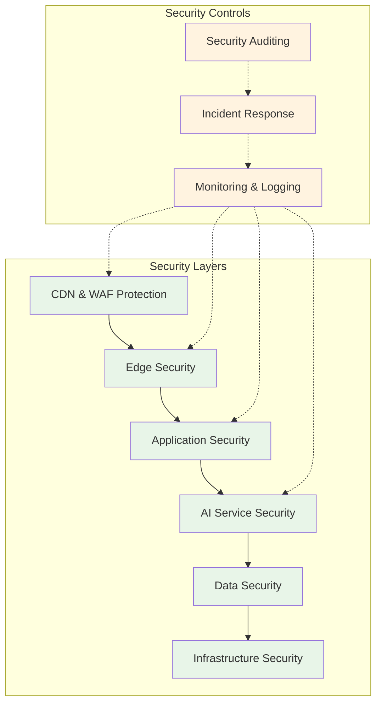

# Security Documentation: Funnel Flow

## Table of Contents
1. [Security Overview](#security-overview)
2. [Security Architecture](#security-architecture)
3. [Authentication & Authorization](#authentication--authorization)
4. [Input Security & Validation](#input-security--validation)
5. [Data Protection](#data-protection)
6. [Infrastructure Security](#infrastructure-security)
7. [AI Security](#ai-security)
8. [API Security](#api-security)
9. [Client-Side Security](#client-side-security)
10. [Monitoring & Incident Response](#monitoring--incident-response)
11. [Compliance & Privacy](#compliance--privacy)
12. [Security Checklist](#security-checklist)

---

## Security Overview

### Security Philosophy

Funnel Flow implements a **defense-in-depth** security strategy with multiple layers of protection across the application stack. As an AI-powered platform handling user-generated content and providing business intelligence, security is paramount to protecting user data and maintaining service integrity.

### Key Security Principles

- **Zero Trust Architecture**: Verify every request and validate all inputs
- **Least Privilege Access**: Minimal permissions for all components
- **Data Minimization**: Process only necessary data, store nothing unnecessarily
- **Encryption Everywhere**: Data protection in transit and at rest
- **Fail Secure**: Secure defaults and graceful failure handling
- **Transparency**: Clear security practices and incident communication

### Threat Model

```mermaid
graph TD
    subgraph "Threat Landscape"
        EXTERNAL[External Threats]
        INTERNAL[Internal Threats]
        SYSTEM[System Threats]
    end
    
    subgraph "External Threats"
        DDoS[DDoS Attacks]
        INJECTION[Injection Attacks]
        XSS[Cross-Site Scripting]
        CSRF[CSRF Attacks]
        SCRAPING[Data Scraping]
    end
    
    subgraph "Internal Threats"
        INSIDER[Insider Threats]
        MISCFG[Misconfigurations]
        PRIVESC[Privilege Escalation]
    end
    
    subgraph "System Threats"
        VULNS[Software Vulnerabilities]
        SUPPLY[Supply Chain Attacks]
        INFRA[Infrastructure Compromise]
    end
    
    EXTERNAL --> DDoS
    EXTERNAL --> INJECTION
    EXTERNAL --> XSS
    EXTERNAL --> CSRF
    EXTERNAL --> SCRAPING
    
    INTERNAL --> INSIDER
    INTERNAL --> MISCFG
    INTERNAL --> PRIVESC
    
    SYSTEM --> VULNS
    SYSTEM --> SUPPLY
    SYSTEM --> INFRA
    
    classDef threat fill:#ff6b6b
    classDef category fill:#4ecdc4
    
    class DDoS,INJECTION,XSS,CSRF,SCRAPING,INSIDER,MISCFG,PRIVESC,VULNS,SUPPLY,INFRA threat
    class EXTERNAL,INTERNAL,SYSTEM category
```



---

## Security Architecture

### Multi-Layer Security Model



### Current Security Implementation

#### Application Layer Security
- **Next.js Security Features**: Built-in CSRF protection, XSS prevention
- **TypeScript Type Safety**: Compile-time error prevention
- **Zod Schema Validation**: Runtime input validation
- **Genkit Security**: Secure AI flow orchestration

#### Infrastructure Security
- **Google App Hosting**: Managed infrastructure with built-in security
- **HTTPS Enforcement**: TLS 1.3 encryption for all communications
- **Secure Headers**: Comprehensive security header implementation
- **Environment Isolation**: Separate staging and production environments

---

## Authentication & Authorization

### Current Authentication Model

**Status**: Public access (MVP - no authentication required)

The current implementation prioritizes user experience by eliminating authentication barriers. However, this design includes security controls:

```typescript
// Current security model
interface SecurityContext {
  ip: string;                     // IP-based rate limiting
  userAgent: string;              // Basic request validation
  origin: string;                 // CORS validation
  timestamp: Date;                // Request timing analysis
}
```

### Planned Authentication System

#### Authentication Phases

**Phase 1: API Key Authentication**
```typescript
interface APIKeyAuth {
  apiKey: string;                 // Unique API key per user
  permissions: Permission[];      // Scoped access control
  rateLimit: RateLimitTier;      // Usage-based limits
  expiresAt?: Date;              // Optional expiration
}

enum Permission {
  ANALYZE_OFFER = 'analyze:offer',
  GENERATE_COPY = 'generate:copy',
  VIEW_HISTORY = 'view:history',
  MANAGE_ACCOUNT = 'manage:account'
}
```

**Phase 2: OAuth 2.0 Integration**
```typescript
interface OAuthProvider {
  google: GoogleOAuthConfig;
  github: GitHubOAuthConfig;
  microsoft: MicrosoftOAuthConfig;
}

interface UserSession {
  userId: string;
  email: string;
  provider: string;
  permissions: Permission[];
  createdAt: Date;
  expiresAt: Date;
}
```

#### JWT Token Structure

```typescript
interface JWTPayload {
  sub: string;                    // User ID
  iss: string;                    // Issuer (Funnel Flow)
  aud: string;                    // Audience
  exp: number;                    // Expiration timestamp
  iat: number;                    // Issued at timestamp
  scope: string[];                // Permissions
  tier: 'free' | 'pro' | 'enterprise';
}
```

### Authorization Framework

#### Role-Based Access Control (RBAC)

```typescript
enum UserRole {
  FREE_USER = 'free_user',
  PRO_USER = 'pro_user',
  ENTERPRISE_USER = 'enterprise_user',
  ADMIN = 'admin'
}

interface RolePermissions {
  [UserRole.FREE_USER]: {
    analysesPerMonth: 10;
    copyGenerationsPerMonth: 20;
    historyRetention: 0; // No history
  };
  [UserRole.PRO_USER]: {
    analysesPerMonth: 100;
    copyGenerationsPerMonth: 200;
    historyRetention: 90; // 90 days
  };
  [UserRole.ENTERPRISE_USER]: {
    analysesPerMonth: -1; // Unlimited
    copyGenerationsPerMonth: -1; // Unlimited
    historyRetention: 365; // 1 year
  };
}
```

---

## Input Security & Validation

### Input Validation Strategy

#### Multi-Layer Validation

```typescript
// Layer 1: Client-side validation
interface ClientValidation {
  formatValidation: boolean;      // URL format, text length
  contentFiltering: boolean;      // Basic content screening
  uiConstraints: boolean;         // Form field limits
}

// Layer 2: API validation
interface APIValidation {
  schemaValidation: ZodSchema;    // Strict type checking
  businessRules: ValidationRule[]; // Business logic validation
  sanitization: SanitizationRule[]; // Input cleaning
}

// Layer 3: AI input validation
interface AIValidation {
  promptInjectionDetection: boolean;
  contentPolicyCheck: boolean;
  toxicityFiltering: boolean;
}
```

#### Input Sanitization

```typescript
class InputSanitizer {
  static sanitizeURL(url: string): string {
    // Remove dangerous protocols
    const dangerousProtocols = ['javascript:', 'data:', 'vbscript:', 'file:'];
    const sanitized = url.toLowerCase();
    
    for (const protocol of dangerousProtocols) {
      if (sanitized.startsWith(protocol)) {
        throw new SecurityError('Dangerous protocol detected');
      }
    }
    
    // Validate URL format
    try {
      const urlObj = new URL(url);
      if (!['http:', 'https:'].includes(urlObj.protocol)) {
        throw new SecurityError('Invalid protocol');
      }
      return urlObj.toString();
    } catch {
      throw new SecurityError('Invalid URL format');
    }
  }
  
  static sanitizeText(text: string): string {
    return text
      .trim()
      .replace(/<script\b[^<]*(?:(?!<\/script>)<[^<]*)*<\/script>/gi, '') // Remove scripts
      .replace(/javascript:/gi, '') // Remove javascript: protocol
      .replace(/on\w+\s*=/gi, '') // Remove event handlers
      .substring(0, 2000); // Limit length
  }
  
  static sanitizePersona(persona: string): string {
    const allowedPersonas = [
      'General Audience',
      'SaaS Founders',
      'Busy Parents',
      'Coaches & Consultants',
      'E-commerce Shoppers',
      'Creative Professionals'
    ];
    
    if (!allowedPersonas.includes(persona)) {
      throw new SecurityError('Invalid persona selected');
    }
    
    return persona;
  }
}
```

### XSS Prevention

#### Content Security Policy (CSP)

```typescript
const cspHeader = {
  'Content-Security-Policy': [
    "default-src 'self'",
    "script-src 'self' 'unsafe-eval' 'unsafe-inline'", // Next.js requirements
    "style-src 'self' 'unsafe-inline' https://fonts.googleapis.com",
    "font-src 'self' https://fonts.gstatic.com",
    "img-src 'self' data: https:",
    "connect-src 'self' https://api.google.com",
    "frame-ancestors 'none'",
    "base-uri 'none'",
    "form-action 'self'"
  ].join('; ')
};
```

#### Output Encoding

```typescript
class OutputEncoder {
  static encodeHTML(text: string): string {
    return text
      .replace(/&/g, '&amp;')
      .replace(/</g, '&lt;')
      .replace(/>/g, '&gt;')
      .replace(/"/g, '&quot;')
      .replace(/'/g, '&#x27;');
  }
  
  static encodeJSON(obj: any): string {
    return JSON.stringify(obj)
      .replace(/</g, '\\u003c')
      .replace(/>/g, '\\u003e')
      .replace(/&/g, '\\u0026');
  }
}
```

### SQL Injection Prevention

**Current Status**: Not applicable (no database in MVP)

**Future Implementation**:
```typescript
// Parameterized queries only
class SecureDatabase {
  async findUser(email: string): Promise<User | null> {
    // Correct: Parameterized query
    return await this.query(
      'SELECT * FROM users WHERE email = ?',
      [email]
    );
  }
  
  // This would be prohibited
  async unsafeQuery(userInput: string) {
    // NEVER: String concatenation
    // return await this.query(`SELECT * FROM users WHERE email = '${userInput}'`);
    throw new Error('Direct string concatenation prohibited');
  }
}
```

---

## Data Protection

### Data Classification

```typescript
enum DataClassification {
  PUBLIC = 'public',              // Publicly available information
  INTERNAL = 'internal',          // Internal use only
  CONFIDENTIAL = 'confidential',  // Restricted access
  RESTRICTED = 'restricted'       // Highest security level
}

interface DataAsset {
  type: string;
  classification: DataClassification;
  encryption: EncryptionLevel;
  retention: RetentionPolicy;
  location: DataLocation;
}
```

#### Current Data Handling

```typescript
const currentDataAssets: DataAsset[] = [
  {
    type: 'User Input (URLs/Text)',
    classification: DataClassification.CONFIDENTIAL,
    encryption: 'HTTPS in transit',
    retention: 'No persistence (processed in memory)',
    location: 'Google Cloud (us-central1)'
  },
  {
    type: 'AI Analysis Results',
    classification: DataClassification.INTERNAL,
    encryption: 'HTTPS in transit',
    retention: 'Session-only (not stored)',
    location: 'Google Cloud (us-central1)'
  },
  {
    type: 'System Logs',
    classification: DataClassification.INTERNAL,
    encryption: 'Google Cloud encryption',
    retention: '30 days',
    location: 'Google Cloud Logging'
  }
];
```

### Encryption Standards

#### Data in Transit
- **TLS 1.3**: All external communications
- **Certificate Pinning**: Planned for mobile applications
- **HSTS**: HTTP Strict Transport Security enabled
- **Perfect Forward Secrecy**: Ephemeral key exchange

#### Data at Rest (Future)
```typescript
interface EncryptionConfig {
  algorithm: 'AES-256-GCM';
  keyManagement: 'Google Cloud KMS';
  keyRotation: '90 days';
  encryptionAtRest: boolean;
}

const encryptionConfig: EncryptionConfig = {
  algorithm: 'AES-256-GCM',
  keyManagement: 'Google Cloud KMS',
  keyRotation: '90 days',
  encryptionAtRest: true
};
```

### Data Retention & Deletion

#### Current Policy (Stateless)
- **User Inputs**: Processed in memory, never persisted
- **Analysis Results**: Returned to client, not stored
- **System Logs**: 30-day retention for debugging
- **Error Logs**: 90-day retention for analysis

#### Future Policy (With Database)
```typescript
interface RetentionPolicy {
  userAccounts: '2 years after last activity';
  analysisHistory: '1 year for paid users, 90 days for free users';
  auditLogs: '7 years for compliance';
  systemLogs: '30 days for operational logs';
  errorLogs: '90 days for debugging';
}

class DataRetentionManager {
  async enforceRetention(): Promise<void> {
    await this.deleteExpiredAnalyses();
    await this.deleteInactiveAccounts();
    await this.archiveOldLogs();
  }
  
  async rightToBeDeleted(userId: string): Promise<void> {
    // GDPR Article 17 - Right to erasure
    await this.deleteAllUserData(userId);
    await this.anonymizeLogsForUser(userId);
  }
}
```

---

## Infrastructure Security

### Google App Hosting Security

#### Built-in Security Features
- **Automatic OS Updates**: Managed by Google
- **Container Isolation**: Secure runtime environment
- **Network Security**: VPC isolation and firewall rules
- **DDoS Protection**: Google Cloud Armor integration
- **Load Balancing**: Global load balancer with health checks

#### Security Configuration

```yaml
# apphosting.yaml security settings
runConfig:
  # Runtime security
  runtime: nodejs20
  cpu: 1
  memory: 2Gi
  
  # Network security
  vpcAccess:
    connector: projects/PROJECT_ID/locations/REGION/connectors/CONNECTOR_NAME
    egress: private-ranges-only
  
  # Environment security
  serviceAccount: secure-service-account@PROJECT_ID.iam.gserviceaccount.com
  
  # Health checks
  healthCheck:
    checkIntervalSeconds: 240
    timeoutSeconds: 4
    unhealthyThreshold: 2
    healthyThreshold: 2

# Build security
buildConfig:
  runtime: nodejs20
  commands:
    - npm ci --audit-level=high  # Security audit during build
    - npm run build
```

#### Security Headers

```typescript
const securityHeaders = {
  // HTTPS enforcement
  'Strict-Transport-Security': 'max-age=63072000; includeSubDomains; preload',
  
  // XSS protection
  'X-XSS-Protection': '1; mode=block',
  'X-Content-Type-Options': 'nosniff',
  
  // Clickjacking protection
  'X-Frame-Options': 'DENY',
  
  // Referrer policy
  'Referrer-Policy': 'strict-origin-when-cross-origin',
  
  // Permissions policy
  'Permissions-Policy': 'camera=(), microphone=(), geolocation=()',
  
  // Content Security Policy
  'Content-Security-Policy': cspHeader['Content-Security-Policy']
};
```

### Secrets Management

#### Google Secret Manager Integration

```typescript
class SecretManager {
  async getSecret(secretName: string): Promise<string> {
    try {
      const [version] = await this.client.accessSecretVersion({
        name: `projects/${PROJECT_ID}/secrets/${secretName}/versions/latest`,
      });
      
      return version.payload?.data?.toString() || '';
    } catch (error) {
      console.error(`Failed to access secret ${secretName}:`, error);
      throw new SecurityError('Secret access failed');
    }
  }
  
  async rotateSecret(secretName: string, newValue: string): Promise<void> {
    await this.client.addSecretVersion({
      parent: `projects/${PROJECT_ID}/secrets/${secretName}`,
      payload: {
        data: Buffer.from(newValue),
      },
    });
  }
}
```

#### Secret Rotation Policy

```yaml
Secrets Rotation Schedule:
  - Google AI API Key: 90 days
  - JWT Signing Keys: 30 days (when implemented)
  - Database Credentials: 90 days (when implemented)
  - Service Account Keys: 180 days
```

---

## AI Security

### AI-Specific Security Considerations

#### Prompt Injection Protection

```typescript
class PromptInjectionDetector {
  private dangerousPatterns = [
    /ignore\s+previous\s+instructions/i,
    /forget\s+everything\s+above/i,
    /system\s*:\s*you\s+are/i,
    /\[INST\]/i,
    /###\s*Human:/i,
    /<\|im_start\|>/i
  ];
  
  detectInjection(input: string): boolean {
    return this.dangerousPatterns.some(pattern => pattern.test(input));
  }
  
  sanitizeInput(input: string): string {
    if (this.detectInjection(input)) {
      throw new SecurityError('Potential prompt injection detected');
    }
    
    // Additional sanitization
    return input
      .replace(/\{|\}/g, '') // Remove template literals
      .replace(/\$\{[^}]*\}/g, '') // Remove variable substitutions
      .trim();
  }
}
```

#### AI Output Validation

```typescript
class AIOutputValidator {
  validateAnalysisOutput(output: any): AnalyzeMarketingOfferOutput {
    // Schema validation with Zod
    const result = AnalyzeMarketingOfferOutputSchema.safeParse(output);
    
    if (!result.success) {
      throw new SecurityError('AI output validation failed');
    }
    
    // Content validation
    this.validateContent(result.data);
    
    return result.data;
  }
  
  private validateContent(data: AnalyzeMarketingOfferOutput): void {
    // Check for inappropriate content
    const inappropriatePatterns = [
      /\b(hack|exploit|attack)\b/i,
      /\b(illegal|fraud|scam)\b/i,
      // Add more patterns as needed
    ];
    
    const allText = [
      ...data.analysis.map(a => `${a.area} ${a.leak} ${a.fix.primarySuggestion} ${a.fix.abTestSuggestion}`),
      data.sampleCopy.content
    ].join(' ');
    
    for (const pattern of inappropriatePatterns) {
      if (pattern.test(allText)) {
        throw new SecurityError('Inappropriate content detected in AI output');
      }
    }
  }
}
```

#### Model Security

```typescript
interface ModelSecurityConfig {
  model: 'gemini-2.0-flash';
  temperature: 0.3;              // Lower temperature for consistency
  maxTokens: 2000;               // Limit response size
  safetySettings: SafetySetting[];
  contentFiltering: boolean;
}

const safetySettings = [
  {
    category: 'HARM_CATEGORY_HARASSMENT',
    threshold: 'BLOCK_MEDIUM_AND_ABOVE'
  },
  {
    category: 'HARM_CATEGORY_HATE_SPEECH', 
    threshold: 'BLOCK_MEDIUM_AND_ABOVE'
  },
  {
    category: 'HARM_CATEGORY_SEXUALLY_EXPLICIT',
    threshold: 'BLOCK_MEDIUM_AND_ABOVE'
  },
  {
    category: 'HARM_CATEGORY_DANGEROUS_CONTENT',
    threshold: 'BLOCK_MEDIUM_AND_ABOVE'
  }
];
```

---

## API Security

### Rate Limiting

#### Implementation Strategy

```typescript
interface RateLimitConfig {
  windowMs: number;
  maxRequests: number;
  skipSuccessfulRequests: boolean;
  keyGenerator: (req: Request) => string;
  onLimitReached: (req: Request) => void;
}

class RateLimiter {
  private configs = new Map<string, RateLimitConfig>();
  
  constructor() {
    // Global rate limit
    this.configs.set('global', {
      windowMs: 15 * 60 * 1000, // 15 minutes
      maxRequests: 100,
      skipSuccessfulRequests: false,
      keyGenerator: (req) => this.getClientIP(req),
      onLimitReached: (req) => this.logRateLimitViolation(req)
    });
    
    // AI analysis endpoint
    this.configs.set('analyze', {
      windowMs: 60 * 1000, // 1 minute
      maxRequests: 10,
      skipSuccessfulRequests: true,
      keyGenerator: (req) => this.getClientIP(req),
      onLimitReached: (req) => this.logAnalysisAbuse(req)
    });
  }
  
  private getClientIP(req: Request): string {
    return req.headers.get('cf-connecting-ip') ||
           req.headers.get('x-forwarded-for') ||
           req.headers.get('x-real-ip') ||
           '127.0.0.1';
  }
}
```

#### Rate Limit Headers

```typescript
interface RateLimitHeaders {
  'X-RateLimit-Limit': string;
  'X-RateLimit-Remaining': string;
  'X-RateLimit-Reset': string;
  'X-RateLimit-Retry-After'?: string;
}

function addRateLimitHeaders(response: Response, info: RateLimitInfo): Response {
  response.headers.set('X-RateLimit-Limit', info.limit.toString());
  response.headers.set('X-RateLimit-Remaining', info.remaining.toString());
  response.headers.set('X-RateLimit-Reset', info.resetTime.toString());
  
  if (info.remaining === 0) {
    response.headers.set('X-RateLimit-Retry-After', info.retryAfter.toString());
  }
  
  return response;
}
```

### CORS Security

```typescript
const corsConfig = {
  origin: process.env.NODE_ENV === 'production' 
    ? ['https://funnelflow.com', 'https://www.funnelflow.com']
    : ['http://localhost:3000', 'http://127.0.0.1:3000'],
  
  methods: ['GET', 'POST', 'OPTIONS'],
  allowedHeaders: [
    'Content-Type',
    'Authorization',
    'X-Requested-With',
    'X-API-Key'
  ],
  exposedHeaders: [
    'X-RateLimit-Limit',
    'X-RateLimit-Remaining',
    'X-RateLimit-Reset'
  ],
  credentials: false,
  maxAge: 86400 // 24 hours
};
```

---

## Client-Side Security

### Frontend Security Measures

#### Content Security Policy

```typescript
const strictCSP = {
  'default-src': ["'self'"],
  'script-src': [
    "'self'",
    "'unsafe-eval'", // Required for Next.js
    "'unsafe-inline'", // Required for styled-components
    'https://www.googletagmanager.com'
  ],
  'style-src': [
    "'self'",
    "'unsafe-inline'", // Required for CSS-in-JS
    'https://fonts.googleapis.com'
  ],
  'font-src': [
    "'self'",
    'https://fonts.gstatic.com'
  ],
  'img-src': [
    "'self'",
    'data:',
    'https:'
  ],
  'connect-src': [
    "'self'",
    'https://api.google.com'
  ],
  'frame-ancestors': ["'none'"],
  'base-uri': ["'none'"],
  'form-action': ["'self'"]
};
```

#### Input Validation on Client

```typescript
class ClientValidator {
  static validateURL(url: string): boolean {
    try {
      const urlObj = new URL(url);
      return ['http:', 'https:'].includes(urlObj.protocol);
    } catch {
      return false;
    }
  }
  
  static validateTextInput(text: string): boolean {
    // Length validation
    if (text.length < 10 || text.length > 2000) {
      return false;
    }
    
    // Basic XSS prevention
    const dangerousPatterns = [
      /<script/i,
      /javascript:/i,
      /on\w+\s*=/i,
      /<iframe/i
    ];
    
    return !dangerousPatterns.some(pattern => pattern.test(text));
  }
  
  static sanitizeInput(input: string): string {
    return input
      .trim()
      .replace(/<[^>]*>/g, '') // Strip HTML tags
      .replace(/[<>'"&]/g, char => {
        const charMap: Record<string, string> = {
          '<': '&lt;',
          '>': '&gt;',
          '"': '&quot;',
          "'": '&#x27;',
          '&': '&amp;'
        };
        return charMap[char] || char;
      });
  }
}
```

#### Secure Local Storage

```typescript
class SecureStorage {
  private static readonly ENCRYPTION_KEY = 'user-session-key';
  
  static setItem(key: string, value: any): void {
    try {
      const encrypted = this.encrypt(JSON.stringify(value));
      localStorage.setItem(key, encrypted);
    } catch (error) {
      console.error('Failed to store item securely:', error);
    }
  }
  
  static getItem(key: string): any | null {
    try {
      const encrypted = localStorage.getItem(key);
      if (!encrypted) return null;
      
      const decrypted = this.decrypt(encrypted);
      return JSON.parse(decrypted);
    } catch (error) {
      console.error('Failed to retrieve item securely:', error);
      return null;
    }
  }
  
  private static encrypt(text: string): string {
    // Simple encryption for demo - use proper crypto in production
    return btoa(text);
  }
  
  private static decrypt(encryptedText: string): string {
    return atob(encryptedText);
  }
}
```

---

## Monitoring & Incident Response

### Security Monitoring

#### Log Structure

```typescript
interface SecurityLog {
  timestamp: string;
  eventType: SecurityEventType;
  severity: 'low' | 'medium' | 'high' | 'critical';
  source: string;
  details: Record<string, any>;
  clientIP: string;
  userAgent: string;
  requestId: string;
}

enum SecurityEventType {
  RATE_LIMIT_EXCEEDED = 'rate_limit_exceeded',
  INVALID_INPUT = 'invalid_input',
  PROMPT_INJECTION_ATTEMPT = 'prompt_injection_attempt',
  UNAUTHORIZED_ACCESS = 'unauthorized_access',
  SUSPICIOUS_ACTIVITY = 'suspicious_activity',
  SECURITY_HEADER_VIOLATION = 'security_header_violation'
}
```

#### Alerting Rules

```typescript
const alertingRules = [
  {
    name: 'High Rate Limit Violations',
    condition: 'rate_limit_exceeded events > 50 in 5 minutes',
    severity: 'high',
    action: 'notify_security_team'
  },
  {
    name: 'Prompt Injection Attempts',
    condition: 'prompt_injection_attempt events > 5 in 1 hour',
    severity: 'medium',
    action: 'block_ip_temporarily'
  },
  {
    name: 'Unusual Error Rate',
    condition: 'error_rate > 10% for 5 minutes',
    severity: 'high',
    action: 'escalate_to_engineering'
  }
];
```

### Incident Response Plan

#### Security Incident Classification

```typescript
enum IncidentSeverity {
  P1_CRITICAL = 'p1_critical',    // Active data breach, service down
  P2_HIGH = 'p2_high',            // Security vulnerability exposed
  P3_MEDIUM = 'p3_medium',        // Potential security issue
  P4_LOW = 'p4_low'               // Security observation
}

interface IncidentResponse {
  detection: string;
  assessment: string;
  containment: string;
  eradication: string;
  recovery: string;
  postIncident: string;
}
```

#### Response Procedures

**P1 Critical Incident Response**:
1. **Immediate (0-15 minutes)**:
   - Isolate affected systems
   - Notify incident commander
   - Begin evidence preservation

2. **Short-term (15-60 minutes)**:
   - Assess breach scope
   - Implement containment measures
   - Notify stakeholders

3. **Medium-term (1-24 hours)**:
   - Eradicate threat vectors
   - Begin system recovery
   - External communication

4. **Long-term (24+ hours)**:
   - Complete post-incident review
   - Implement preventive measures
   - Update security policies

### Security Audit Trail

```typescript
class SecurityAuditLogger {
  async logSecurityEvent(event: SecurityLog): Promise<void> {
    // Log to multiple destinations for redundancy
    await Promise.all([
      this.logToCloudLogging(event),
      this.logToSecuritySIEM(event),
      this.logToLocalBuffer(event)
    ]);
    
    // Check for immediate alerting
    await this.checkAlertingRules(event);
  }
  
  private async checkAlertingRules(event: SecurityLog): Promise<void> {
    if (event.severity === 'critical') {
      await this.triggerImmediateAlert(event);
    }
  }
}
```

---

## Compliance & Privacy

### Privacy Framework

#### Data Minimization

```typescript
interface DataCollection {
  purpose: string;
  legalBasis: 'consent' | 'legitimate_interest' | 'contract';
  dataTypes: string[];
  retentionPeriod: string;
  sharingPartners: string[];
}

const dataCollectionInventory: DataCollection[] = [
  {
    purpose: 'AI Analysis Processing',
    legalBasis: 'legitimate_interest',
    dataTypes: ['URL', 'offer_description', 'persona_selection'],
    retentionPeriod: 'no_retention',
    sharingPartners: ['Google AI Services']
  },
  {
    purpose: 'Service Improvement',
    legalBasis: 'legitimate_interest', 
    dataTypes: ['aggregated_usage_metrics'],
    retentionPeriod: '90_days',
    sharingPartners: []
  }
];
```

#### GDPR Compliance (Future)

```typescript
class GDPRCompliance {
  // Article 15 - Right of access
  async provideDataExport(userId: string): Promise<UserDataExport> {
    return {
      personalData: await this.getUserData(userId),
      analysisHistory: await this.getAnalysisHistory(userId),
      accountSettings: await this.getAccountSettings(userId),
      exportedAt: new Date().toISOString()
    };
  }
  
  // Article 16 - Right to rectification
  async updateUserData(userId: string, updates: UserDataUpdate): Promise<void> {
    await this.validateUpdates(updates);
    await this.updateDatabase(userId, updates);
    await this.logDataModification(userId, updates);
  }
  
  // Article 17 - Right to erasure
  async deleteUserData(userId: string): Promise<void> {
    await this.deleteUserAccount(userId);
    await this.anonymizeUserLogs(userId);
    await this.notifyDataProcessors(userId);
  }
  
  // Article 20 - Right to data portability
  async exportPortableData(userId: string): Promise<PortableDataExport> {
    return {
      format: 'JSON',
      data: await this.getUserData(userId),
      machineReadable: true
    };
  }
}
```

### Security Certifications (Planned)

#### SOC 2 Type II Preparation

```typescript
interface SOC2Controls {
  securityPrinciple: {
    logicalAccess: boolean;
    networkSecurity: boolean;
    dataProtection: boolean;
    changeManagement: boolean;
    riskAssessment: boolean;
  };
  availabilityPrinciple: {
    monitoring: boolean;
    incidentResponse: boolean;
    backupRecovery: boolean;
  };
  processingIntegrityPrinciple: {
    dataValidation: boolean;
    errorHandling: boolean;
    processingAccuracy: boolean;
  };
  confidentialityPrinciple: {
    dataClassification: boolean;
    encryptionStandards: boolean;
    accessControls: boolean;
  };
  privacyPrinciple: {
    dataMinimization: boolean;
    consentManagement: boolean;
    dataRetention: boolean;
  };
}
```

---

## Security Checklist

### Pre-Deployment Security Checklist

#### Infrastructure Security
- [ ] **HTTPS Configuration**: TLS 1.3 enabled with valid certificates
- [ ] **Security Headers**: All security headers properly configured
- [ ] **Secrets Management**: API keys stored in Google Secret Manager
- [ ] **Network Security**: VPC configuration and firewall rules
- [ ] **Container Security**: Base image vulnerabilities scanned
- [ ] **Access Controls**: Service account permissions minimized

#### Application Security
- [ ] **Input Validation**: All inputs validated and sanitized
- [ ] **Output Encoding**: Responses properly encoded
- [ ] **Error Handling**: No sensitive information in error messages
- [ ] **Rate Limiting**: Proper rate limits implemented
- [ ] **CORS Configuration**: Restrictive CORS policy
- [ ] **CSP Headers**: Content Security Policy configured

#### AI Security
- [ ] **Prompt Injection Protection**: Input filtering implemented
- [ ] **Output Validation**: AI responses validated
- [ ] **Content Filtering**: Inappropriate content detection
- [ ] **Model Security**: Safe model parameters configured
- [ ] **Rate Limiting**: AI-specific rate limits

#### Monitoring & Logging
- [ ] **Security Logging**: Security events logged
- [ ] **Error Monitoring**: Error tracking configured
- [ ] **Performance Monitoring**: Response time tracking
- [ ] **Alerting Rules**: Security alerts configured
- [ ] **Audit Trail**: Complete audit logging

### Post-Deployment Security Checklist

#### Immediate (First 24 hours)
- [ ] **SSL/TLS Verification**: Certificate validity confirmed
- [ ] **Security Headers Test**: Headers properly set
- [ ] **Rate Limiting Test**: Limits working correctly
- [ ] **Error Handling Test**: No information disclosure
- [ ] **Monitoring Verification**: Logs and alerts working

#### Weekly Security Tasks
- [ ] **Security Log Review**: Check for suspicious activity
- [ ] **Performance Monitoring**: Response time analysis
- [ ] **Error Rate Monitoring**: Unusual error patterns
- [ ] **Rate Limit Analysis**: Abuse pattern detection
- [ ] **SSL Certificate Check**: Certificate expiry monitoring

#### Monthly Security Tasks
- [ ] **Dependency Audit**: Security vulnerability scan
- [ ] **Access Review**: Permission audit
- [ ] **Secret Rotation**: API key rotation check
- [ ] **Incident Response Test**: Tabletop exercise
- [ ] **Security Documentation Update**: Keep documentation current

#### Quarterly Security Tasks
- [ ] **Penetration Testing**: External security assessment
- [ ] **Code Security Review**: Static analysis
- [ ] **Compliance Audit**: Privacy and security compliance
- [ ] **Disaster Recovery Test**: Business continuity validation
- [ ] **Security Training**: Team security awareness

---

*This security documentation provides comprehensive guidelines for maintaining the security posture of Funnel Flow. Regular review and updates are essential as the application evolves and new threats emerge.* 