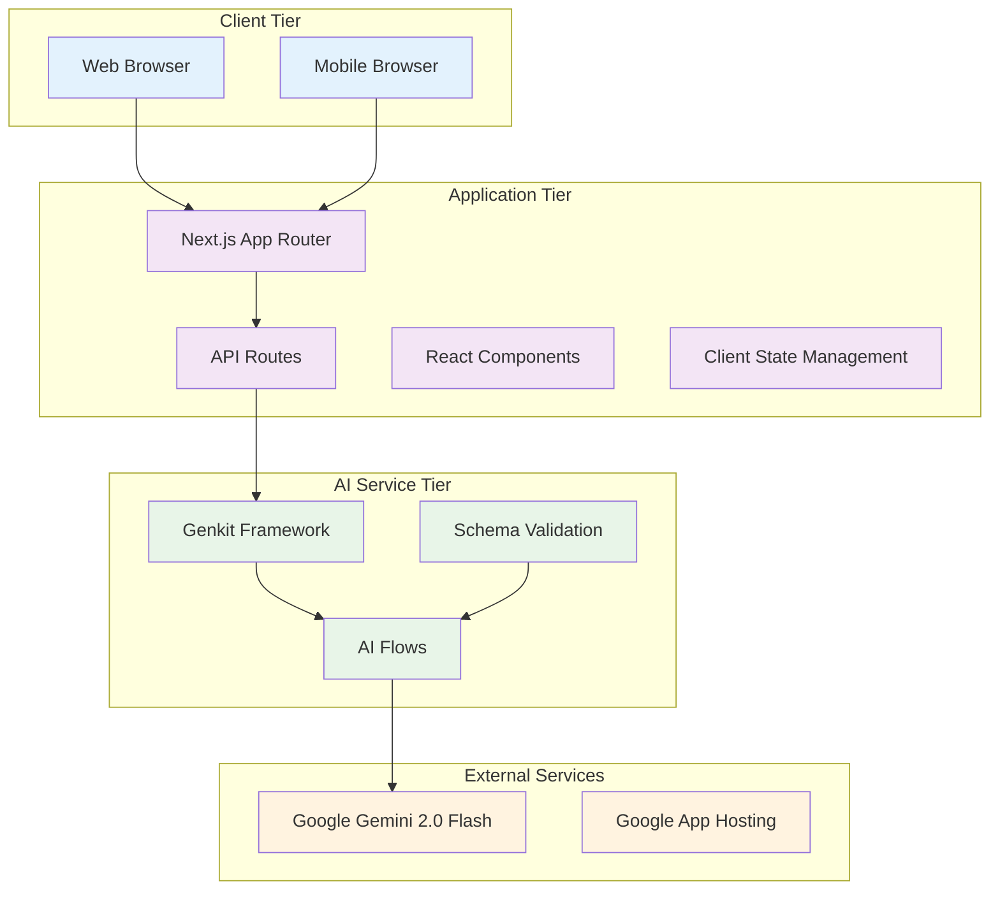

# Technical Specification: Funnel Flow

## 1. Overview

This document provides detailed technical specifications for implementing Funnel Flow, an AI-powered marketing funnel analysis platform. It covers system architecture, API specifications, data models, security requirements, and implementation guidelines.

---

## 2. System Architecture

### 2.1 High-Level Architecture



### 2.2 Technology Stack Specifications

#### Frontend Stack
```yaml
Framework: Next.js 15.3.3
Runtime: React 18.3.1
Language: TypeScript 5.x
Build Tool: Turbopack (Next.js integrated)
Styling: Tailwind CSS 3.4.1
UI Components: Shadcn UI + Radix UI 1.x
Form Management: React Hook Form 7.54.2
Schema Validation: Zod 3.24.2
Icons: Lucide React 0.475.0
```

#### Backend Stack
```yaml
AI Framework: Genkit 1.13.0
AI Provider: Google AI (@genkit-ai/googleai 1.13.0)
Model: gemini-2.0-flash
Runtime: Node.js 20+
Language: TypeScript 5.x
Validation: Zod 3.24.2
Environment Management: dotenv 16.5.0
```

#### Development Tools
```yaml
Package Manager: npm
Linting: ESLint (Next.js integrated)
Type Checking: TypeScript compiler
Hot Reloading: Turbopack
AI Development: Genkit CLI 1.13.0
```

---

## 3. API Specifications

### 3.1 AI Flow APIs

#### Analyze Marketing Offer Flow

**Endpoint**: Internal Genkit Flow  
**Function**: `analyzeMarketingOffer`

**Input Schema**:
```typescript
interface AnalyzeMarketingOfferInput {
  offerDetails: string;           // URL or text description
  inputType: 'link' | 'text';     // Input format type
  persona: string;                // Target audience persona
}
```

**Output Schema**:
```typescript
interface AnalyzeMarketingOfferOutput {
  analysis: AnalysisItem[];
  sampleCopy: SampleCopy;
}

interface AnalysisItem {
  id: string;                     // Unique identifier
  area: string;                   // Analysis area (e.g., "Headline Clarity")
  score: number;                  // Score 1-10
  leak: string;                   // Identified weakness
  fix: {
    primarySuggestion: string;    // Suggestion A
    abTestSuggestion: string;     // Suggestion B
  };
}

interface SampleCopy {
  platform: string;              // e.g., "Instagram Post"
  content: string;                // Generated marketing copy
}
```

**Performance Requirements**:
- Response time: < 30 seconds
- Success rate: > 99%
- Concurrent request handling: 100+ requests/minute

#### Generate Social Media Copy Flow

**Endpoint**: Internal Genkit Flow  
**Function**: `generateSocialMediaCopy`

**Input Schema**:
```typescript
interface GenerateSocialMediaCopyInput {
  analysis: AnalysisItem[];       // Previous analysis results
  persona: string;                // Target audience
  offerDetails: string;           // Original offer details
}
```

**Output Schema**:
```typescript
interface GenerateSocialMediaCopyOutput {
  platform: string;              // Target platform
  content: string;                // Generated copy
}
```

### 3.2 Client-Side API Integration

#### Frontend to AI Service Communication

```typescript
// Client-side function call pattern
const handleAnalysis = async (input: AnalyzeMarketingOfferInput) => {
  try {
    const response = await analyzeMarketingOffer(input);
    setResults(response);
  } catch (error) {
    handleError(error);
  }
};
```

**Error Handling**:
```typescript
interface APIError {
  message: string;
  code: string;
  details?: any;
}

// Error response format
{
  success: false,
  error: {
    message: "Validation failed",
    code: "VALIDATION_ERROR",
    details: { field: "offerDetails", reason: "Required field missing" }
  }
}
```

---

## 4. Data Models & Schemas

### 4.1 Core Data Models

#### User Input Models
```typescript
// Persona options
type PersonaType = 
  | 'General Audience'
  | 'SaaS Founders'
  | 'Busy Parents'
  | 'Coaches & Consultants'
  | 'E-commerce Shoppers'
  | 'Creative Professionals';

// Input validation schema
const InputValidationSchema = z.object({
  offerDetails: z.string()
    .min(10, "Please provide at least 10 characters")
    .max(2000, "Input too long, please limit to 2000 characters"),
  inputType: z.enum(['link', 'text']),
  persona: z.string().min(1, "Please select a persona")
});
```

#### Analysis Output Models
```typescript
// Score validation
const ScoreSchema = z.number()
  .min(1, "Score must be at least 1")
  .max(10, "Score cannot exceed 10")
  .int("Score must be an integer");

// Complete analysis schema
const AnalysisOutputSchema = z.object({
  analysis: z.array(z.object({
    id: z.string().uuid(),
    area: z.string().min(1),
    score: ScoreSchema,
    leak: z.string().min(10),
    fix: z.object({
      primarySuggestion: z.string().min(20),
      abTestSuggestion: z.string().min(20)
    })
  })).min(2).max(3),
  sampleCopy: z.object({
    platform: z.string().min(1),
    content: z.string().min(50).max(500)
  })
});
```

### 4.2 Client State Models

#### React Component State
```typescript
// Main page state interface
interface FunnelFlowState {
  inputType: 'link' | 'text';
  inputValue: string;
  persona: PersonaType;
  results: AnalyzeMarketingOfferOutput | null;
  error: string;
  isPending: boolean;
}

// Form validation state
interface FormValidationState {
  isValid: boolean;
  errors: Record<string, string>;
  touched: Record<string, boolean>;
}
```

---

## 5. Component Specifications

### 5.1 React Component Architecture

#### Component Hierarchy
```
App Layout (layout.tsx)
├── Home Page (page.tsx)
    ├── Header
    ├── FunnelAnalysisForm
    │   ├── PersonaSelect
    │   ├── InputToggle
    │   ├── InputField/Textarea
    │   └── SubmitButton
    ├── LoadingSpinner (conditional)
    ├── AnalysisResults (conditional)
    │   ├── AnalysisCard[]
    │   │   └── ScoreDonut
    │   └── SampleCopyCard
    │       └── CopyButton
    └── Footer
```

#### Component Props Specifications

**FunnelAnalysisForm Component**:
```typescript
interface FunnelAnalysisFormProps {
  inputType: 'link' | 'text';
  setInputType: (type: 'link' | 'text') => void;
  inputValue: string;
  handleInputChange: (e: React.ChangeEvent<HTMLInputElement | HTMLTextAreaElement>) => void;
  persona: string;
  setPersona: (persona: string) => void;
  handleSubmit: (e: React.FormEvent) => void;
  isLoading: boolean;
  error: string;
}
```

**AnalysisResults Component**:
```typescript
interface AnalysisResultsProps {
  results: AnalyzeMarketingOfferOutput;
}
```

**ScoreDonut Component**:
```typescript
interface ScoreDonutProps {
  score: number; // 1-10
}
```

### 5.2 Component Implementation Standards

#### Error Boundary Pattern
```typescript
class AnalysisErrorBoundary extends React.Component {
  constructor(props: any) {
    super(props);
    this.state = { hasError: false };
  }

  static getDerivedStateFromError(error: Error) {
    return { hasError: true };
  }

  componentDidCatch(error: Error, errorInfo: React.ErrorInfo) {
    console.error('Analysis component error:', error, errorInfo);
  }

  render() {
    if (this.state.hasError) {
      return <ErrorFallback />;
    }
    return this.props.children;
  }
}
```

#### Loading State Management
```typescript
// Use React.useTransition for non-blocking UI updates
const [isPending, startTransition] = useTransition();

const handleSubmit = async (data: FormData) => {
  startTransition(async () => {
    try {
      const result = await analyzeMarketingOffer(data);
      setResults(result);
    } catch (error) {
      setError(error.message);
    }
  });
};
```

---

## 6. Security Specifications

### 6.1 Environment Security

#### Environment Variables
```bash
# Required environment variables
GOOGLE_API_KEY=your_google_ai_api_key_here

# Development environment
NODE_ENV=development|production
```

#### Security Headers
```typescript
// Next.js security headers configuration
const securityHeaders = [
  {
    key: 'X-DNS-Prefetch-Control',
    value: 'on'
  },
  {
    key: 'Strict-Transport-Security',
    value: 'max-age=63072000; includeSubDomains; preload'
  },
  {
    key: 'X-XSS-Protection',
    value: '1; mode=block'
  },
  {
    key: 'X-Frame-Options',
    value: 'DENY'
  },
  {
    key: 'X-Content-Type-Options',
    value: 'nosniff'
  },
  {
    key: 'Referrer-Policy',
    value: 'origin-when-cross-origin'
  }
];
```

### 6.2 Input Validation & Sanitization

#### Client-Side Validation
```typescript
// Input sanitization
const sanitizeInput = (input: string): string => {
  return input
    .trim()
    .replace(/<script\b[^<]*(?:(?!<\/script>)<[^<]*)*<\/script>/gi, '')
    .replace(/javascript:/gi, '')
    .substring(0, 2000); // Limit input length
};

// URL validation for link inputs
const validateURL = (url: string): boolean => {
  try {
    const urlObj = new URL(url);
    return ['http:', 'https:'].includes(urlObj.protocol);
  } catch {
    return false;
  }
};
```

#### Server-Side Validation
```typescript
// Genkit flow input validation
const validateAnalysisInput = (input: any): AnalyzeMarketingOfferInput => {
  const result = AnalyzeMarketingOfferInputSchema.safeParse(input);
  if (!result.success) {
    throw new Error(`Validation failed: ${result.error.message}`);
  }
  return result.data;
};
```

### 6.3 API Security

#### Rate Limiting Strategy
```typescript
// Rate limiting configuration
interface RateLimitConfig {
  windowMs: number;     // 15 minutes
  maxRequests: number;  // 100 requests per window
  skipSuccessfulRequests: boolean;
  standardHeaders: boolean;
}

const rateLimitConfig: RateLimitConfig = {
  windowMs: 15 * 60 * 1000, // 15 minutes
  maxRequests: 100,
  skipSuccessfulRequests: false,
  standardHeaders: true
};
```

---

## 7. Performance Specifications

### 7.1 Performance Targets

#### Page Load Performance
```yaml
First Contentful Paint (FCP): < 1.5 seconds
Largest Contentful Paint (LCP): < 2.5 seconds
Cumulative Layout Shift (CLS): < 0.1
First Input Delay (FID): < 100ms
Time to Interactive (TTI): < 3.5 seconds
```

#### AI Processing Performance
```yaml
Analysis Response Time: < 30 seconds (95th percentile)
Error Rate: < 2%
Throughput: 100+ requests/minute
Concurrent Users: 1000+
```

### 7.2 Optimization Strategies

#### Frontend Optimizations
```typescript
// Code splitting with dynamic imports
const AnalysisResults = dynamic(
  () => import('@/components/funnel-flow/AnalysisResults'),
  {
    loading: () => <LoadingSpinner />,
    ssr: false // Client-side only for heavy components
  }
);

// Image optimization
const optimizedImageProps = {
  src: "/hero-image.jpg",
  alt: "Funnel Flow Analysis",
  width: 800,
  height: 600,
  priority: true, // Above-the-fold images
  placeholder: "blur"
};
```

#### Backend Optimizations
```typescript
// Response caching strategy
const cacheConfig = {
  maxAge: 300, // 5 minutes
  staleWhileRevalidate: 3600, // 1 hour
  cacheControl: 'public, max-age=300, s-maxage=3600'
};

// Connection pooling for AI service
const aiServiceConfig = {
  maxConcurrentRequests: 10,
  retryAttempts: 3,
  retryDelay: 1000,
  timeout: 30000
};
```

---

## 8. Error Handling Specifications

### 8.1 Error Categories

#### Client-Side Errors
```typescript
enum ClientErrorType {
  VALIDATION_ERROR = 'VALIDATION_ERROR',
  NETWORK_ERROR = 'NETWORK_ERROR',
  TIMEOUT_ERROR = 'TIMEOUT_ERROR',
  UNEXPECTED_ERROR = 'UNEXPECTED_ERROR'
}

interface ClientError {
  type: ClientErrorType;
  message: string;
  details?: any;
  timestamp: Date;
}
```

#### Server-Side Errors
```typescript
enum ServerErrorType {
  AI_SERVICE_ERROR = 'AI_SERVICE_ERROR',
  SCHEMA_VALIDATION_ERROR = 'SCHEMA_VALIDATION_ERROR',
  RATE_LIMIT_ERROR = 'RATE_LIMIT_ERROR',
  INTERNAL_ERROR = 'INTERNAL_ERROR'
}

interface ServerError {
  type: ServerErrorType;
  message: string;
  statusCode: number;
  requestId?: string;
}
```

### 8.2 Error Recovery Strategies

#### Retry Logic
```typescript
const retryConfig = {
  maxAttempts: 3,
  baseDelay: 1000,
  maxDelay: 10000,
  exponentialBackoff: true
};

const withRetry = async <T>(
  operation: () => Promise<T>,
  config: typeof retryConfig = retryConfig
): Promise<T> => {
  let lastError: Error;
  
  for (let attempt = 1; attempt <= config.maxAttempts; attempt++) {
    try {
      return await operation();
    } catch (error) {
      lastError = error;
      
      if (attempt === config.maxAttempts) {
        throw lastError;
      }
      
      const delay = Math.min(
        config.baseDelay * Math.pow(2, attempt - 1),
        config.maxDelay
      );
      
      await new Promise(resolve => setTimeout(resolve, delay));
    }
  }
  
  throw lastError!;
};
```

---

## 9. Accessibility Specifications

### 9.1 WCAG 2.1 AA Compliance

#### Keyboard Navigation
```typescript
// Keyboard event handling
const handleKeyDown = (event: React.KeyboardEvent) => {
  switch (event.key) {
    case 'Enter':
    case ' ':
      if (event.target === submitButton) {
        event.preventDefault();
        handleSubmit();
      }
      break;
    case 'Escape':
      if (isModalOpen) {
        closeModal();
      }
      break;
  }
};
```

#### Screen Reader Support
```tsx
// Semantic HTML and ARIA attributes
<form 
  onSubmit={handleSubmit}
  aria-labelledby="form-title"
  aria-describedby="form-description"
>
  <h2 id="form-title">Funnel Analysis Form</h2>
  <p id="form-description">
    Enter your landing page URL or describe your offer to get AI-powered analysis
  </p>
  
  <label htmlFor="persona-select">
    Target Audience Persona
  </label>
  <select 
    id="persona-select"
    aria-required="true"
    aria-describedby="persona-help"
  >
    {/* options */}
  </select>
  <div id="persona-help" className="sr-only">
    Select the primary audience for your marketing offer
  </div>
</form>
```

#### Color Contrast Requirements
```css
/* Minimum contrast ratios (WCAG AA) */
:root {
  --text-primary: #ffffff;      /* 21:1 ratio on dark background */
  --text-secondary: #e2e8f0;    /* 15.8:1 ratio on dark background */
  --text-muted: #94a3b8;        /* 7.2:1 ratio on dark background */
  --background-primary: #1e293b;
  --accent-primary: #a78bfa;    /* 4.7:1 ratio on dark background */
}
```

---

## 10. Deployment Specifications

### 10.1 Build Configuration

#### Next.js Build Settings
```typescript
// next.config.ts
const nextConfig: NextConfig = {
  output: 'standalone',
  typescript: {
    ignoreBuildErrors: false // Enable for production
  },
  eslint: {
    ignoreDuringBuilds: false // Enable for production
  },
  compress: true,
  poweredByHeader: false,
  generateEtags: true,
  images: {
    formats: ['image/webp', 'image/avif'],
    minimumCacheTTL: 60 * 60 * 24 * 7 // 1 week
  }
};
```

#### Environment Configuration
```yaml
# Production environment variables
GOOGLE_API_KEY: ${GOOGLE_API_KEY}
NODE_ENV: production
NEXT_TELEMETRY_DISABLED: 1

# Build optimization
NEXT_SHARP: 1
NEXT_RUNTIME: nodejs
```

### 10.2 Google App Hosting Configuration

#### apphosting.yaml
```yaml
runConfig:
  runtime: nodejs20
  cpu: 1
  memory: 2Gi
  maxInstances: 100
  minInstances: 0
  concurrency: 1000

buildConfig:
  runtime: nodejs20
  commands:
    - npm ci
    - npm run build
  outputDirectory: .next

env:
  - variable: GOOGLE_API_KEY
    secret: google-ai-api-key
  - variable: NODE_ENV
    value: production
```

### 10.3 Monitoring & Observability

#### Performance Monitoring
```typescript
// Web Vitals tracking
export function reportWebVitals(metric: any) {
  switch (metric.name) {
    case 'FCP':
    case 'LCP':
    case 'CLS':
    case 'FID':
    case 'TTFB':
      // Send to analytics service
      analytics.track('web_vital', {
        metric_name: metric.name,
        value: metric.value,
        page: window.location.pathname
      });
      break;
  }
}
```

#### Error Tracking
```typescript
// Global error handler
window.addEventListener('error', (event) => {
  console.error('Global error:', event.error);
  // Send to error tracking service
});

// Unhandled promise rejection handler
window.addEventListener('unhandledrejection', (event) => {
  console.error('Unhandled promise rejection:', event.reason);
  // Send to error tracking service
});
```

---

## 11. Testing Requirements

### 11.1 Unit Testing Specifications
- Test coverage: > 80% for business logic
- Test framework: Jest + React Testing Library
- AI flow testing: Genkit testing utilities
- Schema validation testing: Zod schema tests

### 11.2 Integration Testing
- End-to-end user workflows
- AI service integration tests
- Form submission and validation flows
- Error handling scenarios

### 11.3 Performance Testing
- Load testing: 1000+ concurrent users
- Stress testing: AI service limits
- Browser performance testing
- Mobile device testing

---

## 12. Maintenance & Updates

### 12.1 Version Management
```json
{
  "versioning": "semantic",
  "updateStrategy": "automated_patch",
  "securityUpdates": "immediate",
  "dependencyUpdates": "weekly"
}
```

### 12.2 Monitoring Requirements
- Uptime monitoring: 99.9% SLA
- Performance monitoring: Core Web Vitals
- Error rate monitoring: < 2% threshold
- AI service health monitoring

---

*This technical specification serves as the definitive implementation guide for Funnel Flow. All development work should adhere to these specifications to ensure consistency, performance, and maintainability.* 