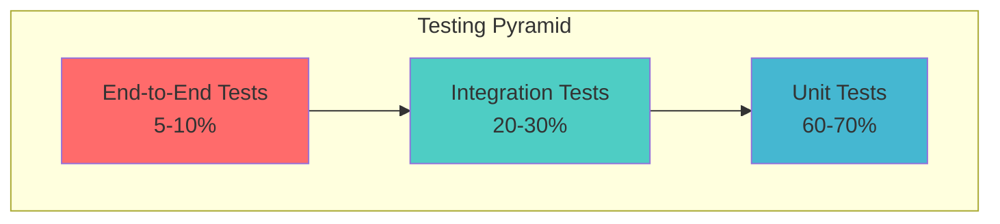

# Testing Strategy: Funnel Flow

## 1. Overview

This document outlines the comprehensive testing strategy for Funnel Flow, covering all aspects from unit testing to production monitoring. The strategy ensures reliability, performance, and user experience quality across the AI-powered marketing funnel analysis platform.

---

## 2. Testing Philosophy & Principles

### 2.1 Testing Pyramid



### 2.2 Core Testing Principles

#### Quality Assurance Goals
- **Reliability**: 99.9% uptime with graceful error handling
- **Performance**: < 30 second AI response times, < 2 second page loads
- **Accessibility**: WCAG 2.1 AA compliance across all features
- **Security**: Input validation and XSS protection
- **User Experience**: Intuitive interface with clear feedback

#### Testing Philosophy
- **Shift-Left Testing**: Catch issues early in development
- **Test-Driven Development**: Write tests before implementation (when applicable)
- **Behavior-Driven Testing**: Focus on user scenarios and business value
- **Continuous Testing**: Automated testing in CI/CD pipeline
- **Risk-Based Testing**: Prioritize high-impact, high-risk areas

---

## 3. Testing Framework & Tools

### 3.1 Technology Stack

#### Frontend Testing
```yaml
Unit Testing:
  Framework: Jest 29.x
  React Testing: @testing-library/react 13.x
  Utilities: @testing-library/jest-dom
  User Events: @testing-library/user-event

Component Testing:
  Framework: Storybook 7.x (future)
  Visual Testing: Chromatic (future)

End-to-End Testing:
  Framework: Playwright 1.x (future)
  Alternatives: Cypress (if needed)
```

#### Backend/AI Testing
```yaml
Flow Testing:
  Framework: Genkit Testing Utilities
  Schema Testing: Zod validation
  Mock Services: MSW (Mock Service Worker)

Performance Testing:
  Load Testing: Artillery.io
  Stress Testing: k6
  Monitoring: Custom metrics
```

#### Cross-Platform Testing
```yaml
Browser Testing:
  Local: Chrome, Firefox, Safari, Edge
  Cloud: BrowserStack (future)
  Mobile: Chrome Mobile, Safari Mobile

Accessibility Testing:
  Automated: axe-core, jest-axe
  Manual: Screen readers, keyboard navigation
  Tools: WAVE, Lighthouse
```

### 3.2 Testing Environment Setup

#### Local Development Setup
```bash
# Install testing dependencies
npm install --save-dev \
  jest \
  @testing-library/react \
  @testing-library/jest-dom \
  @testing-library/user-event \
  jest-environment-jsdom

# Configure Jest (jest.config.js)
module.exports = {
  testEnvironment: 'jsdom',
  setupFilesAfterEnv: ['<rootDir>/src/test/setup.ts'],
  moduleNameMapping: {
    '^@/(.*)$': '<rootDir>/src/$1'
  },
  collectCoverageFrom: [
    'src/**/*.{js,jsx,ts,tsx}',
    '!src/**/*.d.ts',
    '!src/test/**/*'
  ]
};
```

#### Test Setup Configuration
```typescript
// src/test/setup.ts
import '@testing-library/jest-dom';
import { configure } from '@testing-library/react';

// Configure testing library
configure({ testIdAttribute: 'data-testid' });

// Mock environment variables
process.env.GOOGLE_API_KEY = 'test-api-key';

// Mock Next.js router
jest.mock('next/router', () => ({
  useRouter() {
    return {
      route: '/',
      pathname: '/',
      query: {},
      asPath: '/',
      push: jest.fn(),
      replace: jest.fn()
    };
  },
}));

// Mock AI flows
jest.mock('@/ai/flows/analyze-marketing-offer', () => ({
  analyzeMarketingOffer: jest.fn()
}));
```

---

## 4. Unit Testing Strategy

### 4.1 Component Testing

#### Testing Scope
- **UI Components**: All reusable components in `src/components/ui`
- **Feature Components**: Business logic components in `src/components/funnel-flow`
- **Custom Hooks**: All hooks in `src/hooks`
- **Utility Functions**: All functions in `src/lib`

#### Component Testing Template
```typescript
// Example: FunnelAnalysisForm.test.tsx
import { render, screen, fireEvent, waitFor } from '@testing-library/react';
import userEvent from '@testing-library/user-event';
import { FunnelAnalysisForm } from '../FunnelAnalysisForm';

describe('FunnelAnalysisForm', () => {
  const mockProps = {
    inputType: 'link' as const,
    setInputType: jest.fn(),
    inputValue: '',
    handleInputChange: jest.fn(),
    persona: 'General Audience',
    setPersona: jest.fn(),
    handleSubmit: jest.fn(),
    isLoading: false,
    error: ''
  };

  beforeEach(() => {
    jest.clearAllMocks();
  });

  describe('Rendering', () => {
    it('renders all form elements correctly', () => {
      render(<FunnelAnalysisForm {...mockProps} />);
      
      expect(screen.getByLabelText(/target audience/i)).toBeInTheDocument();
      expect(screen.getByRole('button', { name: /generate audit/i })).toBeInTheDocument();
      expect(screen.getByPlaceholderText(/https:\/\//)).toBeInTheDocument();
    });

    it('displays text input when inputType is text', () => {
      render(<FunnelAnalysisForm {...mockProps} inputType="text" />);
      
      expect(screen.getByPlaceholderText(/describe your offer/i)).toBeInTheDocument();
    });
  });

  describe('User Interactions', () => {
    it('calls setInputType when toggle is clicked', async () => {
      const user = userEvent.setup();
      render(<FunnelAnalysisForm {...mockProps} />);
      
      const textToggle = screen.getByRole('button', { name: /describe offer/i });
      await user.click(textToggle);
      
      expect(mockProps.setInputType).toHaveBeenCalledWith('text');
    });

    it('calls handleSubmit when form is submitted', async () => {
      const user = userEvent.setup();
      render(<FunnelAnalysisForm {...mockProps} inputValue="https://example.com" />);
      
      const submitButton = screen.getByRole('button', { name: /generate audit/i });
      await user.click(submitButton);
      
      expect(mockProps.handleSubmit).toHaveBeenCalled();
    });
  });

  describe('Validation', () => {
    it('displays error message when provided', () => {
      render(<FunnelAnalysisForm {...mockProps} error="Invalid URL" />);
      
      expect(screen.getByText('Invalid URL')).toBeInTheDocument();
    });

    it('disables submit button when loading', () => {
      render(<FunnelAnalysisForm {...mockProps} isLoading={true} />);
      
      const submitButton = screen.getByRole('button');
      expect(submitButton).toBeDisabled();
    });
  });

  describe('Accessibility', () => {
    it('has proper ARIA labels', () => {
      render(<FunnelAnalysisForm {...mockProps} />);
      
      expect(screen.getByLabelText(/target audience/i)).toHaveAttribute('aria-required', 'true');
    });

    it('supports keyboard navigation', async () => {
      const user = userEvent.setup();
      render(<FunnelAnalysisForm {...mockProps} />);
      
      await user.tab();
      expect(screen.getByRole('combobox')).toHaveFocus();
    });
  });
});
```

### 4.2 Hook Testing

#### Custom Hook Testing Example
```typescript
// useAnalysis.test.ts
import { renderHook, act } from '@testing-library/react';
import { useAnalysis } from '../useAnalysis';
import { analyzeMarketingOffer } from '@/ai/flows/analyze-marketing-offer';

jest.mock('@/ai/flows/analyze-marketing-offer');

describe('useAnalysis', () => {
  const mockAnalyzeMarketingOffer = analyzeMarketingOffer as jest.MockedFunction<typeof analyzeMarketingOffer>;

  beforeEach(() => {
    mockAnalyzeMarketingOffer.mockClear();
  });

  it('should initialize with default state', () => {
    const { result } = renderHook(() => useAnalysis());
    
    expect(result.current.results).toBeNull();
    expect(result.current.isLoading).toBe(false);
    expect(result.current.error).toBe('');
  });

  it('should handle successful analysis', async () => {
    const mockResults = {
      analysis: [{
        id: '1',
        area: 'Headline',
        score: 8,
        leak: 'Could be more specific',
        fix: {
          primarySuggestion: 'Add numbers',
          abTestSuggestion: 'Use urgency'
        }
      }],
      sampleCopy: {
        platform: 'Instagram',
        content: 'Test copy'
      }
    };

    mockAnalyzeMarketingOffer.mockResolvedValue(mockResults);

    const { result } = renderHook(() => useAnalysis());

    await act(async () => {
      await result.current.analyze({
        offerDetails: 'https://example.com',
        inputType: 'link',
        persona: 'General Audience'
      });
    });

    expect(result.current.results).toEqual(mockResults);
    expect(result.current.isLoading).toBe(false);
    expect(result.current.error).toBe('');
  });

  it('should handle analysis errors', async () => {
    mockAnalyzeMarketingOffer.mockRejectedValue(new Error('API Error'));

    const { result } = renderHook(() => useAnalysis());

    await act(async () => {
      await result.current.analyze({
        offerDetails: 'invalid-input',
        inputType: 'link',
        persona: 'General Audience'
      });
    });

    expect(result.current.results).toBeNull();
    expect(result.current.isLoading).toBe(false);
    expect(result.current.error).toBe('API Error');
  });
});
```

### 4.3 Utility Function Testing

#### Schema Validation Testing
```typescript
// utils.test.ts
import { validateInput, sanitizeInput } from '../utils';

describe('Input Validation', () => {
  describe('validateInput', () => {
    it('validates correct URL format', () => {
      const validUrls = [
        'https://example.com',
        'http://test.org/page',
        'https://subdomain.example.co.uk/path?query=1'
      ];

      validUrls.forEach(url => {
        expect(validateInput(url, 'link')).toBe(true);
      });
    });

    it('rejects invalid URL format', () => {
      const invalidUrls = [
        'not-a-url',
        'javascript:alert(1)',
        'ftp://example.com',
        ''
      ];

      invalidUrls.forEach(url => {
        expect(validateInput(url, 'link')).toBe(false);
      });
    });

    it('validates text input length', () => {
      expect(validateInput('Valid description text', 'text')).toBe(true);
      expect(validateInput('Short', 'text')).toBe(false);
      expect(validateInput('', 'text')).toBe(false);
    });
  });

  describe('sanitizeInput', () => {
    it('removes dangerous script tags', () => {
      const malicious = '<script>alert("xss")</script>Hello';
      expect(sanitizeInput(malicious)).toBe('Hello');
    });

    it('removes javascript protocols', () => {
      const malicious = 'javascript:alert(1)';
      expect(sanitizeInput(malicious)).toBe('');
    });

    it('limits input length', () => {
      const longInput = 'A'.repeat(3000);
      expect(sanitizeInput(longInput)).toHaveLength(2000);
    });
  });
});
```

---

## 5. Integration Testing Strategy

### 5.1 AI Flow Integration Testing

#### Testing AI Flows with Genkit
```typescript
// ai-flows.integration.test.ts
import { runFlow } from '@genkit-ai/core';
import { analyzeMarketingOfferFlow } from '@/ai/flows/analyze-marketing-offer';

describe('AI Flow Integration', () => {
  describe('analyzeMarketingOfferFlow', () => {
    it('should analyze URL input successfully', async () => {
      const input = {
        offerDetails: 'https://example.com/landing',
        inputType: 'link' as const,
        persona: 'SaaS Founders'
      };

      const result = await runFlow(analyzeMarketingOfferFlow, input);

      expect(result).toMatchObject({
        analysis: expect.arrayContaining([
          expect.objectContaining({
            id: expect.any(String),
            area: expect.any(String),
            score: expect.any(Number),
            leak: expect.any(String),
            fix: {
              primarySuggestion: expect.any(String),
              abTestSuggestion: expect.any(String)
            }
          })
        ]),
        sampleCopy: {
          platform: expect.any(String),
          content: expect.any(String)
        }
      });

      // Validate scores are in range
      result.analysis.forEach(item => {
        expect(item.score).toBeGreaterThanOrEqual(1);
        expect(item.score).toBeLessThanOrEqual(10);
      });
    });

    it('should handle different personas correctly', async () => {
      const personas = ['General Audience', 'SaaS Founders', 'Busy Parents'];
      
      for (const persona of personas) {
        const input = {
          offerDetails: 'A productivity app for professionals',
          inputType: 'text' as const,
          persona
        };

        const result = await runFlow(analyzeMarketingOfferFlow, input);
        
        expect(result.analysis).toHaveLength(2); // Minimum 2 analysis items
        expect(result.sampleCopy.content).toContain(persona.toLowerCase().split(' ')[0]);
      }
    });

    it('should validate input schema strictly', async () => {
      const invalidInputs = [
        { offerDetails: '', inputType: 'link', persona: 'General Audience' },
        { offerDetails: 'Valid', inputType: 'invalid', persona: 'General Audience' },
        { offerDetails: 'Valid', inputType: 'link', persona: '' }
      ];

      for (const input of invalidInputs) {
        await expect(runFlow(analyzeMarketingOfferFlow, input))
          .rejects.toThrow();
      }
    });
  });
});
```

### 5.2 Frontend-Backend Integration Testing

#### API Integration Testing
```typescript
// api-integration.test.ts
import { render, screen, fireEvent, waitFor } from '@testing-library/react';
import userEvent from '@testing-library/user-event';
import Home from '@/app/page';
import { analyzeMarketingOffer } from '@/ai/flows/analyze-marketing-offer';

// Mock the AI flow
jest.mock('@/ai/flows/analyze-marketing-offer');
const mockAnalyzeMarketingOffer = analyzeMarketingOffer as jest.MockedFunction<typeof analyzeMarketingOffer>;

describe('Frontend-Backend Integration', () => {
  beforeEach(() => {
    mockAnalyzeMarketingOffer.mockClear();
  });

  it('should complete full analysis workflow', async () => {
    const user = userEvent.setup();
    
    // Mock successful response
    const mockResponse = {
      analysis: [{
        id: '1',
        area: 'Headline Clarity',
        score: 7,
        leak: 'Headline could be more specific',
        fix: {
          primarySuggestion: 'Add specific benefits',
          abTestSuggestion: 'Use question format'
        }
      }],
      sampleCopy: {
        platform: 'Instagram Post',
        content: 'Transform your landing page with AI insights! 🚀'
      }
    };
    
    mockAnalyzeMarketingOffer.mockResolvedValue(mockResponse);

    render(<Home />);

    // Fill out form
    const urlInput = screen.getByPlaceholderText(/https:\/\//);
    await user.type(urlInput, 'https://example.com');

    const personaSelect = screen.getByRole('combobox');
    await user.click(personaSelect);
    await user.click(screen.getByText('SaaS Founders'));

    // Submit form
    const submitButton = screen.getByRole('button', { name: /generate audit/i });
    await user.click(submitButton);

    // Verify loading state
    expect(screen.getByText(/analyzing/i)).toBeInTheDocument();

    // Wait for results
    await waitFor(() => {
      expect(screen.getByText('AI Funnel Audit')).toBeInTheDocument();
    });

    // Verify results display
    expect(screen.getByText('Headline Clarity')).toBeInTheDocument();
    expect(screen.getByText('7')).toBeInTheDocument();
    expect(screen.getByText(/add specific benefits/i)).toBeInTheDocument();

    // Verify API was called correctly
    expect(mockAnalyzeMarketingOffer).toHaveBeenCalledWith({
      offerDetails: 'https://example.com',
      inputType: 'link',
      persona: 'SaaS Founders'
    });
  });

  it('should handle API errors gracefully', async () => {
    const user = userEvent.setup();
    
    mockAnalyzeMarketingOffer.mockRejectedValue(new Error('AI service unavailable'));

    render(<Home />);

    // Fill and submit form
    const urlInput = screen.getByPlaceholderText(/https:\/\//);
    await user.type(urlInput, 'https://example.com');

    const submitButton = screen.getByRole('button', { name: /generate audit/i });
    await user.click(submitButton);

    // Wait for error message
    await waitFor(() => {
      expect(screen.getByText(/error occurred while analyzing/i)).toBeInTheDocument();
    });

    // Verify no results are shown
    expect(screen.queryByText('AI Funnel Audit')).not.toBeInTheDocument();
  });
});
```

---

## 6. End-to-End Testing Strategy

### 6.1 E2E Testing Framework Setup

#### Playwright Configuration
```typescript
// playwright.config.ts
import { defineConfig, devices } from '@playwright/test';

export default defineConfig({
  testDir: './e2e',
  fullyParallel: true,
  forbidOnly: !!process.env.CI,
  retries: process.env.CI ? 2 : 0,
  workers: process.env.CI ? 1 : undefined,
  reporter: 'html',
  use: {
    baseURL: 'http://localhost:3000',
    trace: 'on-first-retry',
    screenshot: 'only-on-failure'
  },
  projects: [
    {
      name: 'chromium',
      use: { ...devices['Desktop Chrome'] },
    },
    {
      name: 'firefox',
      use: { ...devices['Desktop Firefox'] },
    },
    {
      name: 'webkit',
      use: { ...devices['Desktop Safari'] },
    },
    {
      name: 'Mobile Chrome',
      use: { ...devices['Pixel 5'] },
    },
    {
      name: 'Mobile Safari',
      use: { ...devices['iPhone 12'] },
    },
  ],
  webServer: {
    command: 'npm run dev',
    url: 'http://localhost:3000',
    reuseExistingServer: !process.env.CI,
  },
});
```

### 6.2 Critical User Journey Tests

#### Complete Analysis Workflow
```typescript
// e2e/analysis-workflow.spec.ts
import { test, expect } from '@playwright/test';

test.describe('Funnel Analysis Workflow', () => {
  test.beforeEach(async ({ page }) => {
    await page.goto('/');
  });

  test('should complete URL analysis successfully', async ({ page }) => {
    // Fill out form
    await page.fill('input[placeholder*="https://"]', 'https://example.com');
    
    // Select persona
    await page.click('role=combobox');
    await page.click('text=SaaS Founders');
    
    // Submit form
    await page.click('role=button[name="Generate Audit"]');
    
    // Verify loading state
    await expect(page.locator('text=Analyzing')).toBeVisible();
    
    // Wait for results (with timeout for AI response)
    await expect(page.locator('text=AI Funnel Audit')).toBeVisible({ timeout: 45000 });
    
    // Verify analysis results structure
    await expect(page.locator('[data-testid="analysis-item"]')).toHaveCount(2, { timeout: 5000 });
    
    // Verify score visualization
    await expect(page.locator('[data-testid="score-donut"]')).toBeVisible();
    
    // Verify sample copy section
    await expect(page.locator('text=Generated Sample Copy')).toBeVisible();
    
    // Test copy to clipboard functionality
    await page.click('button:has-text("Copy")');
    await expect(page.locator('text=Copied!')).toBeVisible();
  });

  test('should handle text input analysis', async ({ page }) => {
    // Switch to text input
    await page.click('button:has-text("Describe Offer")');
    
    // Fill text area
    await page.fill('textarea', 'A productivity app that helps busy professionals manage their time better');
    
    // Select persona
    await page.click('role=combobox');
    await page.click('text=Busy Parents');
    
    // Submit and verify
    await page.click('role=button[name="Generate Audit"]');
    await expect(page.locator('text=AI Funnel Audit')).toBeVisible({ timeout: 45000 });
  });

  test('should show validation errors for empty input', async ({ page }) => {
    // Try to submit without input
    await page.click('role=button[name="Generate Audit"]');
    
    // Verify error message
    await expect(page.locator('text=Please enter a URL or describe your offer')).toBeVisible();
  });

  test('should be responsive on mobile devices', async ({ page }) => {
    // Set mobile viewport
    await page.setViewportSize({ width: 375, height: 667 });
    
    // Verify mobile layout
    await expect(page.locator('main')).toBeVisible();
    
    // Test form interaction on mobile
    await page.fill('input[placeholder*="https://"]', 'https://mobile-test.com');
    await page.click('role=button[name="Generate Audit"]');
    
    // Verify form submission works
    await expect(page.locator('text=Analyzing')).toBeVisible();
  });
});
```

#### Error Handling Scenarios
```typescript
// e2e/error-handling.spec.ts
import { test, expect } from '@playwright/test';

test.describe('Error Handling', () => {
  test('should handle AI service timeout gracefully', async ({ page }) => {
    // Mock network delay
    await page.route('**/api/**', route => {
      setTimeout(() => route.continue(), 35000); // Simulate timeout
    });

    await page.goto('/');
    await page.fill('input[placeholder*="https://"]', 'https://example.com');
    await page.click('role=button[name="Generate Audit"]');

    // Should show timeout error
    await expect(page.locator('text=An error occurred while analyzing')).toBeVisible({ timeout: 40000 });
  });

  test('should handle network errors', async ({ page }) => {
    // Mock network failure
    await page.route('**/api/**', route => route.abort());

    await page.goto('/');
    await page.fill('input[placeholder*="https://"]', 'https://example.com');
    await page.click('role=button[name="Generate Audit"]');

    await expect(page.locator('text=An error occurred while analyzing')).toBeVisible();
  });
});
```

---

## 7. Performance Testing Strategy

### 7.1 Load Testing

#### AI Service Load Testing
```javascript
// load-tests/ai-service.js (Artillery.io)
config:
  target: 'http://localhost:3000'
  phases:
    - duration: 60
      arrivalRate: 5
      name: "Warm up"
    - duration: 120
      arrivalRate: 10
      name: "Ramp up load"
    - duration: 300
      arrivalRate: 20
      name: "Sustained load"
  processor: "./load-test-processor.js"

scenarios:
  - name: "Funnel Analysis"
    weight: 100
    flow:
      - post:
          url: "/api/analyze"
          json:
            offerDetails: "https://example.com/landing-page"
            inputType: "link"
            persona: "{{ $randomPick(['General Audience', 'SaaS Founders', 'Busy Parents']) }}"
          expect:
            - statusCode: 200
            - contentType: json
            - hasProperty: "analysis"
          capture:
            - json: "$.analysis[0].score"
              as: "firstScore"
      - think: 2
```

#### Frontend Performance Testing
```typescript
// performance/lighthouse.test.ts
import lighthouse from 'lighthouse';
import * as chromeLauncher from 'chrome-launcher';

describe('Performance Tests', () => {
  let chrome;
  let port;

  beforeAll(async () => {
    chrome = await chromeLauncher.launch({ chromeFlags: ['--headless'] });
    port = chrome.port;
  });

  afterAll(async () => {
    await chrome.kill();
  });

  test('should meet Core Web Vitals thresholds', async () => {
    const options = {
      logLevel: 'info',
      output: 'json',
      onlyCategories: ['performance'],
      port
    };

    const runnerResult = await lighthouse('http://localhost:3000', options);
    const { lhr } = runnerResult;

    // Core Web Vitals thresholds
    expect(lhr.audits['first-contentful-paint'].numericValue).toBeLessThan(1500);
    expect(lhr.audits['largest-contentful-paint'].numericValue).toBeLessThan(2500);
    expect(lhr.audits['cumulative-layout-shift'].numericValue).toBeLessThan(0.1);
    expect(lhr.audits['total-blocking-time'].numericValue).toBeLessThan(200);
  });

  test('should have good performance score', async () => {
    const options = { port, onlyCategories: ['performance'] };
    const { lhr } = await lighthouse('http://localhost:3000', options);
    
    expect(lhr.categories.performance.score).toBeGreaterThan(0.9);
  });
});
```

### 7.2 Stress Testing

#### Concurrent User Simulation
```typescript
// stress-tests/concurrent-analysis.ts
import { test } from '@playwright/test';

test.describe('Stress Tests', () => {
  test('should handle 50 concurrent analysis requests', async () => {
    const promises = [];
    
    for (let i = 0; i < 50; i++) {
      promises.push(
        test.step(`Analysis request ${i + 1}`, async () => {
          const page = await browser.newPage();
          try {
            await page.goto('/');
            await page.fill('input[placeholder*="https://"]', `https://test-${i}.com`);
            await page.click('role=button[name="Generate Audit"]');
            await expect(page.locator('text=AI Funnel Audit')).toBeVisible({ timeout: 45000 });
          } finally {
            await page.close();
          }
        })
      );
    }
    
    // All requests should complete successfully
    await Promise.all(promises);
  });
});
```

---

## 8. Accessibility Testing Strategy

### 8.1 Automated Accessibility Testing

#### Jest + axe-core Integration
```typescript
// accessibility/axe.test.ts
import { render } from '@testing-library/react';
import { axe, toHaveNoViolations } from 'jest-axe';
import Home from '@/app/page';
import FunnelAnalysisForm from '@/components/funnel-flow/FunnelAnalysisForm';

expect.extend(toHaveNoViolations);

describe('Accessibility Tests', () => {
  test('Home page should have no accessibility violations', async () => {
    const { container } = render(<Home />);
    const results = await axe(container);
    expect(results).toHaveNoViolations();
  });

  test('FunnelAnalysisForm should be accessible', async () => {
    const mockProps = {
      inputType: 'link' as const,
      setInputType: jest.fn(),
      inputValue: '',
      handleInputChange: jest.fn(),
      persona: 'General Audience',
      setPersona: jest.fn(),
      handleSubmit: jest.fn(),
      isLoading: false,
      error: ''
    };

    const { container } = render(<FunnelAnalysisForm {...mockProps} />);
    const results = await axe(container);
    expect(results).toHaveNoViolations();
  });

  test('should be accessible in error state', async () => {
    const mockProps = {
      // ... props with error
      error: 'Please enter a valid URL'
    };

    const { container } = render(<FunnelAnalysisForm {...mockProps} />);
    const results = await axe(container);
    expect(results).toHaveNoViolations();
  });
});
```

### 8.2 Manual Accessibility Testing

#### Keyboard Navigation Testing Checklist
```markdown
## Keyboard Navigation Tests

### Form Navigation
- [ ] Tab order is logical and predictable
- [ ] All interactive elements are focusable
- [ ] Focus indicators are clearly visible
- [ ] Enter key submits form
- [ ] Escape key dismisses modals/dropdowns

### Screen Reader Testing
- [ ] Form labels are properly associated
- [ ] Error messages are announced
- [ ] Loading states are announced
- [ ] Results are properly structured for screen readers
- [ ] ARIA landmarks are used correctly

### Color Contrast Testing
- [ ] Text meets WCAG AA contrast ratios (4.5:1)
- [ ] Interactive elements meet contrast requirements
- [ ] Focus indicators have sufficient contrast
- [ ] Error states don't rely solely on color

### Motor Accessibility
- [ ] Click targets are at least 44x44px
- [ ] No essential functionality requires precise movements
- [ ] Hover states have keyboard equivalents
```

#### Screen Reader Testing Script
```typescript
// accessibility/screen-reader.spec.ts
import { test, expect } from '@playwright/test';

test.describe('Screen Reader Accessibility', () => {
  test('should have proper ARIA structure', async ({ page }) => {
    await page.goto('/');

    // Check for main landmarks
    await expect(page.locator('role=main')).toBeVisible();
    await expect(page.locator('role=banner')).toBeVisible(); // header
    await expect(page.locator('role=contentinfo')).toBeVisible(); // footer

    // Check form accessibility
    const form = page.locator('role=form');
    await expect(form).toHaveAttribute('aria-labelledby');

    // Check input labels
    const personaSelect = page.locator('role=combobox');
    await expect(personaSelect).toHaveAttribute('aria-required', 'true');
    await expect(personaSelect).toHaveAttribute('aria-describedby');

    // Check button accessibility
    const submitButton = page.locator('role=button[name="Generate Audit"]');
    await expect(submitButton).toBeVisible();
  });

  test('should announce loading states', async ({ page }) => {
    await page.goto('/');
    
    // Fill form
    await page.fill('input[placeholder*="https://"]', 'https://example.com');
    
    // Submit and check ARIA live region
    await page.click('role=button[name="Generate Audit"]');
    
    // Should have live region for status updates
    await expect(page.locator('[aria-live="polite"]')).toHaveText(/analyzing/i);
  });
});
```

---

## 9. Security Testing Strategy

### 9.1 Input Validation Testing

#### XSS Prevention Testing
```typescript
// security/xss-prevention.test.ts
import { render, screen } from '@testing-library/react';
import userEvent from '@testing-library/user-event';
import FunnelAnalysisForm from '@/components/funnel-flow/FunnelAnalysisForm';

describe('XSS Prevention', () => {
  const mockProps = {
    inputType: 'text' as const,
    setInputType: jest.fn(),
    inputValue: '',
    handleInputChange: jest.fn(),
    persona: 'General Audience',
    setPersona: jest.fn(),
    handleSubmit: jest.fn(),
    isLoading: false,
    error: ''
  };

  test('should sanitize script tags in text input', async () => {
    const user = userEvent.setup();
    const handleInputChange = jest.fn();
    
    render(<FunnelAnalysisForm {...mockProps} handleInputChange={handleInputChange} />);

    const textarea = screen.getByRole('textbox');
    await user.type(textarea, '<script>alert("xss")</script>Legitimate content');

    // Should call handleInputChange but script should be sanitized in validation
    expect(handleInputChange).toHaveBeenCalled();
  });

  test('should reject javascript: URLs', async () => {
    const user = userEvent.setup();
    
    render(<FunnelAnalysisForm {...mockProps} inputType="link" />);

    const input = screen.getByRole('textbox');
    await user.type(input, 'javascript:alert(1)');

    // Form validation should prevent submission
    const submitButton = screen.getByRole('button', { name: /generate audit/i });
    await user.click(submitButton);

    // Should show validation error
    expect(screen.getByText(/please enter a valid url/i)).toBeInTheDocument();
  });
});
```

#### SQL Injection Prevention (Future Database)
```typescript
// security/sql-injection.test.ts
describe('SQL Injection Prevention', () => {
  test('should prevent SQL injection in user inputs', async () => {
    const maliciousInputs = [
      "'; DROP TABLE users; --",
      "1' OR '1'='1",
      "UNION SELECT * FROM admin_users",
      "'; INSERT INTO users VALUES ('admin', 'password'); --"
    ];

    for (const maliciousInput of maliciousInputs) {
      // Test that parameterized queries prevent injection
      // This would be tested against actual database operations
      const result = await testDatabaseQuery(maliciousInput);
      expect(result).not.toContain('admin_users');
      expect(result).not.toThrow('syntax error');
    }
  });
});
```

### 9.2 Authentication Security Testing (Future)

#### Session Management Testing
```typescript
// security/auth.test.ts (for future implementation)
describe('Authentication Security', () => {
  test('should enforce secure session handling', async ({ page }) => {
    // Test session timeout
    // Test CSRF protection
    // Test secure cookie flags
    // Test proper logout
  });

  test('should prevent unauthorized access', async ({ page }) => {
    // Test protected routes
    // Test role-based access
    // Test API endpoint security
  });
});
```

---

## 10. Monitoring & Production Testing

### 10.1 Real User Monitoring (RUM)

#### Performance Monitoring Setup
```typescript
// monitoring/rum.ts
export function initializeRUM() {
  // Web Vitals monitoring
  import('web-vitals').then(({ getCLS, getFID, getFCP, getLCP, getTTFB }) => {
    getCLS(sendToAnalytics);
    getFID(sendToAnalytics);
    getFCP(sendToAnalytics);
    getLCP(sendToAnalytics);
    getTTFB(sendToAnalytics);
  });

  // Custom performance markers
  performance.mark('app-init');
  
  window.addEventListener('load', () => {
    performance.mark('app-loaded');
    performance.measure('app-load-time', 'app-init', 'app-loaded');
  });
}

function sendToAnalytics(metric: any) {
  // Send to monitoring service
  console.log('Performance metric:', metric);
  
  // Track critical thresholds
  if (metric.name === 'LCP' && metric.value > 2500) {
    console.warn('LCP threshold exceeded:', metric.value);
  }
  
  if (metric.name === 'FID' && metric.value > 100) {
    console.warn('FID threshold exceeded:', metric.value);
  }
}
```

### 10.2 Error Monitoring

#### Production Error Tracking
```typescript
// monitoring/error-tracking.ts
class ErrorMonitor {
  static init() {
    // Global error handler
    window.addEventListener('error', (event) => {
      this.logError({
        type: 'javascript',
        message: event.message,
        filename: event.filename,
        lineno: event.lineno,
        colno: event.colno,
        stack: event.error?.stack,
        timestamp: new Date().toISOString(),
        url: window.location.href,
        userAgent: navigator.userAgent
      });
    });

    // Unhandled promise rejections
    window.addEventListener('unhandledrejection', (event) => {
      this.logError({
        type: 'unhandled-promise',
        message: event.reason?.message || 'Unhandled promise rejection',
        stack: event.reason?.stack,
        timestamp: new Date().toISOString(),
        url: window.location.href
      });
    });

    // AI service errors
    this.setupAIErrorMonitoring();
  }

  static logError(error: any) {
    // Send to error tracking service
    console.error('Production error:', error);
    
    // Categorize errors
    if (error.message?.includes('AI service')) {
      this.trackAIServiceError(error);
    } else if (error.message?.includes('Network')) {
      this.trackNetworkError(error);
    }
  }

  static setupAIErrorMonitoring() {
    // Monitor AI service response times
    const originalFetch = window.fetch;
    window.fetch = async (...args) => {
      const start = performance.now();
      try {
        const response = await originalFetch(...args);
        const duration = performance.now() - start;
        
        if (duration > 30000) {
          this.logError({
            type: 'ai-service-slow',
            message: 'AI service response time exceeded threshold',
            duration,
            url: args[0]
          });
        }
        
        return response;
      } catch (error) {
        const duration = performance.now() - start;
        this.logError({
          type: 'ai-service-error',
          message: error.message,
          duration,
          url: args[0],
          stack: error.stack
        });
        throw error;
      }
    };
  }
}
```

### 10.3 Health Check Monitoring

#### Application Health Checks
```typescript
// monitoring/health-checks.ts
export class HealthChecker {
  static async runHealthChecks() {
    const checks = [
      this.checkAIServiceHealth(),
      this.checkPageLoadHealth(),
      this.checkFormFunctionality(),
      this.checkCoreWebVitals()
    ];

    const results = await Promise.allSettled(checks);
    return this.aggregateResults(results);
  }

  static async checkAIServiceHealth() {
    try {
      const start = performance.now();
      // Simple health check request
      const response = await fetch('/api/health');
      const duration = performance.now() - start;
      
      return {
        service: 'ai-service',
        status: response.ok ? 'healthy' : 'unhealthy',
        responseTime: duration,
        timestamp: new Date().toISOString()
      };
    } catch (error) {
      return {
        service: 'ai-service',
        status: 'error',
        error: error.message,
        timestamp: new Date().toISOString()
      };
    }
  }

  static async checkPageLoadHealth() {
    const navigation = performance.getEntriesByType('navigation')[0] as PerformanceNavigationTiming;
    
    return {
      service: 'page-load',
      status: navigation.loadEventEnd < 3000 ? 'healthy' : 'slow',
      loadTime: navigation.loadEventEnd,
      timestamp: new Date().toISOString()
    };
  }
}
```

---

## 11. Test Data Management

### 11.1 Test Data Strategy

#### Mock Data for AI Responses
```typescript
// test-data/mock-responses.ts
export const mockAnalysisResponses = {
  successful: {
    analysis: [
      {
        id: 'test-1',
        area: 'Headline Clarity',
        score: 7,
        leak: 'Headline could be more specific about the main benefit',
        fix: {
          primarySuggestion: 'Include specific numbers or outcomes in the headline',
          abTestSuggestion: 'Use a question format to engage curiosity'
        }
      },
      {
        id: 'test-2',
        area: 'Call-to-Action Strength',
        score: 5,
        leak: 'CTA button text is generic and lacks urgency',
        fix: {
          primarySuggestion: 'Use action-oriented text like "Start Your Free Trial"',
          abTestSuggestion: 'Add time-sensitive language like "Get Instant Access"'
        }
      }
    ],
    sampleCopy: {
      platform: 'Instagram Post',
      content: '🚀 Transform your landing page conversions with AI-powered insights! Our analysis reveals exactly where visitors drop off and provides A/B test suggestions to fix it. Ready to boost your conversion rate? #MarketingTips #ConversionOptimization'
    }
  },
  
  error: {
    message: 'AI service temporarily unavailable',
    code: 'AI_SERVICE_ERROR',
    retry: true
  },
  
  validation: {
    message: 'Invalid input format',
    code: 'VALIDATION_ERROR',
    details: { field: 'offerDetails', reason: 'URL format invalid' }
  }
};

export const testInputs = {
  validUrls: [
    'https://example.com',
    'https://landing.saasapp.com/signup',
    'https://ecommerce-store.com/product/123'
  ],
  
  validTexts: [
    'A productivity app that helps busy professionals manage their time better and achieve work-life balance',
    'An online course teaching digital marketing strategies for small business owners',
    'A meal planning service that delivers personalized recipes based on dietary preferences'
  ],
  
  invalidInputs: [
    '',
    'not-a-url',
    'javascript:alert(1)',
    'short'
  ],
  
  personas: [
    'General Audience',
    'SaaS Founders',
    'Busy Parents',
    'Coaches & Consultants',
    'E-commerce Shoppers',
    'Creative Professionals'
  ]
};
```

### 11.2 Test Environment Management

#### Environment Configuration
```typescript
// test-utils/setup-test-env.ts
export function setupTestEnvironment() {
  // Mock environment variables
  process.env.GOOGLE_API_KEY = 'test-key';
  process.env.NODE_ENV = 'test';
  
  // Setup global mocks
  global.fetch = jest.fn();
  global.navigator.clipboard = {
    writeText: jest.fn().mockResolvedValue(undefined)
  };
  
  // Mock Next.js router
  jest.mock('next/navigation', () => ({
    useRouter: () => ({
      push: jest.fn(),
      replace: jest.fn(),
      back: jest.fn()
    })
  }));
  
  // Setup test database (when implemented)
  // setupTestDatabase();
}

export function cleanupTestEnvironment() {
  jest.clearAllMocks();
  jest.resetAllMocks();
  // cleanup test database
}
```

---

## 12. Test Execution & CI/CD Integration

### 12.1 Test Execution Pipeline

#### GitHub Actions Workflow
```yaml
# .github/workflows/test.yml
name: Test Suite

on:
  push:
    branches: [ main, develop ]
  pull_request:
    branches: [ main ]

jobs:
  unit-tests:
    runs-on: ubuntu-latest
    steps:
      - uses: actions/checkout@v3
      - uses: actions/setup-node@v3
        with:
          node-version: '20'
          cache: 'npm'
      
      - name: Install dependencies
        run: npm ci
      
      - name: Run type checking
        run: npm run typecheck
      
      - name: Run linting
        run: npm run lint
      
      - name: Run unit tests
        run: npm test -- --coverage --watchAll=false
      
      - name: Upload coverage to Codecov
        uses: codecov/codecov-action@v3

  integration-tests:
    runs-on: ubuntu-latest
    needs: unit-tests
    steps:
      - uses: actions/checkout@v3
      - uses: actions/setup-node@v3
        with:
          node-version: '20'
          cache: 'npm'
      
      - name: Install dependencies
        run: npm ci
      
      - name: Run integration tests
        run: npm run test:integration
        env:
          GOOGLE_API_KEY: ${{ secrets.GOOGLE_API_KEY_TEST }}

  e2e-tests:
    runs-on: ubuntu-latest
    needs: integration-tests
    steps:
      - uses: actions/checkout@v3
      - uses: actions/setup-node@v3
        with:
          node-version: '20'
          cache: 'npm'
      
      - name: Install dependencies
        run: npm ci
      
      - name: Install Playwright
        run: npx playwright install --with-deps
      
      - name: Build application
        run: npm run build
      
      - name: Run E2E tests
        run: npm run test:e2e
        env:
          GOOGLE_API_KEY: ${{ secrets.GOOGLE_API_KEY_TEST }}
      
      - name: Upload E2E test results
        uses: actions/upload-artifact@v3
        if: always()
        with:
          name: playwright-report
          path: playwright-report/
```

### 12.2 Test Scripts Configuration

#### Package.json Test Scripts
```json
{
  "scripts": {
    "test": "jest",
    "test:watch": "jest --watch",
    "test:coverage": "jest --coverage",
    "test:integration": "jest --config jest.integration.config.js",
    "test:e2e": "playwright test",
    "test:e2e:ui": "playwright test --ui",
    "test:accessibility": "jest --config jest.a11y.config.js",
    "test:performance": "lighthouse-ci autorun",
    "test:all": "npm run test && npm run test:integration && npm run test:e2e"
  }
}
```

### 12.3 Quality Gates

#### Coverage Requirements
```javascript
// jest.config.js coverage thresholds
module.exports = {
  collectCoverageFrom: [
    'src/**/*.{js,jsx,ts,tsx}',
    '!src/**/*.d.ts',
    '!src/test/**/*'
  ],
  coverageThreshold: {
    global: {
      branches: 80,
      functions: 80,
      lines: 80,
      statements: 80
    },
    './src/components/': {
      branches: 90,
      functions: 90,
      lines: 90,
      statements: 90
    },
    './src/ai/flows/': {
      branches: 85,
      functions: 85,
      lines: 85,
      statements: 85
    }
  }
};
```

---

## 13. Test Reporting & Metrics

### 13.1 Test Reporting Strategy

#### Automated Report Generation
```typescript
// scripts/generate-test-report.ts
import fs from 'fs';
import path from 'path';

interface TestMetrics {
  unitTests: {
    total: number;
    passed: number;
    failed: number;
    coverage: number;
  };
  integrationTests: {
    total: number;
    passed: number;
    failed: number;
  };
  e2eTests: {
    total: number;
    passed: number;
    failed: number;
  };
  performance: {
    lighthouse: number;
    loadTime: number;
    aiResponseTime: number;
  };
}

export function generateTestReport(metrics: TestMetrics) {
  const report = `
# Test Execution Report

## Summary
- **Total Tests**: ${metrics.unitTests.total + metrics.integrationTests.total + metrics.e2eTests.total}
- **Overall Pass Rate**: ${calculateOverallPassRate(metrics)}%
- **Code Coverage**: ${metrics.unitTests.coverage}%

## Unit Tests
- Total: ${metrics.unitTests.total}
- Passed: ${metrics.unitTests.passed}
- Failed: ${metrics.unitTests.failed}
- Pass Rate: ${(metrics.unitTests.passed / metrics.unitTests.total * 100).toFixed(1)}%

## Integration Tests
- Total: ${metrics.integrationTests.total}
- Passed: ${metrics.integrationTests.passed}
- Failed: ${metrics.integrationTests.failed}

## E2E Tests
- Total: ${metrics.e2eTests.total}
- Passed: ${metrics.e2eTests.passed}
- Failed: ${metrics.e2eTests.failed}

## Performance Metrics
- Lighthouse Score: ${metrics.performance.lighthouse}
- Average Load Time: ${metrics.performance.loadTime}ms
- AI Response Time: ${metrics.performance.aiResponseTime}ms

Generated: ${new Date().toISOString()}
  `;

  fs.writeFileSync('test-report.md', report);
}
```

---

*This testing strategy provides comprehensive coverage for Funnel Flow, ensuring reliability, performance, and user experience quality. All testing procedures should be followed consistently to maintain high code quality and user satisfaction.* 